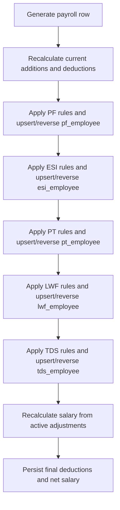
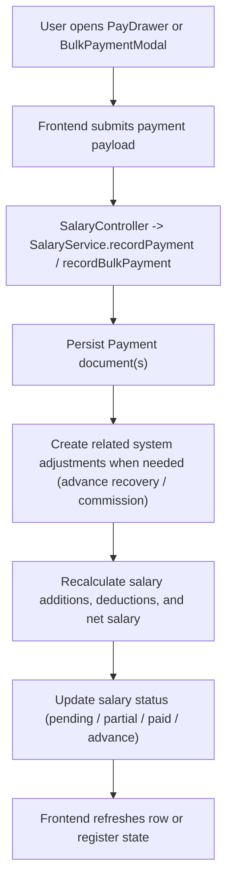
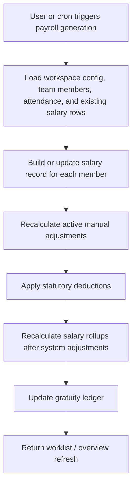
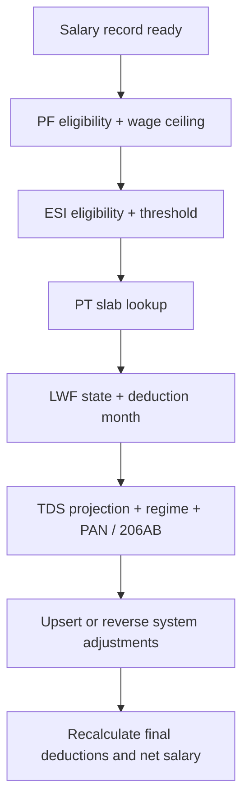
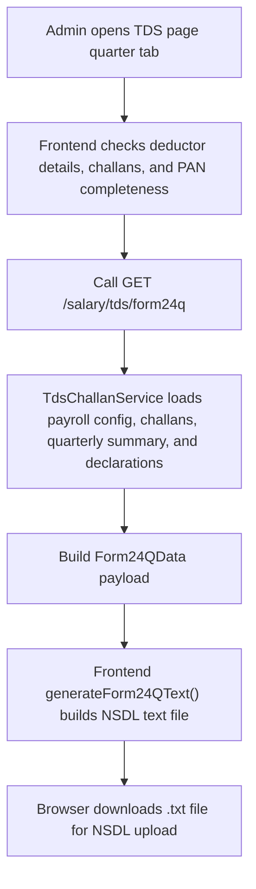

# Salary Module - Technical Documentation

> **Project:** Zari360 (Zari360)
> **Module:** Salary / Payroll
> **Last Updated:** 2026-04-10
> **Compliance Standard:** Indian Payroll (PF, ESI, PT, TDS, LWF, Gratuity, Form 24Q, PF ECR, Form 16)

---

## Table of Contents

1. [Module Overview](#1-module-overview)
2. [Frontend Architecture](#2-frontend-architecture)
   - [2.1 File & Folder Structure](#21-file--folder-structure)
   - [2.2 Page Routing & Navigation](#22-page-routing--navigation)
   - [2.3 Component Inventory](#23-component-inventory)
   - [2.4 State Management](#24-state-management)
   - [2.5 Key TypeScript Types](#25-key-typescript-types)
   - [2.6 UX Flow](#26-ux-flow)
3. [API Integration](#3-api-integration)
   - [3.1 Client API Module](#31-client-api-module)
   - [3.2 Server Actions](#32-server-actions)
   - [3.3 Error Handling](#33-error-handling)
4. [Backend Processes](#4-backend-processes)
   - [4.1 Module Structure](#41-module-structure)
   - [4.2 Controller Endpoints](#42-controller-endpoints)
   - [4.3 Service Layer](#43-service-layer)
   - [4.4 Database Schemas](#44-database-schemas)
   - [4.5 Statutory Deduction Engine](#45-statutory-deduction-engine)
   - [4.6 Cron Jobs](#46-cron-jobs)
   - [4.7 Subscription Gates](#47-subscription-gates)
5. [Data Flow Diagrams](#5-data-flow-diagrams)
6. [Key Business Rules & Logic](#6-key-business-rules--logic)
7. [Environment Variables & Configuration](#7-environment-variables--configuration)
8. [Known Limitations & TODOs](#8-known-limitations--todos)

---

## 1. Module Overview

The Salary module is the payroll operating system for a workspace. It combines monthly payroll generation, attendance-aware salary computation, payment recording, salary adjustments, CTC component templates, compliance deductions, document generation, and offboarding settlement workflows under one workspace-scoped module.

Current capabilities in the codebase include:

- Monthly payroll generation for active employees, including re-run safe upserts for existing salary records.
- Salary computation for both monthly and hourly employees.
- Attendance-aware pay handling, fixed-month-day vs calendar-month-day logic, and employment-window proration for joiners and offboarded employees.
- Salary record locking and unlocking.
- Salary adjustments for additions and deductions, including system-generated adjustments.
- Payment recording for single and bulk flows, plus reversal and audit history.
- Advance payments with recovery adjustments.
- Salary increment scheduling and application.
- Salary component templates and CTC calculation support.
- Payroll overview KPIs, trend charts, shift summaries, and paginated payroll tables.
- Payslip data generation, client-side payslip PDF generation, and payslip email delivery.
- Statutory payroll deductions stored as `SalaryAdjustment` records with `source = 'system'`:
  - PF
  - ESI
  - Professional Tax
  - Labour Welfare Fund
  - TDS under Section 192
- TDS projection and declaration management, including:
  - old/new regime handling
  - previous employer data
  - PAN-missing Section 206AA handling
  - manual `isNonItrFiler` Section 206AB override
- Compliance export outputs:
  - PF ECR text
  - ESI challan CSV
  - bank/UPI disbursement CSVs
- TDS challan management:
  - monthly liability
  - BSR code lookup
  - challan CRUD
  - quarterly summary
  - Form 24Q payload generation
- Form 16 PDF generation.
- Gratuity liability tracking and workspace gratuity summary.
- Full and Final settlement (FnF) drafting, finalisation, and PDF export.
- Payroll auto-generation cron for workspaces that enable `features.autoGenerate`.

The module is split between:

- `zari360-web/app/dashboard/salary/*` for user-facing payroll pages.
- `zari360-web/features/salary/*` for feature gates, config stores, and salary utilities.
- `zari360-backend/src/modules/salary/*` for controllers, services, schemas, constants, and cron logic.

---

## 2. Frontend Architecture

### 2.1 File & Folder Structure

```text
zari360-web/
|-- app/dashboard/salary/
|   |-- layout.tsx
|   |-- page.tsx
|   |-- RunPayrollPage.tsx
|   |-- components/salary/
|   |   |-- AdjustmentDrawer.tsx
|   |   |-- AdvanceTargetSelector.tsx
|   |   |-- BulkPaymentModal.tsx
|   |   |-- ComplianceExportModal.tsx
|   |   |-- CreateBankAccountModal.tsx
|   |   |-- FnfSettlementModal.tsx
|   |   |-- FullHistoryDrawer.tsx
|   |   |-- MonthDetailDrawer.tsx
|   |   |-- MonthTransactionsModal.tsx
|   |   |-- PayDrawer.tsx
|   |   |-- ReverseAdjustmentModal.tsx
|   |   |-- ReversePaymentModal.tsx
|   |   |-- SalaryPageHeader.tsx
|   |   |-- SalarySummaryCards.tsx
|   |   |-- SalaryWorkspaceNav.tsx
|   |   |-- SetSalaryModal.tsx
|   |   |-- TaxDeclarationModal.tsx
|   |   `-- TransactionDetailModal.tsx
|   |-- constants/
|   |   `-- salary-page.constants.ts
|   |-- hooks/
|   |   |-- useAdjustmentActions.ts
|   |   |-- useLedgerData.ts
|   |   |-- usePaymentActions.ts
|   |   |-- usePayslipActions.ts
|   |   |-- useSalaryData.ts
|   |   `-- useSetSalaryActions.ts
|   |-- payments/
|   |   `-- page.tsx
|   |-- run-payroll/
|   |   `-- page.tsx
|   |-- settings/
|   |   `-- page.tsx
|   |-- store/
|   |   `-- useSalaryPageStore.ts
|   |-- tds/
|   |   `-- page.tsx
|   |-- types/
|   |   `-- salary-page.types.ts
|   `-- utils/
|       |-- payroll-route.utils.ts
|       `-- salary-page.utils.ts
|-- components/dashboard/
|   |-- MemberDetailDrawer.tsx
|   `-- SalaryIncrementModal.tsx
|-- features/salary/
|   |-- constants/
|   |   |-- feature-access-map.ts
|   |   `-- payroll-presets.ts
|   |-- hooks/
|   |   |-- useCurrencyFormatter.ts
|   |   |-- useSalaryFeatureAccess.ts
|   |   `-- useSalaryFeatures.ts
|   |-- store/
|   |   |-- useComponentTemplateStore.ts
|   |   `-- usePayrollConfigStore.ts
|   `-- utils/
|       `-- component-calculator.ts
|-- lib/
|   |-- actions/
|   |   `-- salary.actions.ts
|   |-- api/
|   |   |-- endpoints.ts
|   |   `-- modules/
|   |       `-- salary.api.ts
|   |-- constants/
|   |   |-- bsr-codes.ts
|   |   |-- feature-access.registry.ts
|   |   `-- lwf-rates.ts
|   |-- export/
|   |   |-- brandingCache.ts
|   |   |-- exportExcel.ts
|   |   |-- exportPdf.ts
|   |   |-- generateAttendancePdf.ts
|   |   |-- generateFnfPdf.ts
|   |   |-- generateForm16Pdf.ts
|   |   |-- generateForm24Q.ts
|   |   |-- generatePayslipPdf.ts
|   |   |-- generateSectionedPdf.ts
|   |   |-- imageUtils.ts
|   |   `-- zipDownload.ts
|   |-- exportFields/
|   |   |-- ledgerFields.ts
|   |   `-- salaryFields.ts
|   `-- salary.ts
`-- types/
    `-- index.ts
```

Notes:

- The main salary UI lives under `app/dashboard/salary/`.
- Two cross-module dashboard components are part of the salary experience even though they live outside the salary folder:
  - `components/dashboard/MemberDetailDrawer.tsx`
  - `components/dashboard/SalaryIncrementModal.tsx`
- Newer compliance and settlement exports are generated client-side in `lib/export/`.

### 2.2 Page Routing & Navigation

The salary workspace layout renders `SalaryWorkspaceNav` and currently exposes five tabs:

| Label | Href | Notes |
|------|------|-------|
| Overview | `/dashboard/salary` | Always visible |
| Run Payroll | `/dashboard/salary/run-payroll` | Always visible |
| Payments | `/dashboard/salary/payments` | Always visible |
| TDS | `/dashboard/salary/tds` | Visible only when `features.tdsManagement.enabled` |
| Settings | `/dashboard/salary/settings` | Always visible |

Page routing and query parameter usage:

| Route | Component | Description | Query Params |
|------|-----------|-------------|-------------|
| `/dashboard/salary` | `app/dashboard/salary/page.tsx` | Overview dashboard with KPI cards, trend chart, shift snapshot, and gated gratuity section | `month`, `year` |
| `/dashboard/salary/run-payroll` | `app/dashboard/salary/run-payroll/page.tsx` -> `RunPayrollPage.tsx` | Main payroll worklist and row-level payroll actions | `month`, `year`, `view`, `status`, `search`, `sort`, `teamMemberId` |
| `/dashboard/salary/payments` | `app/dashboard/salary/payments/page.tsx` | Payment register, period navigation, register summary, search/status filters | `month`, `year` |
| `/dashboard/salary/settings` | `app/dashboard/salary/settings/page.tsx` | Payroll presets, feature toggles, defaults, statutory setup, component templates | none |
| `/dashboard/salary/tds` | `app/dashboard/salary/tds/page.tsx` | Deductor details, monthly TDS liability, challan CRUD, quarterly summary, Form 24Q generation | none |

### 2.3 Component Inventory

#### Core salary pages and layout

| File | Responsibility |
|------|----------------|
| `app/dashboard/salary/layout.tsx` | Salary section layout that wraps page content with `SalaryWorkspaceNav`. |
| `app/dashboard/salary/page.tsx` | Salary overview dashboard with KPIs, trend chart, shift breakdown, and gratuity liability section. |
| `app/dashboard/salary/RunPayrollPage.tsx` | Main payroll operations screen with generation, row actions, modal orchestration, filters, and exports. |
| `app/dashboard/salary/payments/page.tsx` | Payment register page with month navigation and paginated payment table. |
| `app/dashboard/salary/settings/page.tsx` | Payroll settings page for presets, feature switches, defaults, statutory panels, and component templates. |
| `app/dashboard/salary/tds/page.tsx` | TDS management page for deductor details, challans, liability, quarterly summary, and Form 24Q. |

#### Run-payroll modals and drawers

| File | Responsibility |
|------|----------------|
| `components/salary/SalaryPageHeader.tsx` | Period navigation, export triggers, bulk actions, and high-level page controls. |
| `components/salary/SalarySummaryCards.tsx` | Summary card strip for payroll totals and record counts. |
| `components/salary/SetSalaryModal.tsx` | Base pay / CTC configuration editor for a team member. |
| `components/salary/PayDrawer.tsx` | Single salary payment entry drawer, including proof upload and split payment flows. |
| `components/salary/BulkPaymentModal.tsx` | Bulk payment recording modal. |
| `components/salary/AdjustmentDrawer.tsx` | Salary adjustment creation drawer. |
| `components/salary/ReverseAdjustmentModal.tsx` | Adjustment reversal confirmation modal. |
| `components/salary/ReversePaymentModal.tsx` | Payment reversal confirmation modal. |
| `components/salary/MonthDetailDrawer.tsx` | Month-level salary record detail drawer. |
| `components/salary/FullHistoryDrawer.tsx` | Full employee salary history drawer. |
| `components/salary/MonthTransactionsModal.tsx` | Month transaction detail modal for the history view. |
| `components/salary/TransactionDetailModal.tsx` | Single transaction detail modal. |
| `components/salary/CreateBankAccountModal.tsx` | Helper modal to add a bank account while recording salary payments. |
| `components/salary/AdvanceTargetSelector.tsx` | Recovery targeting helper for over-and-above payments treated as advances. |

#### Compliance, tax, and settlement components

| File | Responsibility |
|------|----------------|
| `components/salary/ComplianceExportModal.tsx` | PF ECR, ESI challan, and bank/UPI disbursement preview/download tabs. |
| `components/salary/TaxDeclarationModal.tsx` | Tax declaration entry and TDS preview modal per employee. |
| `components/salary/FnfSettlementModal.tsx` | Full and Final settlement drafting, review, finalisation, and PDF export. |
| `components/dashboard/MemberDetailDrawer.tsx` | Team member drawer that exposes statutory fields and the salary-history gratuity status card. |
| `components/dashboard/SalaryIncrementModal.tsx` | Salary increment creation workflow surfaced from run-payroll. |

#### Supporting salary-specific hooks, constants, and utils

| File | Responsibility |
|------|----------------|
| `hooks/useSalaryData.ts` | Loads salary records, summaries, shift data, and export-friendly row sets. |
| `hooks/usePaymentActions.ts` | Encapsulates salary payment mutations and local row updates. |
| `hooks/useAdjustmentActions.ts` | Encapsulates adjustment create/reverse flows. |
| `hooks/usePayslipActions.ts` | Coordinates payslip data fetching and PDF download/email helpers. |
| `hooks/useLedgerData.ts` | Loads ledger history, month drilldowns, and adjustment history. |
| `hooks/useSetSalaryActions.ts` | Encapsulates base pay and salary-config mutations. |
| `constants/salary-page.constants.ts` | Static option lists for adjustment categories and history ranges. |
| `utils/payroll-route.utils.ts` | Route parsing and month/year URL helpers. |
| `utils/salary-page.utils.ts` | Formatting helpers, status labels, and filename-safe slug generation. |

### 2.4 State Management

The salary module uses a mix of workspace-global and salary-specific Zustand stores.

#### Global stores consumed by salary pages

| Store | Used For |
|------|----------|
| `useWorkspaceStore` | Current workspace ID, hydration state, workspace metadata, and fiscal year start month. |
| `useAuthStore` | Current user, especially on settings pages that check owner/admin capability. |
| `useSubscriptionStore` | Underlies entitlement checks surfaced through `useSalaryFeatureAccess` and `useSalaryFeatures`. |

#### `useSalaryPageStore`

File: `app/dashboard/salary/store/useSalaryPageStore.ts`

This is the central UI state container for the run-payroll screen.

| Slice / Action Group | What It Manages |
|----------------------|-----------------|
| `records`, `teamMembers`, `loading` | Current run-payroll dataset and loading state. |
| `page`, `pageSize`, `totalRecords`, `totalPages`, `serverSummary` | Server-driven pagination state. |
| `month`, `year`, `search`, `sortKey`, `statusFilter`, `viewMode` | Current filter, search, sorting, and view mode state. |
| `selectedRowKeys`, `setSelectedRowKeys`, `clearSelection` | Table selection for bulk actions. |
| `payModal`, `setPayModal` | Single payment drawer state. |
| `setSalaryModal`, `setSetSalaryModal` | Salary configuration modal state. |
| `complianceModal`, `openComplianceModal`, `closeComplianceModal` | PF/ESI/bank export modal state. |
| `tdsModal`, `openTdsModal`, `closeTdsModal` | Tax declaration modal state. |
| `fnfModal`, `openFnfModal`, `closeFnfModal` | FnF settlement modal state. |
| `adjustmentDrawerRecord`, `setAdjustmentDrawerRecord` | Adjustment drawer target record. |
| `monthTransactionsModal`, `setMonthTransactionsModal` | History transaction modal state. |
| `incrementModalOpen`, `selectedMemberForIncrement` | Salary increment modal target state. |
| `ledgerData`, `isLedgerLoading`, `ledgerError` | Full employee ledger data state. |
| `adjustmentHistory`, `adjustmentsLoading` | Adjustment/audit history data for side drawers. |
| `patchRecord` | In-place row patching after successful mutations. |

#### `usePayrollConfigStore`

File: `features/salary/store/usePayrollConfigStore.ts`

This store owns the workspace payroll configuration lifecycle.

| Slice / Action Group | What It Manages |
|----------------------|-----------------|
| `config`, `isLoading`, `error` | Loaded payroll config and request status. |
| `fetchConfig` | Loads `PayrollConfig` from the backend and merges defaults. |
| `updateConfig` | Sends partial config updates and refreshes local state with defaults applied. |
| `applyPreset` | Applies one of the payroll presets through `updateConfig`. |
| `isFeatureEnabled` | Reads a runtime config flag from `config.features`. |
| `getCurrencyConfig` | Returns currency symbol, locale, and code used throughout the module. |
| `reset` | Clears local salary config state. |

Important nested defaults currently injected by the store:

- `DEFAULT_PAYROLL_STATUTORY`
  - `pfEnabled`
  - `pfEstablishmentCode`
  - `pfWageCeiling`
  - `esiEnabled`
  - `esiCode`
  - `esiGrossThreshold`
  - `ptEnabled`
  - `tdsEnabled`
  - `lwfEnabled`
  - `ptState`
  - `ptUseCustomSlabs`
  - `ptCustomSlabs`
- `DEFAULT_PAYROLL_DEDUCTOR`
  - `tan`
  - `pan`
  - `branchDivision`
  - `address1`
  - `address2`
  - `city`
  - `state`
  - `pincode`
  - `phone`
  - `email`
  - `responsiblePersonName`
  - `responsiblePersonPan`
  - `responsiblePersonDesignation`

#### `useComponentTemplateStore`

File: `features/salary/store/useComponentTemplateStore.ts`

This store manages salary component templates used by CTC workflows.

| Slice / Action Group | What It Manages |
|----------------------|-----------------|
| `templates`, `isLoading`, `error` | Template list and request status. |
| `hasFetched`, `fetchedWorkspaceId` | Workspace-aware fetch lifecycle state. |
| `fetchTemplates` | Loads workspace templates. |
| `seedTemplate` | Creates one of the built-in component templates. |
| `createTemplate`, `updateTemplate`, `deleteTemplate` | Template CRUD. |
| `getDefaultTemplate` | Looks up the default template in local state. |
| `reset` | Clears the template store. |

#### Feature access hooks

| Hook | Responsibility |
|------|----------------|
| `useSalaryFeatureAccess` | Combines subscription entitlements and optional runtime payroll-config flags into a single `enabled/visible/gatedBy` result. |
| `useSalaryFeatures` | Materialises the full salary feature gate object consumed by salary pages and cross-module salary UI. |
| `useCurrencyFormatter` | Standardises payroll amount formatting from workspace config. |

### 2.5 Key TypeScript Types

See `zari360-web/types/index.ts` for the complete definitions. The most important types are grouped below.

#### Core payroll types

| Type | Key Fields | Purpose |
|------|------------|---------|
| `SalaryRecord` | `_id`, `teamMember`, `month`, `year`, `baseSalary`, `additions`, `deductions`, `netSalary`, `status` | Primary record shown in run-payroll. |
| `SalaryAdjustment` | `type`, `category`, `amount`, `source`, `status`, `reasonTitle`, `reversalReason` | Additions/deductions, including system statutory deductions. |
| `Payment` | `amount`, `paymentDate`, `paymentMode`, `proofUrls`, `commission`, `status` | Salary payment transaction record. |
| `SalaryIncrement` | `effectiveMonth`, `effectiveYear`, `type`, `value`, `previousSalary`, `newSalary` | Scheduled salary revision record. |
| `PayrollOverviewResponse` | `summary`, `shiftSnapshot`, `trend` | Overview page API payload. |
| `PaymentRegisterResponse` | `records`, `pagination`, `summary` | Payment register payload. |
| `SalaryComponentTemplate` | `_id`, `name`, `isDefault`, `components[]` | CTC and salary component template. |

#### Statutory compliance and settlement types

| Type | Key Fields | Purpose |
|------|------------|---------|
| `TaxDeclaration` | `financialYear`, `taxRegime`, `hraExemption`, `deduction80C`, `previousEmployerGross`, `tdsDedutedSoFar` | Employee tax declaration used by the TDS engine. |
| `TdsChallan` | `quarter`, `financialYear`, `month`, `year`, `bsrCode`, `challanSerialNo`, `tdsTotalDeposited` | Bank challan record for monthly TDS deposits. |
| `GratuityLedger` | `dateOfJoining`, `completedYears`, `completedMonths`, `isEligible`, `gratuityAmount`, `monthlyAccruals[]` | Employer gratuity liability tracker per employee. |
| `GratuitySummary` | `totalEligibleEmployees`, `totalGratuityLiability`, `nearingEligibility`, `ledgers[]` | Workspace gratuity summary shown on the overview page. |
| `FnfSettlement` | `lastWorkingDate`, `gratuityAmount`, `leaveEncashmentAmount`, `noticeRecoveryAmount`, `netFnfPayable`, `status` | Full and Final settlement record. |
| `TeamMember` | `pan`, `uan`, `esiIpNumber`, `stateOfEmployment`, `employmentType`, `pfApplicable`, `pfOptedOut`, `esiApplicable`, `taxRegime`, `isNonItrFiler` | Team member carries the compliance flags used by salary services and forms. |

#### Export and filing types

| Type | Key Fields | Purpose |
|------|------------|---------|
| `Form16Data` | `employeeName`, `fyLabel`, `monthlyBreakdown[]`, `declaration`, `totalTdsDeducted` | Input contract for client-side Form 16 PDF generation. |
| `Form24QData` | `deductor`, `quarter`, `fyLabel`, `challans[]`, `employees[]`, `isQ4` | Input contract for Form 24Q text generation. |
| `EcrExportResponse` | `rows[]`, `text`, `filename`, `summary` | PF ECR export response. |
| `EsiChallanExportResponse` | `rows[]`, `csv`, `filename`, `summary` | ESI challan export response. |
| `BankFileExportResponse` | `bankRows[]`, `upiRows[]`, `skippedRows[]`, `bankCsv`, `upiCsv` | Bank and UPI disbursement export response. |

#### Config types

| Type | Key Fields | Purpose |
|------|------------|---------|
| `PayrollConfig` | `preset`, `features`, `rules`, `display`, `statutory`, `deductor` | Runtime payroll configuration document. |
| `PayrollConfigStatutory` | `pfEnabled`, `esiEnabled`, `ptEnabled`, `tdsEnabled`, `lwfEnabled`, `ptState`, `ptCustomSlabs[]` | Workspace-level statutory controls. |
| `PayrollConfigDeductor` | `tan`, `pan`, `address1`, `city`, `state`, `pincode`, `responsiblePersonName` | Deductor metadata used by Form 24Q. |
| `UpdatePayrollConfigPayload` | `preset`, `features`, `rules`, `display`, `statutory`, `deductor` | Partial update payload sent from settings and TDS pages. |

### 2.6 UX Flow

#### 1. Overview page

1. The page resolves the current payroll period from `month` and `year` query params.
2. It loads `salaryApi.getOverview(...)`.
3. If `features.gratuityTracking.enabled` is true, it also loads `salaryApi.getGratuitySummary(...)`.
4. The page renders:
   - summary metric cards
   - payroll trend chart
   - shift snapshot cards
   - gated gratuity liability section
5. Period navigation updates the URL, which becomes the source of truth for the selected month.

#### 2. Run payroll

1. The page reads current filters from URL/search state and loads payroll records via `useSalaryData`.
2. Workspace payroll config and subscription gates are loaded through `usePayrollConfigStore` and `useSalaryFeatures`.
3. Users can:
   - generate or re-run payroll
   - set base pay / salary config
   - lock or unlock salary records
   - record single or bulk payments
   - create or reverse salary adjustments
   - open history drawers and transaction details
4. Gated row actions appear only when the corresponding feature is enabled:
   - TDS declaration modal
   - Form 16 generation
   - payslip email
   - FnF settlement
5. Page-level actions can also open:
   - compliance export modal
   - increment modal
   - bulk payment modal

#### 3. Payment register

1. The page resolves the current payroll period from `month` and `year` query params.
2. It loads the payment register via `salaryApi.getPaymentRegister(...)`.
3. Users can filter by search text and payment status.
4. The page renders register metrics plus a paginated register table.

#### 4. Settings

1. The page loads `PayrollConfig` and salary component templates.
2. It renders:
   - preset cards
   - feature toggle groups
   - workspace payroll defaults
   - statutory setup
   - component template management
3. The statutory section is rendered only when `features.statutoryCompliance.enabled` is true.
4. Inside the statutory section, the current code renders up to five panels:
   - PF
   - ESI
   - Professional Tax
   - TDS / Income Tax (only when `features.statutoryTds.enabled`)
   - LWF (only when `features.lwfTracking.enabled`)
5. Saves are issued through `usePayrollConfigStore.updateConfig(...)`.

#### 5. TDS page

1. The page is available only when `features.tdsManagement.enabled` is true.
2. It loads payroll config to access deductor details, then loads:
   - current-month TDS liability
   - all challans for the selected FY
   - quarter-specific challans
   - quarter summary
3. The top collapsible section manages deductor details and persists them through `updateConfig({ deductor: ... })`.
4. Quarter tabs expose challan CRUD via the inline challan modal.
5. Each quarter also renders:
   - challan-vs-deducted balance status
   - employee-wise TDS summary
   - Excel export
   - Form 24Q pre-flight checklist and download button

---

## 3. API Integration

### 3.1 Client API Module

File: `zari360-web/lib/api/modules/salary.api.ts`

All methods are workspace-scoped and use URL builders from `zari360-web/lib/api/endpoints.ts`.

#### Records and overview

| # | Method | HTTP | Endpoint | Description |
|---|--------|------|----------|-------------|
| 1 | `getRecords` | GET | `/workspaces/{wsId}/salary` | Fetch all salary records for a period. |
| 2 | `getRecordsPaginated` | GET | `/workspaces/{wsId}/salary/paginated` | Fetch paginated salary records with filters. |
| 3 | `getOverview` | GET | `/workspaces/{wsId}/salary/overview` | Fetch overview KPIs, trend, and shift snapshot. |
| 4 | `getShiftSummaries` | GET | `/workspaces/{wsId}/salary/by-shift-summary` | Fetch shift-level payroll totals. |
| 5 | `generate` | POST | `/workspaces/{wsId}/salary/generate?month={m}&year={y}` | Generate or re-run payroll for a month. |
| 6 | `update` | PATCH | `/workspaces/{wsId}/salary/{recordId}` | Update a salary record. |
| 7 | `ensureSalaryRecord` | POST | `/workspaces/{wsId}/salary/ensure-record` | Lazily create one salary record if missing. |
| 8 | `setBasePay` | PATCH | `/workspaces/{wsId}/salary/set-base-pay` | Update employee salary configuration. |
| 9 | `lockSalaryRecord` | PATCH | `/workspaces/{wsId}/salary/{salaryId}/lock` | Lock a salary record. |
| 10 | `unlockSalaryRecord` | PATCH | `/workspaces/{wsId}/salary/{salaryId}/unlock` | Unlock a salary record. |

#### Adjustments and audit

| # | Method | HTTP | Endpoint | Description |
|---|--------|------|----------|-------------|
| 11 | `listAdjustments` | GET | `/workspaces/{wsId}/salary/{salaryId}/adjustments` | Fetch salary adjustments for one record. |
| 12 | `createAdjustment` | POST | `/workspaces/{wsId}/salary/{salaryId}/adjustments` | Create an addition or deduction adjustment. |
| 13 | `reverseAdjustment` | POST | `/workspaces/{wsId}/salary/adjustments/{adjustmentId}/reverse` | Reverse a previously posted adjustment. |
| 14 | `getAdjustmentAudit` | GET | `/workspaces/{wsId}/salary/adjustments/{adjustmentId}/audit` | Fetch audit history for one adjustment. |

#### Payments and payslips

| # | Method | HTTP | Endpoint | Description |
|---|--------|------|----------|-------------|
| 15 | `recordPayment` | POST | `/workspaces/{wsId}/salary/payments` | Record one salary payment. |
| 16 | `recordBulkPayment` | POST | `/workspaces/{wsId}/salary/payments/bulk` | Record multiple salary payments in one request. |
| 17 | `getPayments` | GET | `/workspaces/{wsId}/salary/payments` | Fetch payments for a salary record or period. |
| 18 | `getPaymentRegister` | GET | `/workspaces/{wsId}/salary/payments/register` | Fetch paginated payment register data. |
| 19 | `reversePayment` | POST | `/workspaces/{wsId}/salary/payments/{paymentId}/reverse` | Reverse a recorded payment. |
| 20 | `getPayslipData` | POST | `/workspaces/{wsId}/salary/payslip-data` | Fetch the structured data used to build payslip PDFs. |
| 21 | `sendPayslipEmail` | POST | `/workspaces/{wsId}/salary/send-payslip-email` | Send one client-generated payslip PDF by email. |
| 22 | `sendBulkPayslipEmails` | POST | `/workspaces/{wsId}/salary/send-payslip-email/bulk` | Send many client-generated payslip PDFs sequentially on the backend. |
| 23 | `getOutstandingAdvances` | GET | `/workspaces/{wsId}/salary/advances/{teamMemberId}` | Fetch the outstanding advance balance for an employee. |
| 24 | `getLedger` | GET | `/workspaces/{wsId}/salary/history/{memberId}` | Fetch full salary ledger history for one employee. |

#### Payroll configuration and templates

| # | Method | HTTP | Endpoint | Description |
|---|--------|------|----------|-------------|
| 25 | `getPayrollConfig` | GET | `/workspaces/{wsId}/salary/payroll-config` | Fetch runtime payroll config. |
| 26 | `updatePayrollConfig` | PUT | `/workspaces/{wsId}/salary/payroll-config` | Persist partial payroll config updates. |
| 27 | `addIncrement` | POST | `/workspaces/{wsId}/salary/increments` | Create a salary increment. |
| 28 | `getIncrements` | GET | `/workspaces/{wsId}/salary/increments` | List salary increments. |
| 29 | `deleteIncrement` | DELETE | `/workspaces/{wsId}/salary/increments/{id}` | Delete an unapplied increment. |
| 30 | `listComponentTemplates` | GET | `/workspaces/{wsId}/salary/component-templates` | List salary component templates. |
| 31 | `createComponentTemplate` | POST | `/workspaces/{wsId}/salary/component-templates` | Create a component template. |
| 32 | `seedComponentTemplate` | POST | `/workspaces/{wsId}/salary/component-templates/seed` | Seed a built-in template. |
| 33 | `updateComponentTemplate` | PUT | `/workspaces/{wsId}/salary/component-templates/{templateId}` | Update a component template. |
| 34 | `deleteComponentTemplate` | DELETE | `/workspaces/{wsId}/salary/component-templates/{templateId}` | Delete a component template. |

#### Tax declarations, TDS, and Form 24Q

| # | Method | HTTP | Endpoint | Description |
|---|--------|------|----------|-------------|
| 35 | `getTaxDeclaration` | GET | `/workspaces/{wsId}/salary/tax-declaration/{memberId}` | Fetch one employee tax declaration for an FY. |
| 36 | `upsertTaxDeclaration` | PUT | `/workspaces/{wsId}/salary/tax-declaration/{memberId}` | Create or update one employee tax declaration. |
| 37 | `getTdsPreview` | GET | `/workspaces/{wsId}/salary/tax-declaration/{memberId}/tds-preview` | Preview monthly TDS for an employee without saving. |
| 38 | `createTdsChallan` | POST | `/workspaces/{wsId}/salary/tds/challans` | Create a monthly TDS challan record. |
| 39 | `updateTdsChallan` | PUT | `/workspaces/{wsId}/salary/tds/challans/{challanId}` | Update an existing TDS challan. |
| 40 | `deleteTdsChallan` | DELETE | `/workspaces/{wsId}/salary/tds/challans/{challanId}` | Delete a challan record. |
| 41 | `getTdsChallans` | GET | `/workspaces/{wsId}/salary/tds/challans` | List all challans for an FY. |
| 42 | `getTdsChallansForQuarter` | GET | `/workspaces/{wsId}/salary/tds/challans/quarter` | List challans for one quarter. |
| 43 | `getTdsLiability` | GET | `/workspaces/{wsId}/salary/tds/liability` | Fetch month-level TDS liability and employee breakdown. |
| 44 | `getTdsQuarterlySummary` | GET | `/workspaces/{wsId}/salary/tds/summary` | Fetch employee-wise quarterly TDS summary and challan totals. |
| 45 | `getForm24QData` | GET | `/workspaces/{wsId}/salary/tds/form24q` | Fetch the payload used to generate Form 24Q text. |

#### Compliance exports and certificates

| # | Method | HTTP | Endpoint | Description |
|---|--------|------|----------|-------------|
| 46 | `getForm16Data` | GET | `/workspaces/{wsId}/salary/form16/{memberId}` | Fetch annual salary/TDS data for Form 16 PDF generation. |
| 47 | `getEcrExport` | GET | `/workspaces/{wsId}/salary/compliance/ecr` | Fetch PF ECR rows and formatted text. |
| 48 | `getEsiChallanExport` | GET | `/workspaces/{wsId}/salary/compliance/esi-challan` | Fetch ESI challan rows and CSV. |
| 49 | `getBankFileExport` | GET | `/workspaces/{wsId}/salary/compliance/bank-file` | Fetch bank transfer / UPI disbursement data and CSVs. |

#### Gratuity and FnF

| # | Method | HTTP | Endpoint | Description |
|---|--------|------|----------|-------------|
| 50 | `getGratuityLedger` | GET | `/workspaces/{wsId}/salary/gratuity/{memberId}` | Fetch one employee gratuity ledger. |
| 51 | `getGratuitySummary` | GET | `/workspaces/{wsId}/salary/gratuity` | Fetch workspace gratuity summary. |
| 52 | `initiateFnf` | POST | `/workspaces/{wsId}/salary/fnf/{memberId}/initiate` | Create or recompute an FnF draft. |
| 53 | `getFnfSettlement` | GET | `/workspaces/{wsId}/salary/fnf/{memberId}` | Fetch one employee FnF settlement. |
| 54 | `finaliseFnf` | POST | `/workspaces/{wsId}/salary/fnf/{memberId}/finalise` | Mark an FnF settlement as finalised. |
| 55 | `getFnfList` | GET | `/workspaces/{wsId}/salary/fnf` | List all FnF settlements in the workspace. |

### 3.2 Server Actions

File: `zari360-web/lib/actions/salary.actions.ts`

The server-actions layer currently covers the original payroll flows plus selected compliance exports. Newer TDS challan and FnF flows are handled directly through `salaryApi` from client components.

| # | Exported Function | Responsibility |
|---|-------------------|----------------|
| 1 | `getSalaryRecords` | Fetch salary records for a month. |
| 2 | `getEcrExport` | Fetch PF ECR export payload. |
| 3 | `getEsiChallanExport` | Fetch ESI challan export payload. |
| 4 | `getBankFileExport` | Fetch bank/UPI disbursement export payload. |
| 5 | `getForm16Data` | Fetch Form 16 generation payload. |
| 6 | `getGratuityLedger` | Fetch one employee gratuity ledger. |
| 7 | `getGratuitySummary` | Fetch workspace gratuity summary. |
| 8 | `generateSalary` | Trigger payroll generation for a period. |
| 9 | `ensureSalaryRecord` | Ensure one employee salary record exists. |
| 10 | `updateSalary` | Update a salary record. |
| 11 | `setBasePay` | Update employee salary configuration. |
| 12 | `lockSalaryRecord` | Lock a salary record. |
| 13 | `unlockSalaryRecord` | Unlock a salary record. |
| 14 | `getSalaryAdjustments` | Fetch adjustments for a salary record. |
| 15 | `createSalaryAdjustment` | Create a salary adjustment. |
| 16 | `reverseSalaryAdjustment` | Reverse a salary adjustment. |
| 17 | `reverseSalaryPayment` | Reverse a payment. |
| 18 | `getSalaryAdjustmentAudit` | Fetch adjustment audit history. |
| 19 | `recordSalaryPayment` | Record one salary payment. |
| 20 | `getSalaryPayments` | Fetch salary payments. |
| 21 | `getSalaryLedger` | Fetch full salary ledger history. |
| 22 | `addSalaryIncrement` | Create a salary increment. |
| 23 | `getSalaryIncrements` | Fetch salary increments. |
| 24 | `deleteSalaryIncrement` | Delete a salary increment. |

### 3.3 Error Handling

The salary module follows the project-wide request/response conventions:

- Backend responses use the standard envelope: `{ success: true, data: ... }`.
- Client API calls use Axios wrappers from `lib/api/client.ts` and unwrap through the shared helpers.
- Server Actions use `serverHttp()` and `unwrapServer<T>()`.

Common frontend patterns in the salary module:

- Page-level loading states:
  - overview page uses skeletons and empty states
  - payment register uses skeletons and inline reload affordances
  - TDS page uses per-section loading states
- Modal/drawer loading states:
  - TDS generation button loading
  - challan save loading
  - statutory save loading
  - FnF calculation/finalisation loading
  - payslip email loading
- Errors are normalised with `parseApiError(...)` before being shown in `message.error(...)`.
- Confirmation modals are used before destructive actions such as reversals, deletions, and FnF finalisation.
- The run-payroll store includes targeted row patching (`patchRecord`) after successful mutations rather than broad optimistic list rewrites.

Authentication and subscription behaviour:

- The Axios client uses the project-wide token refresh interceptor for 401 handling.
- Middleware and backend guards enforce workspace access.
- Subscription-denied backend calls surface 403 errors.
- Most salary UI actions are hidden entirely when the relevant feature gate is not enabled, so the normal UX is "hidden action" rather than "disabled action".

---

## 4. Backend Processes

### 4.1 Module Structure

Backend salary files are grouped as follows.

**Controllers**

- `zari360-backend/src/modules/salary/salary.controller.ts` - Primary workspace payroll controller for records, payments, adjustments, config, statutory exports, gratuity, Form 16, and FnF.
- `zari360-backend/src/modules/salary/tds-challan.controller.ts` - Dedicated TDS administration controller for challans, liability, quarterly summaries, and Form 24Q payloads.

**Services**

- `zari360-backend/src/modules/salary/salary.service.ts` - Core payroll engine and orchestration service.
- `zari360-backend/src/modules/salary/tds.service.ts` - Income-tax regime helpers, FY helpers, and monthly TDS projection logic.
- `zari360-backend/src/modules/salary/tds-challan.service.ts` - TDS challan CRUD, liability calculation, quarterly summary, and Form 24Q payload builder.
- `zari360-backend/src/modules/salary/gratuity.service.ts` - Gratuity accrual and FnF gratuity helper logic.
- `zari360-backend/src/modules/salary/fnf.service.ts` - Full-and-final settlement calculation and persistence.
- `zari360-backend/src/modules/salary/compliance-export.service.ts` - PF ECR, ESI challan, and bank/UPI disbursement export builders.

**Module Wiring**

- `zari360-backend/src/modules/salary/salary.module.ts` - Registers all salary schemas, controllers, services, cron, and cross-module dependencies.

**Constants**

- `zari360-backend/src/modules/salary/constants/payroll-presets.ts` - Built-in payroll preset definitions.
- `zari360-backend/src/modules/salary/constants/salary-component-templates.ts` - Seed data for salary component templates.
- `zari360-backend/src/modules/salary/constants/lwf-rates.ts` - Hardcoded Labour Welfare Fund rates and deduction-month helpers.
- `zari360-backend/src/modules/salary/constants/bsr-codes.ts` - Curated BSR code list and search helper for TDS challan UI.

**Cron**

- `zari360-backend/src/modules/salary/crons/payroll-auto-generate.cron.ts` - Scheduled auto-generation flow for payroll.

**DTOs**

- `zari360-backend/src/modules/salary/dto/salary.dto.ts` - Record, payment, adjustment, declaration, and increment DTOs.
- `zari360-backend/src/modules/salary/dto/update-payroll-config.dto.ts` - Payroll config update DTO including statutory and deductor subdocuments.
- `zari360-backend/src/modules/salary/dto/salary-component-template.dto.ts` - Salary component template DTOs.

**Schemas**

- `zari360-backend/src/modules/salary/schemas/salary.schema.ts` - Monthly salary records.
- `zari360-backend/src/modules/salary/schemas/payment.schema.ts` - Salary payments and reversals.
- `zari360-backend/src/modules/salary/schemas/salary-adjustment.schema.ts` - Manual and system salary additions/deductions.
- `zari360-backend/src/modules/salary/schemas/payroll-config.schema.ts` - Workspace payroll feature/config singleton.
- `zari360-backend/src/modules/salary/schemas/salary-component-template.schema.ts` - Reusable CTC component templates.
- `zari360-backend/src/modules/salary/schemas/salary-increment.schema.ts` - Scheduled salary increment records.
- `zari360-backend/src/modules/salary/schemas/tax-declaration.schema.ts` - Per-employee financial-year tax declarations.
- `zari360-backend/src/modules/salary/schemas/gratuity-ledger.schema.ts` - Employer gratuity liability tracking ledger.
- `zari360-backend/src/modules/salary/schemas/fnf-settlement.schema.ts` - Full-and-final settlement records.
- `zari360-backend/src/modules/salary/schemas/tds-challan.schema.ts` - TDS bank challan records.
- `zari360-backend/src/modules/salary/schemas/pt-slab.schema.ts` - Professional tax slab defaults by state.

**Types**

- `zari360-backend/src/modules/salary/types/salary.types.ts` - Shared backend types, including Form 24Q payload types.

**Utils**

- `zari360-backend/src/modules/salary/utils/component-calculator.ts` - CTC component calculation helpers.
- `zari360-backend/src/modules/salary/utils/component-calculator.spec.ts` - Component calculator tests.

### 4.2 Controller Endpoints

#### SalaryController

Base route: `/api/workspaces/:workspaceId/salary`

| Method | Route | SubFeature Gate | Description |
|--------|-------|-----------------|-------------|
| POST | `/generate` | `generate_payroll` | Generate payroll for a month/year. |
| GET | `/` | - | List salary records for a month/year. |
| GET | `/paginated` | - | Return paginated salary records with filters and sorting. |
| GET | `/overview` | - | Return overview KPIs, payroll trend, and shift snapshot. |
| GET | `/gratuity` | `gratuity_tracking` | Return workspace gratuity liability summary. |
| GET | `/gratuity/:teamMemberId` | `gratuity_tracking` | Return one employee gratuity ledger. |
| GET | `/fnf` | `fnf_settlement` | List workspace FnF settlements. |
| GET | `/fnf/:teamMemberId` | `fnf_settlement` | Return one FnF settlement. |
| POST | `/fnf/:teamMemberId/initiate` | `fnf_settlement` | Initiate or recalculate FnF settlement. |
| POST | `/fnf/:teamMemberId/finalise` | `fnf_settlement` | Finalise one FnF settlement. |
| GET | `/compliance/ecr` | `compliance_exports` | Return PF ECR export payload. |
| GET | `/compliance/esi-challan` | `compliance_exports` | Return ESI challan export payload. |
| GET | `/compliance/bank-file` | `compliance_exports` | Return bank and UPI disbursement export payload. |
| GET | `/by-shift-summary` | - | Return shift-wise payroll summary. |
| PATCH | `/:recordId` | `edit_salary` | Update a salary record. |
| POST | `/ensure-record` | `edit_salary` | Ensure a salary record exists for a member/month. |
| PATCH | `/set-base-pay` | `edit_salary` | Update employee salary configuration. |
| PATCH | `/:salaryId/lock` | `edit_salary` | Lock a salary record. |
| PATCH | `/:salaryId/unlock` | `edit_salary` | Unlock a salary record. |
| POST | `/:salaryId/adjustments` | `salary_adjustments_create` | Create a salary adjustment. |
| GET | `/:salaryId/adjustments` | `salary_adjustments_view` | List adjustments for a salary record. |
| POST | `/adjustments/:adjustmentId/reverse` | `salary_adjustments_reverse` | Reverse a salary adjustment. |
| GET | `/adjustments/:adjustmentId/audit` | `salary_adjustments_view_audit` | Return adjustment audit history. |
| POST | `/payments` | `record_payment` | Record one salary payment. |
| POST | `/payments/bulk` | `bulk_payments` | Record bulk salary payments. |
| GET | `/payments` | - | List salary payments. |
| GET | `/payments/register` | - | Return paginated payment register. |
| POST | `/payslip-data` | `payslip_generation` | Return structured payslip data payloads. |
| POST | `/send-payslip-email` | `payslip_generation`, `payslip_email` | Email one payslip PDF attachment. |
| POST | `/send-payslip-email/bulk` | `payslip_generation`, `payslip_email` | Email multiple payslip PDF attachments. |
| GET | `/advances/:teamMemberId` | - | Return outstanding advance balance. |
| POST | `/payments/:paymentId/reverse` | `reverse_payment` | Reverse a salary payment. |
| GET | `/payments/:paymentId/audit` | - | Return payment audit history. |
| GET | `/history/:teamMemberId` | - | Return salary ledger history for one employee. |
| GET | `/form16/:teamMemberId` | `form16_generation` | Return Form 16 generation payload. |
| POST | `/increments` | `salary_increments` | Create a salary increment. |
| GET | `/increments` | - | List salary increments. |
| DELETE | `/increments/:id` | `salary_increments` | Delete a salary increment. |
| GET | `/tax-declaration/:teamMemberId/tds-preview` | `statutory_tds` | Return projected monthly TDS. |
| GET | `/tax-declaration/:teamMemberId` | `statutory_tds` | Return employee tax declaration for a FY. |
| PUT | `/tax-declaration/:teamMemberId` | `statutory_tds` | Upsert employee tax declaration. |
| GET | `/payroll-config` | - | Return payroll config singleton for a workspace. |
| PUT | `/payroll-config` | `statutory_compliance`, `lwf_tracking` | Update payroll config including statutory and deductor settings. |
| GET | `/component-templates` | - | List salary component templates. |
| POST | `/component-templates` | - | Create salary component template. |
| POST | `/component-templates/seed` | - | Seed a built-in salary component template. |
| PUT | `/component-templates/:templateId` | - | Update salary component template. |
| DELETE | `/component-templates/:templateId` | - | Delete salary component template. |

#### TdsChallanController

Base route: `/api/workspaces/:workspaceId/salary/tds`

All endpoints in this controller are protected by `tds_management`.

| Method | Route | SubFeature Gate | Description |
|--------|-------|-----------------|-------------|
| POST | `/challans` | `tds_management` | Create a TDS challan record. |
| PUT | `/challans/:challanId` | `tds_management` | Update a TDS challan record. |
| DELETE | `/challans/:challanId` | `tds_management` | Delete a TDS challan record. |
| GET | `/challans/quarter` | `tds_management` | Return challans for one quarter. |
| GET | `/challans` | `tds_management` | Return challans for a financial year. |
| GET | `/liability` | `tds_management` | Return monthly TDS liability breakdown. |
| GET | `/summary` | `tds_management` | Return quarterly employee-wise TDS summary. |
| GET | `/form24q` | `tds_management` | Return Form 24Q generation payload. |

### 4.3 Service Layer

#### SalaryService

`SalaryService` is the orchestration layer for the module. It owns payroll generation, record upserts, salary math, statutory deduction application, payment workflows, exports, configuration, and the thin delegations to specialist services.

**Core payroll and salary math**

- `buildSalaryRecordData` - Computes the base salary snapshot for one employee and month.
- `resolveSalaryCalculationContext` - Resolves monthly vs hourly context, working-day basis, and attendance behaviour.
- `resolveEffectiveMonthlySalary` - Picks the effective salary amount after overrides and template logic.
- `calculateNetSalary` - Applies additions and deductions to derive net salary.
- `buildPayrollAttendanceBreakdown` - Computes the attendance window and present-day breakdown.
- `generatePayroll` - Main batch flow that creates or updates salary records, applies system deductions, and updates downstream ledgers.
- `ensureSalaryRecord` - Creates or repairs one salary record on demand.
- `recalculateSalaryFromAdjustments` - Recomputes additions, deductions, and net salary from active adjustments.
- `applyStatutoryDeductions` - Applies PF, ESI, PT, LWF, and TDS system adjustments in sequence.

**Listing, analytics, and retrieval**

- `getSalaryRecords` - Returns the month worklist with member data.
- `getSalaryRecordsPaginated` - Server-side pagination, filters, and sorting.
- `buildSalaryAggregationBasePipeline` - Shared Mongo aggregation for list responses.
- `getPayrollOverview` - Overview KPIs, payroll trend, and shift snapshot.
- `getSalarySummaryAggregate` - Totals for the period.
- `getSalaryShiftSummaries` - Shift-level salary summary.
- `getPaymentRegister` - Paginated register of payment transactions.
- `getPayments` - Raw payment list.
- `getLedgerHistory` - Full employee salary history.
- `getSalaryRecordsForFy` - Loads salary records across a financial year for Form 16.
- `getPayslipData` - Builds one or more payslip payloads for PDF generation.

**Payments and adjustments**

- `createAdjustment` - Creates a manual salary adjustment.
- `listAdjustmentsForSalary` - Returns adjustments for one salary record.
- `reverseAdjustment` - Reverses an active adjustment.
- `getAdjustmentAuditTrail` - Returns adjustment audit snapshots.
- `recordPayment` - Records one payment and its side effects.
- `recordBulkPayment` - Records multiple payments.
- `reversePayment` - Reverses one payment and syncs the salary record.
- `getPaymentAuditTrail` - Returns payment audit history.
- `getOutstandingAdvances` - Returns active outstanding advance amount for one employee.

**Exports and statutory documents**

- `getForm16Data` - Returns aggregated Form 16 payload for one employee and FY.
- `getEcrExport` - Returns PF ECR export payload.
- `getEsiChallanExport` - Returns ESI challan export payload.
- `getBankFileExport` - Returns bank and UPI disbursement payload.
- `sendPayslipEmail` - Emails one client-generated payslip PDF attachment.
- `sendBulkPayslipEmails` - Sequential bulk payslip email flow.

**Declarations, gratuity, FnF**

- `getTaxDeclaration` - Delegates to `TdsService`.
- `upsertTaxDeclaration` - Delegates to `TdsService`.
- `getTdsPreview` - Delegates to `TdsService` after deriving current payroll context.
- `getGratuityLedger` - Delegates to `GratuityService`.
- `getWorkspaceGratuitySummary` - Delegates to `GratuityService`.
- `initiateFnf` - Delegates to `FnfService`.
- `getFnfSettlement` - Delegates to `FnfService`.
- `finaliseFnf` - Delegates to `FnfService`.
- `getWorkspaceFnfList` - Delegates to `FnfService`.

**Configuration and templates**

- `getPayrollConfig` - Returns or lazily creates the workspace payroll config.
- `updatePayrollConfig` - Merges feature, rules, display, statutory, and deductor subdocuments.
- `listComponentTemplates` - Lists component templates for the workspace.
- `createComponentTemplate` - Creates a new template.
- `seedComponentTemplate` - Seeds a built-in template.
- `updateComponentTemplate` - Updates a template.
- `deleteComponentTemplate` - Deletes a template.
- `addIncrement`, `getIncrements`, `deleteIncrement`, `applyPendingIncrement` - Salary increment scheduling and application helpers.

#### TdsService

`TdsService` centralises TDS computation and employee tax declarations.

| Method | Responsibility |
|--------|----------------|
| `getFinancialYear` | Resolve FY start year from payroll month/year and FY start month. |
| `getEffectiveMonthsInFy` | Derive total, elapsed, and remaining months for annual TDS projection. |
| `getFyMonthRange` | Return the 12 `(month, year)` pairs for one FY. |
| `computeTaxNewRegime` | Compute annual tax under the new regime. |
| `computeTaxOldRegime` | Compute annual tax under the old regime. |
| `computeMonthlyTds` | Project annual salary, apply deductions, handle 206AA and 206AB overrides, and spread remaining liability. |
| `getOrCreateDeclaration` | Create a declaration lazily if missing. |
| `updateDeclaration` | Upsert declaration values for a FY. |
| `getDeclaration` | Fetch one declaration. |
| `updateTdsDedutedSoFar` | Store the running TDS amount already deducted in the FY. |

#### TdsChallanService

`TdsChallanService` owns post-deposit TDS workflows and quarterly reporting.

| Method | Responsibility |
|--------|----------------|
| `resolveFyStartMonth` | Determine FY start month from payroll config or workspace default. |
| `createChallan` | Create a challan and compute quarter/FY/total amount. |
| `updateChallan` | Update a challan and recompute total amount when monetary values change. |
| `deleteChallan` | Delete a challan scoped to a workspace. |
| `getChallansForFy` | List challans for a FY. |
| `getChallansForQuarter` | List challans for a specific quarter. |
| `getTdsLiabilityForMonth` | Aggregate monthly salary TDS liability. |
| `getTdsQuarterlySummary` | Build challan-vs-deducted summary plus employee breakdown. |
| `getForm24QData` | Build the Form 24Q text-generation payload, including Q4 Annexure II fields. |

#### GratuityService

`GratuityService` tracks gratuity as an employer liability, not an employee deduction.

| Method | Responsibility |
|--------|----------------|
| `computeServiceDuration` | Convert date of joining and payroll month into completed years/months. |
| `computeGratuityAmount` | Apply the statutory gratuity formula and the 5-year eligibility threshold. |
| `updateGratuityLedger` | Upsert one employee gratuity ledger after payroll generation. |
| `getGratuityLedger` | Fetch one ledger. |
| `getWorkspaceGratuitySummary` | Return liability totals and eligibility counts for the workspace. |
| `computeFnfGratuity` | Compute gratuity payout inputs for FnF. |

#### FnfService

`FnfService` handles offboarding settlement calculations and persistence.

| Method | Responsibility |
|--------|----------------|
| `computeLeaveEncashment` | Calculate leave encashment as `(basic / 26) * leaveDays`. |
| `computeNoticeRecovery` | Calculate notice shortfall and recovery amount. |
| `computeFnfTotals` | Derive total earnings, total deductions, and net payable with floor at zero. |
| `getOutstandingAdvances` | Sum outstanding advance recovery deductions. |
| `initiateFnf` | Build or refresh the draft settlement. |
| `finaliseFnf` | Lock a draft settlement as finalised. |
| `getFnfSettlement` | Fetch one settlement. |
| `getWorkspaceFnfList` | List workspace settlements. |

#### ComplianceExportService

`ComplianceExportService` builds structured payloads for client-side file generation.

| Method | Responsibility |
|--------|----------------|
| `getMember` | Normalize access to the member object within export rows. |
| `isPfApplicable` | Determine whether a record qualifies for PF export rows. |
| `isEsiApplicable` | Determine whether a record qualifies for ESI export rows. |
| `normalizePreferredMethod` | Normalize payment method for bank file export. |
| `buildEcrData` | Build PF ECR rows. |
| `formatEcrText` | Format ECR rows into EPFO V2 text. |
| `buildEsiData` | Build ESI challan rows. |
| `formatEsiCsv` | Format ESI rows as CSV. |
| `buildBankDisbursementData` | Split disbursement rows into bank, UPI, and skipped buckets. |
| `formatBankNeftCsv` | Format bank transfer rows as CSV. |
| `formatUpiCsv` | Format UPI rows as CSV. |

### 4.4 Database Schemas

#### Salary (`salaries`)

| Field | Type | Description |
|------|------|-------------|
| `workspaceId` | `ObjectId` | Workspace reference. |
| `teamMemberId` | `ObjectId` | Team member reference. |
| `month` | `number` | Payroll month (`1-12`). |
| `year` | `number` | Payroll year. |
| `baseSalary` | `number` | Attendance-adjusted salary before additions/deductions. |
| `totalDays` | `number` | Total days considered in the payroll window. |
| `presentDays` | `number` | Present/paid days within the payroll window. |
| `salaryType` | `'monthly' | 'hourly'` | Salary model applied for the record. |
| `salaryDayBasis` | `'fixed_month_days' | 'calendar_month_days'` | Day-count basis used for proration. |
| `fixedMonthDays` | `number` | Fixed working-day basis when configured. |
| `attendancePayModeApplied` | `'enabled' | 'disabled'` | Final attendance-based-pay mode used for the record. |
| `deductions` | `number` | Sum of active salary deductions. |
| `additions` | `number` | Sum of active salary additions. |
| `netSalary` | `number` | Final net salary after rollups. |
| `status` | `'pending' | 'partial' | 'paid' | 'advance'` | Payment status of the record. |
| `isLocked` | `boolean` | Whether edits are blocked. |
| `lockedBy` | `ObjectId` | User who locked the record. |
| `lockedAt` | `Date` | Lock timestamp. |
| `createdBy` | `ObjectId` | User who created the record. |
| `updatedBy` | `ObjectId` | User who last updated the record. |

Indexes:

- Unique: `workspaceId + teamMemberId + month + year`

#### Payment (`payments`)

| Field | Type | Description |
|------|------|-------------|
| `workspaceId` | `ObjectId` | Workspace reference. |
| `teamMemberId` | `ObjectId` | Team member reference. |
| `salaryId` | `ObjectId` | Salary record reference. |
| `amount` | `number` | Payment amount recorded. |
| `paymentDate` | `Date` | Date of payment. |
| `paymentMode` | `'cash' | 'bank_transfer' | 'upi' | 'cheque' | 'split' | 'other'` | Payment mode used. |
| `referenceNo` | `string` | Bank/UPI/cheque reference. |
| `paidBy` | `ObjectId` | User who recorded the payment. |
| `note` | `string` | Optional operator note. |
| `proofAttached` | `boolean` | Whether proof is attached. |
| `proofUrl` | `string` | Legacy proof URL. |
| `proofUrls` | `string[]` | Attached proof files. |
| `paymentFrom` | `string` | Source account/method label. |
| `upiDebitedAccount` | `string` | UPI source metadata. |
| `bankFromAccount` | `string` | Bank source metadata. |
| `splitLines` | `Array<object>` | Split-payment line items. |
| `recordedBy` | `ObjectId` | User who created the payment entry. |
| `commission` | `number` | Commission linked to the payment. |
| `commissionNote` | `string` | Commission metadata note. |
| `isAdvance` | `boolean` | Whether payment is an advance. |
| `advanceForMonth` | `number` | Month an advance targets. |
| `advanceForYear` | `number` | Year an advance targets. |
| `advanceRecoveryAdjustmentId` | `ObjectId` | Recovery adjustment created for an advance. |
| `status` | `'active' | 'reversed'` | Payment lifecycle state. |
| `reversedBy` | `ObjectId` | User who reversed the payment. |
| `reversedAt` | `Date` | Reversal timestamp. |
| `reversalReason` | `string` | Why the payment was reversed. |

#### SalaryAdjustment (`salaryadjustments`)

| Field | Type | Description |
|------|------|-------------|
| `workspaceId` | `ObjectId` | Workspace reference. |
| `salaryId` | `ObjectId` | Salary record reference. |
| `teamMemberId` | `ObjectId` | Team member reference. |
| `month` | `number` | Payroll month snapshot. |
| `year` | `number` | Payroll year snapshot. |
| `type` | `'addition' | 'deduction'` | Adjustment direction. |
| `category` | `string` | Addition or deduction category key. |
| `amount` | `number` | Adjustment amount. |
| `source` | `'manual' | 'payment_recording' | 'system'` | Creation source. |
| `linkedPaymentId` | `ObjectId` | Source payment reference when applicable. |
| `advanceSourcePaymentId` | `ObjectId` | Original advance payment reference. |
| `correctionOfAdjustmentId` | `ObjectId` | Correction chain reference. |
| `reasonTitle` | `string` | Human-readable reason label. |
| `note` | `string` | Operator note or system note. |
| `attachments` | `string[]` | Attachment URLs. |
| `status` | `'active' | 'reversed'` | Adjustment lifecycle state. |
| `createdBy` | `ObjectId` | User who created the adjustment. |
| `reversedBy` | `ObjectId` | User who reversed the adjustment. |
| `reversedAt` | `Date` | Reversal timestamp. |
| `reversalReason` | `string` | Reversal reason. |

Supported system deduction categories in the current schema:

- `pf_employee`
- `esi_employee`
- `pt_employee`
- `tds_employee`
- `lwf_employee`

#### PayrollConfig (`payrollconfigs`)

Top-level fields:

| Field | Type | Description |
|------|------|-------------|
| `workspaceId` | `ObjectId` | Workspace reference. |
| `preset` | `'basic' | 'standard' | 'professional' | 'enterprise' | 'custom'` | Active preset identifier. |
| `lastAutoGenerateKey` | `string` | Idempotency key for payroll auto-generation. |
| `features` | `object` | Workspace payroll feature toggles. |
| `rules` | `object` | Payroll rules subdocument. |
| `display` | `object` | Currency and display settings. |
| `statutory` | `object` | Statutory deduction settings. |
| `deductor` | `object` | Employer deductor details used for TDS filing. |

`features` subdocument:

| Field | Type | Description |
|------|------|-------------|
| `attendanceBasedPay` | `boolean` | Enables attendance-based pay mode. |
| `adjustments` | `boolean` | Enables salary adjustments. |
| `advancePayments` | `boolean` | Enables advance payment flows. |
| `splitPayments` | `boolean` | Enables split payment recording. |
| `commissionTracking` | `boolean` | Enables commission capture. |
| `salaryComponents` | `boolean` | Enables CTC components/templates. |
| `payslipGeneration` | `boolean` | Enables payslip generation. |
| `bankDetails` | `boolean` | Enables bank detail handling. |
| `proofAttachments` | `boolean` | Enables proof attachments on payments. |
| `hourlySalary` | `boolean` | Enables hourly salary mode. |
| `bulkPayments` | `boolean` | Enables bulk payment workflows. |
| `autoGenerate` | `boolean` | Enables auto-generate cron eligibility. |
| `salaryRevisions` | `boolean` | Enables salary revision tooling. |
| `salaryIncrements` | `boolean` | Enables salary increments. |

`rules` subdocument:

| Field | Type | Description |
|------|------|-------------|
| `attendancePayModeDefault` | `'enabled' | 'disabled'` | Default attendance-pay rule. |

`display` subdocument:

| Field | Type | Description |
|------|------|-------------|
| `currencyCode` | `string` | ISO currency code. |
| `currencySymbol` | `string` | Currency symbol. |
| `currencyLocale` | `string` | Locale used for formatting. |
| `defaultWorkingDays` | `number` | Default working days for calculations. |
| `payDay` | `number` | Expected pay-day value. |
| `payCycle` | `'monthly' | 'biweekly' | 'weekly'` | Payroll cycle label. |

`statutory` subdocument:

| Field | Type | Description |
|------|------|-------------|
| `pfEnabled` | `boolean` | Enables PF deduction logic. |
| `pfEstablishmentCode` | `string` | PF establishment code for exports. |
| `pfWageCeiling` | `number` | PF wage ceiling. |
| `esiEnabled` | `boolean` | Enables ESI deduction logic. |
| `esiCode` | `string` | ESI employer code. |
| `esiGrossThreshold` | `number` | ESI applicability threshold. |
| `ptEnabled` | `boolean` | Enables PT deduction logic. |
| `tdsEnabled` | `boolean` | Enables TDS deduction logic. |
| `lwfEnabled` | `boolean` | Enables LWF deduction logic. |
| `ptState` | `string` | Workspace PT state used for default PT slabs. |
| `ptUseCustomSlabs` | `boolean` | Whether PT uses workspace custom slabs. |
| `ptCustomSlabs` | `Array<object>` | Custom PT slab rows. |

`deductor` subdocument:

| Field | Type | Description |
|------|------|-------------|
| `tan` | `string` | Employer TAN. |
| `pan` | `string` | Employer PAN. |
| `branchDivision` | `string` | Optional branch/division name. |
| `address1` | `string` | Address line 1. |
| `address2` | `string` | Address line 2. |
| `city` | `string` | City. |
| `state` | `string` | State. |
| `pincode` | `string` | Postal code. |
| `phone` | `string` | Contact phone number. |
| `email` | `string` | Contact email. |
| `responsiblePersonName` | `string` | Person responsible for TDS compliance. |
| `responsiblePersonPan` | `string` | Responsible person's PAN. |
| `responsiblePersonDesignation` | `string` | Responsible person's designation. |

#### SalaryComponentTemplate (`salarycomponenttemplates`)

Top-level fields:

| Field | Type | Description |
|------|------|-------------|
| `workspaceId` | `ObjectId` | Workspace reference. |
| `name` | `string` | Template name. |
| `isDefault` | `boolean` | Whether the template is marked as default. |
| `components` | `Array<object>` | Salary component definitions. |
| `createdBy` | `ObjectId` | User who created the template. |

`components[]` (`SalaryComponentDef`) fields:

| Field | Type | Description |
|------|------|-------------|
| `id` | `string` | Stable component identifier. |
| `name` | `string` | Component label. |
| `calcMode` | `'percent_of_ctc' | 'percent_of_component' | 'fixed' | 'balancing'` | Calculation mode. |
| `value` | `number` | Numeric value for the calc mode. |
| `referenceComponentId` | `string` | Component dependency reference. |
| `includedInCtc` | `boolean` | Whether the component is part of CTC. |
| `isBasicComponent` | `boolean` | Whether the component represents basic pay. |
| `isTaxable` | `boolean` | Whether the component is taxable. |
| `isEmployerContribution` | `boolean` | Marks employer-side informational components. |
| `sortOrder` | `number` | UI and calculation ordering. |

#### SalaryIncrement (`salaryincrements`)

| Field | Type | Description |
|------|------|-------------|
| `workspaceId` | `ObjectId` | Workspace reference. |
| `teamMemberId` | `ObjectId` | Team member reference. |
| `effectiveMonth` | `number` | Month when the increment applies. |
| `effectiveYear` | `number` | Year when the increment applies. |
| `type` | `'fixed_amount' | 'percentage'` | Increment mode. |
| `value` | `number` | Increment amount or percent. |
| `previousSalary` | `number` | Salary before increment. |
| `newSalary` | `number` | Salary after increment. |
| `note` | `string` | Operator note. |
| `isApplied` | `boolean` | Whether the increment has been applied to payroll. |
| `appliedAt` | `Date` | Timestamp when applied. |
| `createdBy` | `ObjectId` | User who created the increment. |

Indexes:

- Unique: `workspaceId + teamMemberId + effectiveMonth + effectiveYear`

#### TaxDeclaration (`taxdeclarations`)

| Field | Type | Description |
|------|------|-------------|
| `workspaceId` | `ObjectId` | Workspace reference. |
| `teamMemberId` | `ObjectId` | Team member reference. |
| `financialYear` | `number` | FY start year, for example `2024` for FY `2024-25`. |
| `taxRegime` | `'old' | 'new'` | Declared regime for the FY. |
| `hraExemption` | `number` | HRA exemption amount. |
| `standardDeduction` | `number` | Stored standard deduction value for audit. |
| `deduction80C` | `number` | Chapter VI-A 80C deduction. |
| `deduction80D` | `number` | 80D deduction. |
| `deduction80G` | `number` | 80G deduction. |
| `deduction80CCD1B` | `number` | Additional NPS deduction. |
| `deduction80TTA` | `number` | Savings-interest deduction. |
| `otherDeductions` | `number` | Catch-all deduction amount. |
| `previousEmployerGross` | `number` | Form 12B previous-employer gross income. |
| `previousEmployerTds` | `number` | Form 12B previous-employer TDS. |
| `tdsDedutedSoFar` | `number` | Running TDS deducted so far in the FY. |
| `notes` | `string` | Notes. |
| `createdBy` | `ObjectId` | User who created the declaration. |
| `updatedBy` | `ObjectId` | User who last updated the declaration. |

Indexes:

- Unique: `workspaceId + teamMemberId + financialYear`

#### GratuityLedger (`gratuityledgers`)

| Field | Type | Description |
|------|------|-------------|
| `workspaceId` | `ObjectId` | Workspace reference. |
| `teamMemberId` | `ObjectId` | Team member reference. |
| `dateOfJoining` | `Date` | Date of joining snapshot. |
| `lastBasicSalary` | `number` | Latest basic salary used for gratuity. |
| `completedYears` | `number` | Completed service years. |
| `completedMonths` | `number` | Remaining completed months beyond full years. |
| `isEligible` | `boolean` | Whether 5-year gratuity threshold is met. |
| `gratuityAmount` | `number` | Current gratuity liability. |
| `lastCalculatedMonth` | `number` | Most recent payroll month used. |
| `lastCalculatedYear` | `number` | Most recent payroll year used. |
| `monthlyAccruals` | `Array<object>` | Recent monthly accrual history. |

`monthlyAccruals[]` fields:

| Field | Type | Description |
|------|------|-------------|
| `month` | `number` | Payroll month. |
| `year` | `number` | Payroll year. |
| `basicSalary` | `number` | Basic salary used for that accrual. |
| `completedYears` | `number` | Completed years at that point. |
| `gratuityAmount` | `number` | Liability snapshot for that month. |

Indexes:

- Unique: `workspaceId + teamMemberId`
- Secondary: `workspaceId + isEligible`

#### FnfSettlement (`fnfsettlements`)

| Field | Type | Description |
|------|------|-------------|
| `workspaceId` | `ObjectId` | Workspace reference. |
| `teamMemberId` | `ObjectId` | Team member reference. |
| `dateOfJoining` | `Date` | Joining-date snapshot. |
| `lastWorkingDate` | `Date` | Exit date. |
| `resignationReason` | `string` | Exit reason. |
| `completedYears` | `number` | Service years at exit. |
| `completedMonths` | `number` | Service months beyond full years at exit. |
| `lastBasicSalary` | `number` | Basic salary used for FnF computations. |
| `lastGrossSalary` | `number` | Last gross salary snapshot. |
| `lastSalaryRecordId` | `ObjectId` | Last salary record reference. |
| `lastMonthNetSalary` | `number` | Net salary from the final payroll month. |
| `gratuityEligible` | `boolean` | Whether gratuity is payable. |
| `gratuityAmount` | `number` | Gratuity payable in settlement. |
| `leaveBalanceDays` | `number` | Leave days encashed. |
| `leaveEncashmentAmount` | `number` | Monetary leave encashment. |
| `leaveBalanceManuallyEntered` | `boolean` | Whether leave balance was manual. |
| `noticePeriodDays` | `number` | Contractual notice period. |
| `noticeServedDays` | `number` | Days actually served. |
| `noticeShortfallDays` | `number` | Unserved notice days. |
| `noticeRecoveryAmount` | `number` | Recovery amount for notice shortfall. |
| `outstandingAdvanceAmount` | `number` | Outstanding advance recovery in settlement. |
| `otherAdditions` | `Array<object>` | Manual additional earnings. |
| `otherDeductions` | `Array<object>` | Manual deductions. |
| `totalEarnings` | `number` | Settlement earnings total. |
| `totalDeductions` | `number` | Settlement deductions total. |
| `netFnfPayable` | `number` | Net FnF amount payable. |
| `status` | `'draft' | 'finalised' | 'paid'` | Settlement lifecycle status. |
| `finalisedBy` | `ObjectId` | User who finalised the settlement. |
| `finalisedAt` | `Date` | Finalisation timestamp. |
| `notes` | `string` | Notes. |
| `createdBy` | `ObjectId` | User who created the settlement. |
| `updatedBy` | `ObjectId` | User who last updated the settlement. |

`otherAdditions[]` and `otherDeductions[]` fields:

| Field | Type | Description |
|------|------|-------------|
| `description` | `string` | Item description. |
| `amount` | `number` | Item amount. |

Indexes:

- Unique: `workspaceId + teamMemberId`
- Secondary: `workspaceId + status`

#### TdsChallan (`tdschallans`)

| Field | Type | Description |
|------|------|-------------|
| `workspaceId` | `ObjectId` | Workspace reference. |
| `quarter` | `1 | 2 | 3 | 4` | FY quarter. |
| `financialYear` | `number` | FY start year. |
| `month` | `number` | Covered month. |
| `year` | `number` | Covered year. |
| `bsrCode` | `string` | Bank branch BSR code. |
| `bankName` | `string` | Bank name. |
| `branchName` | `string` | Branch name. |
| `challanSerialNo` | `string` | Bank challan serial number. |
| `depositDate` | `Date` | Date of deposit. |
| `tdsTotalDeposited` | `number` | Principal TDS amount deposited. |
| `interestAmount` | `number` | Interest amount. |
| `feeAmount` | `number` | Late fee amount. |
| `totalChallanAmount` | `number` | Total deposited including interest and fee. |
| `section` | `string` | TDS section code (`192`). |
| `minorHeadCode` | `string` | Minor head code (`200`). |
| `remarks` | `string` | Remarks. |
| `createdBy` | `ObjectId` | User who created the challan. |
| `updatedBy` | `ObjectId` | User who last updated the challan. |

Indexes:

- `workspaceId + financialYear + quarter`
- `workspaceId + month + year`

#### PtSlabConfig (`ptslabconfigs`)

| Field | Type | Description |
|------|------|-------------|
| `state` | `string` | State name. |
| `frequency` | `'monthly' | 'annual'` | Slab frequency. |
| `slabs` | `Array<object>` | Slab rows for the state. |
| `isActive` | `boolean` | Whether the state configuration is active. |

`slabs[]` fields:

| Field | Type | Description |
|------|------|-------------|
| `minSalary` | `number` | Lower bound inclusive. |
| `maxSalary` | `number | null` | Upper bound inclusive or `null` for open-ended. |
| `ptAmount` | `number` | PT amount for the slab. |

Index:

- Unique: `state`

### 4.5 Statutory Deduction Engine

The statutory engine runs inside `SalaryService.applyStatutoryDeductions(...)` during payroll generation. It creates or updates `SalaryAdjustment` rows with `source = 'system'`, reverses stale system rows when applicability changes, and then re-runs salary rollups so `deductions` and `netSalary` stay in sync.

**When it runs**

`generatePayroll(...)` follows this pattern for both the existing-record path and the new-record path:

1. Build or update the salary record.
2. Recalculate salary rollups from adjustments.
3. Apply statutory deductions.
4. Recalculate salary rollups again after statutory adjustments.
5. Update gratuity ledger.

**Actual deduction order in code**

1. PF
2. ESI
3. PT
4. LWF
5. TDS
6. Final `recalculateSalaryFromAdjustments(...)`

**Upsert and reversal pattern**

- Each statutory deduction uses `findOneAndUpdate(..., { upsert: true })` scoped by `workspaceId + salaryId + category + source = 'system' + status = 'active'`.
- Re-running payroll for the same month updates the same system adjustment instead of creating duplicates.
- If a deduction is no longer applicable, the service reverses any matching active system adjustment by setting:
  - `status = 'reversed'`
  - `reversalReason = '...'`

**Applicability rules by deduction**

| Deduction | Core Rules in Code |
|-----------|--------------------|
| PF | Requires `statutory.pfEnabled`; excludes `contract`, `consultant`, `intern`; respects `member.pfApplicable !== false`; blocks when `member.pfOptedOut === true`; applies 12% on `min(baseSalary, pfWageCeiling)`. |
| ESI | Requires `statutory.esiEnabled`; excludes `contract`, `consultant`; applies when `member.esiApplicable === true` or `grossForEsi <= esiGrossThreshold`; amount is `0.75%` of gross. |
| PT | Requires `statutory.ptEnabled`; excludes `intern`; uses workspace `ptCustomSlabs` when enabled, otherwise active `PtSlabConfig` for `statutory.ptState`; amount is slab-based fixed PT. |
| LWF | Requires `statutory.lwfEnabled`; excludes `contract`, `consultant`, `intern`; resolves state from `member.stateOfEmployment` first, then `statutory.ptState`; deducts only in configured deduction months using fixed state amounts. |
| TDS | Requires `statutory.tdsEnabled`; only applies to `full_time` and `part_time`; uses workspace FY start month, team member regime, declaration overrides, PAN status, and `isNonItrFiler`. |

**Employee-level overrides and inputs**

- `member.pfApplicable`
- `member.pfOptedOut`
- `member.esiApplicable`
- `member.stateOfEmployment`
- `member.taxRegime`
- `member.pan`
- `member.isNonItrFiler`

Important implementation note:

- PT currently uses workspace PT state/custom slabs only. Unlike LWF, the PT engine does not currently switch slabs by `member.stateOfEmployment`.

**TDS details**

- `TdsService.computeMonthlyTds(...)` projects annual salary from current monthly salary and effective months remaining in the FY.
- Missing PAN triggers the Section 206AA path (`20%` flat tax on taxable income).
- `isNonItrFiler` triggers the Section 206AB override and returns the higher of:
  - normal projected monthly TDS
  - `20%` annualized projection divided monthly

**Statutory flow**



### 4.6 Cron Jobs

| File | Schedule | Purpose | Notes |
|------|----------|---------|-------|
| `crons/payroll-auto-generate.cron.ts` | `15 0 * * *` (UTC) | Auto-generate payroll for eligible workspaces. | Uses workspace timezone, only runs when the local workspace day is `1`, and uses `lastAutoGenerateKey` for idempotency. |

### 4.7 Subscription Gates

The salary module uses the shared subscription system through `@RequireSubscription(...)` on backend endpoints and `useSalaryFeatureAccess(...)` in the frontend. The table below lists the current salary subfeature keys from `module-features.registry.ts`.

| SubFeature Key | Endpoints Gated | Free | Pro |
|----------------|-----------------|------|-----|
| `generate_payroll` | `POST /salary/generate` | `full` | `full` |
| `record_payment` | `POST /salary/payments` | `full` | `full` |
| `edit_salary` | `PATCH /salary/:recordId`, `POST /salary/ensure-record`, `PATCH /salary/set-base-pay`, `PATCH /salary/:salaryId/lock`, `PATCH /salary/:salaryId/unlock` | `full` | `full` |
| `salary_adjustments_view` | `GET /salary/:salaryId/adjustments` | `full` | `full` |
| `salary_adjustments_create` | `POST /salary/:salaryId/adjustments` | `full` | `full` |
| `salary_adjustments_reverse` | `POST /salary/adjustments/:adjustmentId/reverse` | `full` | `full` |
| `salary_adjustments_edit_note` | No salary controller decorator currently uses this key. | `full` | `full` |
| `salary_adjustments_view_audit` | `GET /salary/adjustments/:adjustmentId/audit` | `full` | `full` |
| `export_pdf` | No salary controller decorator currently uses this key directly; used by frontend gating patterns. | `locked` | `full` |
| `export_excel` | No salary controller decorator currently uses this key directly; used by frontend gating patterns. | `locked` | `full` |
| `advance_payments` | Frontend/payment-flow gating. | `locked` | `full` |
| `split_payments` | Frontend/payment-flow gating. | `locked` | `full` |
| `bulk_payments` | `POST /salary/payments/bulk` | `locked` | `full` |
| `commission_tracking` | Frontend/payment-flow gating. | `locked` | `full` |
| `salary_components` | Frontend/settings/template gating. | `locked` | `full` |
| `payslip_generation` | `POST /salary/payslip-data`, `POST /salary/send-payslip-email`, `POST /salary/send-payslip-email/bulk` | `locked` | `full` |
| `statutory_compliance` | `PUT /salary/payroll-config` | `locked` | `full` |
| `statutory_tds` | TDS declaration GET/PUT/preview endpoints | `locked` | `full` |
| `compliance_exports` | Compliance export endpoints (`ecr`, `esi-challan`, `bank-file`) | `locked` | `full` |
| `form16_generation` | `GET /salary/form16/:teamMemberId` | `locked` | `full` |
| `payslip_email` | `POST /salary/send-payslip-email`, `POST /salary/send-payslip-email/bulk` | `locked` | `full` |
| `gratuity_tracking` | Gratuity summary and ledger endpoints | `locked` | `full` |
| `lwf_tracking` | Additional gate on `PUT /salary/payroll-config`; frontend LWF panel gating | `locked` | `full` |
| `tds_management` | All `/salary/tds/*` endpoints in `TdsChallanController` | `locked` | `full` |
| `fnf_settlement` | All `/salary/fnf*` endpoints | `locked` | `full` |
| `salary_increments` | `POST /salary/increments`, `DELETE /salary/increments/:id` | `locked` | `full` |
| `reverse_payment` | `POST /salary/payments/:paymentId/reverse` | `full` | `full` |

## 5. Data Flow Diagrams

### 5.1 Payment Recording Flow



### 5.2 Payroll Generation Flow



### 5.3 Statutory Deduction Flow



### 5.4 Form 24Q Generation Flow



## 6. Key Business Rules & Logic

| Rule | Detail |
|------|--------|
| Workspace scope | All salary data is workspace-scoped at the API and persistence layers. |
| Salary uniqueness | Salary records are unique per `workspaceId + teamMemberId + month + year`. |
| Salary status | Status is derived from amount paid relative to `netSalary` and can be `pending`, `partial`, `paid`, or `advance`. |
| Locked records | Locked salary rows block most edit operations until unlocked. |
| Attendance proration | Salary calculation uses an employment window plus either fixed-month-day or calendar-month-day basis, depending on config and member setup. |
| Hourly salary | Hourly employees use hourly context and feature gating through payroll config. |
| Manual vs system adjustments | Adjustments can be manual, payment-linked, or system-generated. Statutory deductions always use `source = 'system'`. |
| Adjustment re-run safety | System deductions use upsert + reverse semantics so payroll re-runs do not create duplicates. |
| PF formula | Employee PF deduction is `12%` of `min(baseSalary, pfWageCeiling)`. |
| PF eligibility | PF requires workspace PF enablement, excludes `contract`, `consultant`, `intern`, respects `pfApplicable !== false`, and blocks when `pfOptedOut` is true. |
| PF employer display | Employer PF/EPS split is tracked for export/display logic, not deducted from `netSalary`. |
| ESI applicability | ESI applies when workspace ESI is enabled and either employee is explicitly marked ESI-applicable or gross salary is at/below the configured threshold. |
| ESI formula | Employee contribution is `0.75%` of gross; employer contribution used in exports is `3.25%`. |
| PT resolution | PT uses workspace PT custom slabs when enabled, otherwise platform PT slabs for `statutory.ptState`. |
| PT limitation | Employee-level `stateOfEmployment` is not currently used by the PT engine. |
| LWF resolution | LWF resolves state in this order: `member.stateOfEmployment` -> `statutory.ptState` -> skip silently if no known LWF state is found. |
| LWF timing | LWF is deducted only in configured deduction months; for West Bengal that is December only. |
| LWF amounts | LWF uses hardcoded state amounts, not percentages and not DB-managed slabs. |
| TDS regime | TDS uses declaration regime override first, then member tax regime, then defaults to `new`. |
| TDS projection | Monthly TDS is projected from current monthly salary over the effective months in the FY. |
| TDS spreading | Remaining annual tax is spread across remaining FY months, floored at zero. |
| Section 206AA | Missing PAN causes the TDS engine to use a `20%` flat annual-tax path. |
| Section 206AB | `isNonItrFiler = true` causes the TDS engine to return the higher of normal projected TDS or the 20% override. |
| Tax declaration scope | One tax declaration exists per employee per financial year. |
| FY mapping | Financial year is stored as the start year and respects workspace `fiscalYearStartMonth` (default `4`, April). |
| TDS challan quarter mapping | Q1 = Apr-Jun, Q2 = Jul-Sep, Q3 = Oct-Dec, Q4 = Jan-Mar for the default April FY start. |
| TDS liability | Monthly TDS liability equals the sum of active `tds_employee` system adjustments for that month. |
| TDS quarterly difference | Quarterly summary `difference = deducted - deposited`; positive means underpaid, negative means overpaid. |
| Form 24Q output | Form 24Q is generated as pipe-delimited text and downloaded with `.txt` extension. |
| Form 24Q Q4 | Annexure II fields are appended to employee DD records only in Q4. |
| Missing PAN in Form 24Q | Employee PAN is exported as `PANNOTAVBL` when missing. |
| PF ECR eligibility | Employees missing UAN are excluded from ECR output. |
| ESI export behaviour | Employees missing ESI IP number remain included with `NOT_ASSIGNED`. |
| Bank file amount due | Bank export amount due is `max(netSalary - paidAmount, 0)`. Fully paid employees are excluded. |
| RTGS threshold | Bank disbursement export uses `RTGS` when amount due is at least `200000`, else `NEFT`. |
| Gratuity liability | Gratuity is tracked as an employer liability only and is never deducted from `netSalary`. |
| Gratuity eligibility | Gratuity amount is `0` until `completedYears >= 5`. |
| Gratuity formula | `gratuity = (lastBasicSalary * 15 * completedYears) / 26` with result rounded. |
| FnF leave encashment | Leave encashment is `(lastBasicSalary / 26) * leaveBalanceDays`. |
| FnF notice recovery | Notice recovery is `(lastBasicSalary / 26) * noticeShortfallDays`, where shortfall is floored at `0`. |
| FnF net payable | FnF net payable is floored at `0`, never negative. |
| FnF lifecycle | FnF settlements move from `draft` to `finalised` to `paid`; finalised settlements are treated as locked records. |
| Payroll config singleton | `getPayrollConfig` lazily creates the workspace config if it does not exist. |

## 7. Environment Variables & Configuration

The salary module does not introduce a large standalone environment surface. It mostly depends on shared workspace config, payroll config documents, and the existing mail/export infrastructure.

| Variable / Config | Scope | Purpose |
|-------------------|-------|---------|
| `MONGODB_URI` | Backend | MongoDB connection string used by all salary collections. |
| `BACKEND_API_URL` | Web server-side | Base URL for Server Actions calling the backend. |
| `NEXT_PUBLIC_BACKEND_API_URL` | Web client-side | Base URL for browser API calls. |
| `SMTP_HOST` | Backend | Mail transport host used by payslip email delivery. |
| `SMTP_PORT` | Backend | Mail transport port. |
| `SMTP_USER` | Backend | Mail transport username. |
| `SMTP_PASS` | Backend | Mail transport password. |
| `SMTP_FROM` | Backend | Default sender address for salary emails. |

Database-backed configuration that drives payroll behaviour:

- `Workspace.fiscalYearStartMonth` - Financial year start month, default `4`.
- `PayrollConfig.features` - Feature toggles such as adjustments, payslip generation, bulk payments, and salary components.
- `PayrollConfig.rules` - Payroll rule defaults such as attendance-pay mode.
- `PayrollConfig.display` - Currency and pay-cycle display settings.
- `PayrollConfig.statutory` - PF, ESI, PT, TDS, and LWF settings.
- `PayrollConfig.deductor` - TAN, employer PAN, and responsible-person information used for Form 24Q generation.

## 8. Known Limitations & TODOs

- PT employee state override is not fully implemented. `member.stateOfEmployment` is used by LWF, but the PT engine still uses workspace PT state/custom slabs only.
- Maharashtra PT remains a simplified monthly approximation in seeded defaults (`200` for the top slab) and does not model the special February amount.
- Section 206AB is a manual flag (`isNonItrFiler`) with no external ITR-verification API integration.
- Form 24Q generation is a formatter only. It is not FVU-validated; admins still need to run the NSDL validation tool before filing.
- The BSR code list is a curated subset of common branches, not the full NSDL bank-branch master.
- FnF leave balance is manual in Sprint J. Auto-population from attendance/leave balances is still pending (`Sprint J2` scope).
- The frontend shared `SalaryDeductionCategory` union currently does not include `lwf_employee`, even though backend schema and engine support it.
- Salary server actions lag behind the client API surface. Newer flows such as TDS challans, Form 24Q, FnF mutations, and some email/TDS actions are invoked directly through `salary.api.ts` instead of mirrored server actions.
- Most export/document generation remains client-side (`jsPDF`, CSV/TXT/Excel formatting), which keeps the backend simple but moves heavy generation work into the browser.
- Automated test coverage is still limited for the salary module as a whole. There is a component-calculator spec file, but no broad regression suite for payroll, statutory logic, or export generators.
