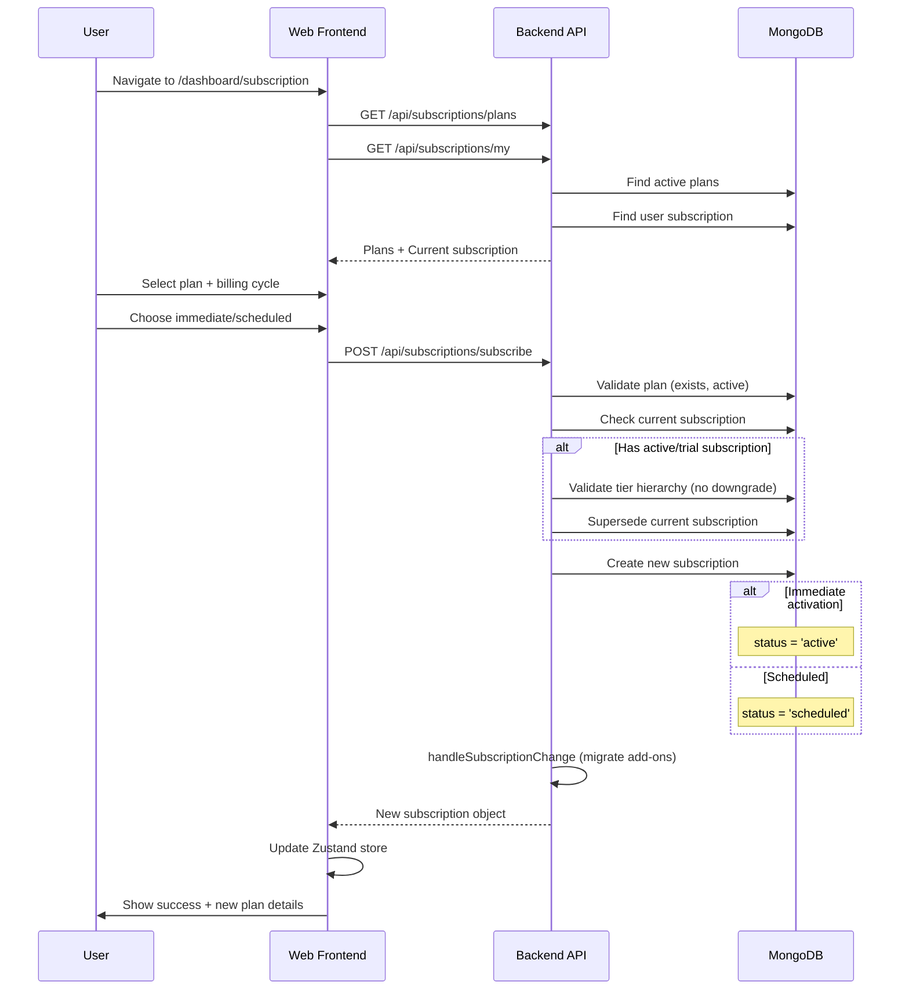
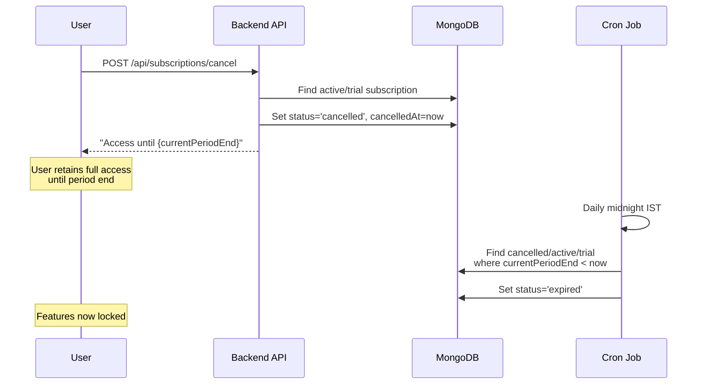
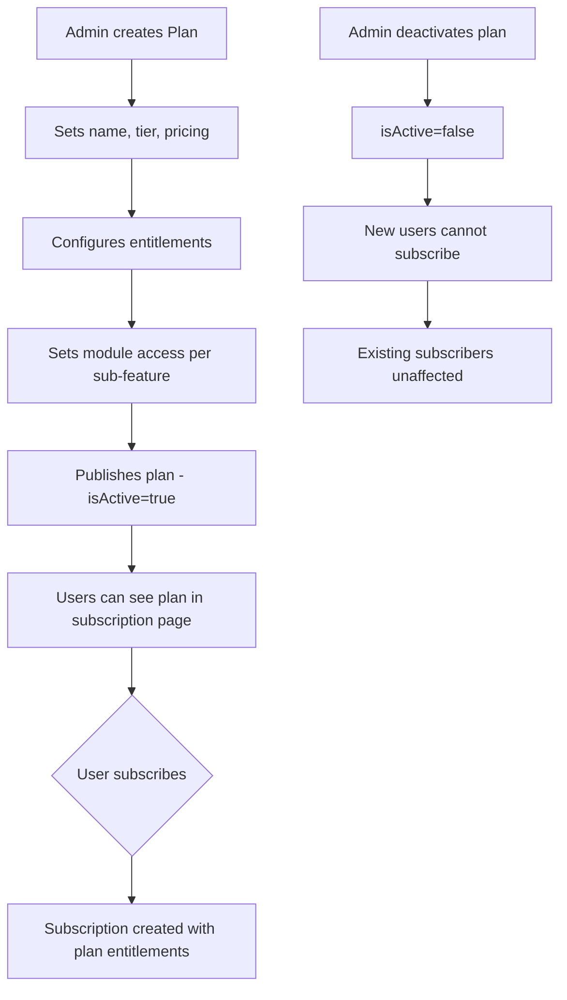
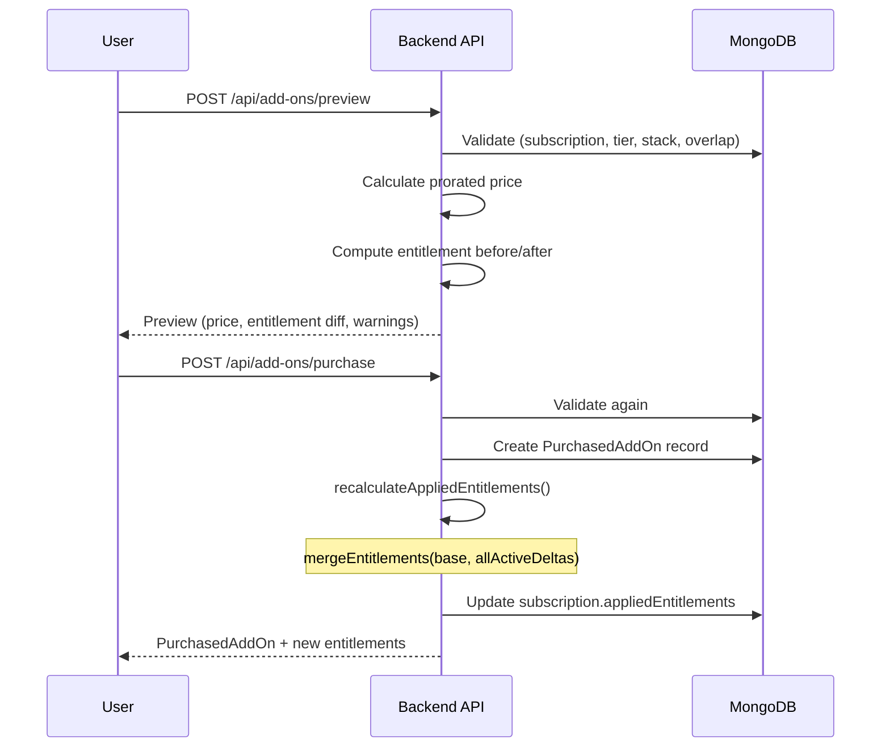
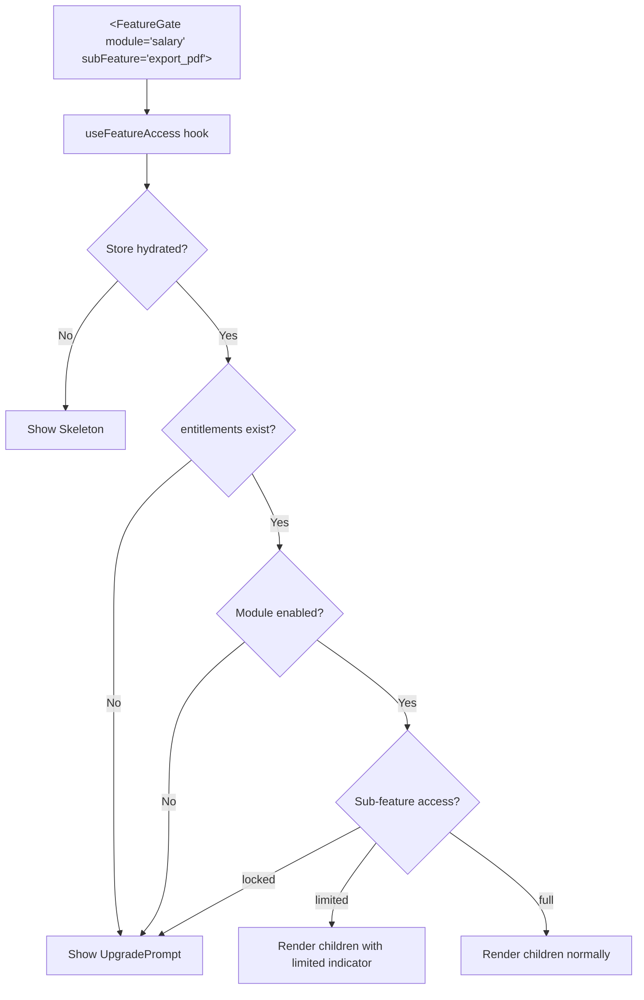
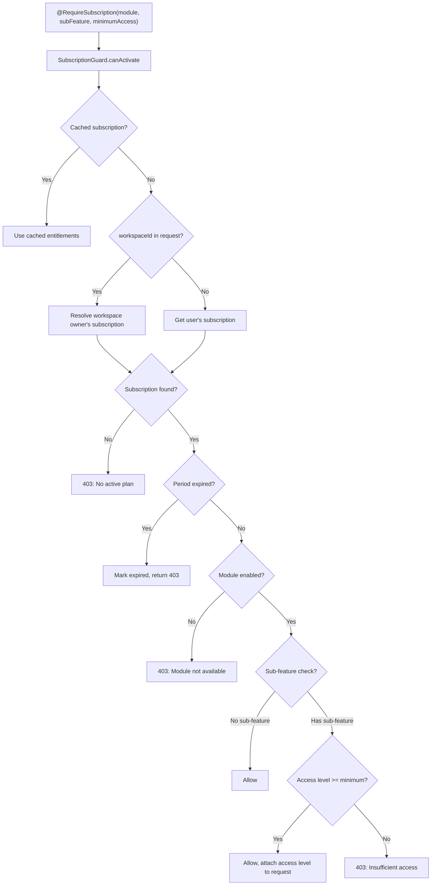

# Subscription Module - Complete Technical Documentation

> **Product:** Zari360 (Zari360)  
> **Generated:** 2026-04-12  
> **Scope:** Web (User + Admin) + Backend + Mobile (summary)  
> **Position in Architecture:**  
> `TEAM MODULE` (who) → `SUBSCRIPTION MODULE` (gate) → `SALARY MODULE` (feature)

---

## Table of Contents

1. [Module Overview](#1-module-overview)
2. [Subscription Plans & Pricing Structure](#2-subscription-plans--pricing-structure)
3. [Frontend Architecture - User Side](#3-frontend-architecture--user-side)
4. [Frontend Architecture - Admin Side](#4-frontend-architecture--admin-side)
5. [API Integration (Frontend → Backend)](#5-api-integration-frontend--backend)
6. [Backend Architecture & Business Logic](#6-backend-architecture--business-logic)
7. [Database Schema](#7-database-schema)
8. [Background Jobs & Scheduled Tasks](#8-background-jobs--scheduled-tasks)
9. [Notifications & Communication](#9-notifications--communication)
10. [Data Flow Diagrams](#10-data-flow-diagrams)
11. [Access Control & Permissions](#11-access-control--permissions)
12. [Environment Variables & Configuration](#12-environment-variables--configuration)
13. [Third-Party Integrations](#13-third-party-integrations)
14. [Error Handling & Edge Cases](#14-error-handling--edge-cases)
15. [Known Limitations / TODOs](#15-known-limitations--todos)
16. [Mobile App - Comparison Summary](#16-mobile-app--comparison-summary)

---

## 1. Module Overview

### Business Purpose

The Subscription Module is the **monetization and access-control layer** of Zari360. It determines which features, modules, and quotas each user/company can access based on their active subscription plan and purchased add-ons. It sits between the Team Module (who the users are) and all feature modules (what they can do).

### Actors

| Actor                        | Description                                                                                                                       |
| ---------------------------- | --------------------------------------------------------------------------------------------------------------------------------- |
| **End User / Company Admin** | Subscribes to plans, purchases add-ons, views subscription status, manages billing cycle                                          |
| **Super Admin (Platform)**   | Creates/manages plans, tiers, add-on definitions; assigns/revokes subscriptions; overrides entitlements; monitors subscriber base |
| **System (Cron Jobs)**       | Processes scheduled subscription activations, expires stale subscriptions, expires add-ons                                        |

### Subscription Lifecycle (Current State)

```
Registration → Free Plan Auto-Created (trial status)
     ↓
Plan Selection → Subscribe (immediate or scheduled)
     ↓
Active Subscription → Feature Access Unlocked
     ↓
[Optional] Purchase Add-Ons → Entitlements Expanded
     ↓
Cancellation → Graceful (access until period end)
     ↓
Expiration → Features Locked → Resubscribe
```

> **CRITICAL NOTE:** There is **no payment gateway integration**. All plan changes are recorded as subscriptions without actual monetary transactions. Payment processing is entirely absent from the codebase.

---

## 2. Subscription Plans & Pricing Structure

### Plan Definition

Plans are stored in MongoDB via the `Plan` schema. Each plan belongs to a tier and defines pricing + entitlements.

**Source:** `zari360-backend/src/modules/subscriptions/schemas/plan.schema.ts`

| Attribute      | Type               | Description                                              |
| -------------- | ------------------ | -------------------------------------------------------- |
| `name`         | `string`           | Display name (e.g., "Free Forever", "Pro Plan")          |
| `tier`         | `string`           | One of: `free`, `starter`, `pro`, `enterprise`, `custom` |
| `isActive`     | `boolean`          | Whether plan is available for subscription               |
| `monthlyPrice` | `number`           | Monthly price (stored as number, no currency metadata)   |
| `yearlyPrice`  | `number`           | Yearly price                                             |
| `entitlements` | `PlanEntitlements` | Complete feature/quota configuration                     |

### Tier Hierarchy

**Source:** `zari360-backend/src/common/enums/plan-tier.enum.ts`

| Tier         | Order | Legacy Aliases | Description           |
| ------------ | ----- | -------------- | --------------------- |
| `free`       | 0     | -              | Default for new users |
| `starter`    | 1     | `growth`       | Entry paid tier       |
| `pro`        | 3     | `business`     | Full feature access   |
| `enterprise` | 4     | -              | Unlimited quotas      |
| `custom`     | 5     | -              | Admin-assigned only   |

Tier hierarchy is enforced: users **cannot downgrade** to a lower tier while active. They must cancel first.

### Billing Cycles

- **Monthly** and **Yearly** for user self-service
- **Lifetime** available for admin-assigned subscriptions and add-ons
- Period calculation: `currentPeriodStart` + cycle duration = `currentPeriodEnd`

### Pricing Model

- **Flat pricing** per plan (not per-seat)
- No currency field - prices stored as raw numbers
- No tax/GST calculation
- No multi-currency support
- Monthly vs yearly pricing defined separately per plan (no automatic discount calculation)

### Entitlements Structure

**Source:** `zari360-backend/src/modules/subscriptions/schemas/plan.schema.ts` - `PlanEntitlements` class

```typescript
PlanEntitlements {
  maxWorkspaces: number            // Default: 1
  maxMembersPerWorkspace: number   // Default: 5
  maxTotalMembers: number          // Default: 5
  modules: AppModule[]             // Legacy: enabled module list
  features: PlanFeatures {
    export: boolean
    apiAccess: boolean
    advancedRbac: boolean
    customRoles: boolean
    shifts: boolean
    bills: boolean
  }
  moduleAccess: ModuleAccessEntry[] {  // Granular per-module control
    module: AppModule
    enabled: boolean
    subFeatures: {
      key: string
      access: 'locked' | 'limited' | 'full'
    }[]
  }
  platformAccess: 'web_only' | 'mobile_only' | 'both'  // Default: 'both'
  maxSessionsPerPlatform: number   // Default: 3
  maxSessionsTotal: number         // Default: 5
}
```

### Default Free Plan (Auto-Created on Bootstrap)

| Quota                 | Value                    |
| --------------------- | ------------------------ |
| Max Workspaces        | 1                        |
| Max Members/Workspace | 5                        |
| Max Total Members     | 5                        |
| Enabled Modules       | Team, Attendance, Salary |
| Locked Modules        | Shifts, Holidays, Roles  |
| Platform Access       | Both                     |
| Sessions per Platform | 3                        |
| Total Sessions        | 5                        |

### Tier Feature Matrix (Sub-Feature Defaults)

**Source:** `zari360-backend/src/common/constants/module-features.registry.ts` - `TIER_SUBFEATURE_DEFAULTS`

| Feature Area                                  | Free   | Starter | Pro  | Enterprise |
| --------------------------------------------- | ------ | ------- | ---- | ---------- |
| **Attendance** mark/edit                      | Full   | Full    | Full | Full       |
| **Attendance** bulk_mark                      | Locked | Full    | Full | Full       |
| **Attendance** export_pdf/excel               | Locked | Limited | Full | Full       |
| **Attendance** auto_present, advanced_filters | Locked | Full    | Full | Full       |
| **Team** add/edit/remove_member               | Full   | Full    | Full | Full       |
| **Team** bulk*import, bulk*\* ops             | Locked | Locked  | Full | Full       |
| **Team** grant_app_access                     | Locked | Locked  | Full | Full       |
| **Team** export_team                          | Locked | Locked  | Full | Full       |
| **Team** designation_filter                   | Locked | Full    | Full | Full       |
| **Salary** generate/record/edit               | Full   | Full    | Full | Full       |
| **Salary** adjustments (all)                  | Full   | Full    | Full | Full       |
| **Salary** export_pdf/excel                   | Locked | Limited | Full | Full       |
| **Salary** advance/split/bulk payments        | Locked | Full    | Full | Full       |
| **Salary** commission_tracking                | Locked | Full    | Full | Full       |
| **Salary** salary_components/CTC              | Locked | Locked  | Full | Full       |
| **Salary** payslip_generation                 | Locked | Limited | Full | Full       |
| **Salary** statutory_compliance/tds           | Locked | Locked  | Full | Full       |
| **Salary** compliance_exports, form16         | Locked | Locked  | Full | Full       |
| **Salary** payslip_email                      | Locked | Locked  | Full | Full       |
| **Salary** gratuity/lwf/tds_management        | Locked | Locked  | Full | Full       |
| **Salary** fnf_settlement                     | Locked | Locked  | Full | Full       |
| **Salary** salary_increments                  | Locked | Full    | Full | Full       |
| **Salary** reverse_payment                    | Full   | Full    | Full | Full       |
| **Shifts** create/edit/delete                 | Locked | Full    | Full | Full       |
| **Holidays** create/edit/delete               | Locked | Full    | Full | Full       |
| **Roles** create/edit/delete                  | Locked | Full    | Full | Full       |
| **Settings** edit_settings                    | Full   | Full    | Full | Full       |
| **Settings** workspace/pdf_branding           | Locked | Locked  | Full | Full       |

> **"Limited" access** means the feature works but with restrictions (e.g., watermarked PDF exports). Only features with `supportsLimited: true` in the registry can have limited access.

---

## 3. Frontend Architecture - User Side

### File Structure

```
zari360-web/
  app/dashboard/subscription/page.tsx     # Main subscription page (1236 lines)
  components/subscription/
    FeatureGate.tsx                         # Declarative feature gating wrapper
    UpgradePrompt.tsx                       # Upgrade CTA for locked features
    ModuleLockedPage.tsx                    # Full-page module lock screen
  hooks/
    useFeatureAccess.ts                     # Hook: check feature access level
    useAddOns.ts                            # Hook: manage add-on state
  lib/
    store.ts                                # Zustand: useSubscriptionStore
    actions/subscriptions.actions.ts        # Server actions: user subscription ops
    actions/add-ons.actions.ts              # Server actions: add-on ops
    api/modules/subscriptions.api.ts        # Client-side API wrapper
    utils/subscription.utils.ts             # Status colors, formatters, builders
    constants/feature-access.registry.ts    # Frontend feature registry mirror
```

### Subscription Page (`app/dashboard/subscription/page.tsx`)

**Route:** `/dashboard/subscription`

**Functionality:**

- Displays current subscription status (plan, tier, billing cycle, period dates)
- Shows scheduled subscription if one exists
- Plan selection with monthly/yearly toggle
- Subscribe/upgrade flow with immediate or scheduled activation
- Force-activate a scheduled subscription
- Cancel scheduled subscription
- Cancel active subscription (graceful)
- Subscription history table (all past subscriptions)
- **Add-ons tab:**
  - Available add-ons list
  - Purchase modal with preview (prorated pricing, entitlement before/after)
  - Active add-ons with cancel option
  - Quantity selection for stackable add-ons
  - Billing cycle selection

**State Management:**

- Local state for UI (modals, loading, selections)
- Zustand store (`useSubscriptionStore`) synced on data refresh
- Server actions for all API calls

### Feature Gating Components

#### `FeatureGate` (`components/subscription/FeatureGate.tsx`)

Declarative wrapper controlling feature visibility based on subscription.

```tsx
<FeatureGate module="salary" subFeature="export_pdf">
  <ExportButton /> {/* Only renders if user has access */}
</FeatureGate>
```

**Props:** `module`, `subFeature?`, `fallback?`, `compact?`, `showLimitedIndicator?`, `onLimitedAction?`

**Behavior:**

- Loading → shows Skeleton
- Locked → shows `UpgradePrompt` (or custom fallback)
- Limited → renders children (optionally triggers callback)
- Full → renders children

#### `ModuleGate` (exported from same file)

Module-level variant - checks only if module is enabled.

#### `UpgradePrompt` (`components/subscription/UpgradePrompt.tsx`)

- Compact mode: inline lock icon + "Upgrade" link
- Full mode: `EmptyStateLayout` with lock icon, feature name, plan info, upgrade button
- Links to `/dashboard/subscription`

#### `ModuleLockedPage` (`components/subscription/ModuleLockedPage.tsx`)

Full-page lock screen with "Go to Dashboard" and "Upgrade Plan" buttons.

### Hooks

#### `useFeatureAccess(module, subFeature?)` (`hooks/useFeatureAccess.ts`)

```typescript
Returns: {
  hasAccess: boolean; // true if not locked
  accessLevel: 'locked' | 'limited' | 'full';
  isLimited: boolean;
  isLocked: boolean;
  isLoading: boolean;
}
```

Reads from `useSubscriptionStore().entitlements.moduleAccess[]`.

#### `useAddOns()` (`hooks/useAddOns.ts`)

```typescript
Returns: {
  activeAddOns: PurchasedAddOn[]
  availableAddOns: AddOnDefinition[]
  isLoading: boolean
  error: string | null
  refresh(): Promise<void>
  hasAddOn(slug): boolean
  getAddOnQuantity(definitionId): number
}
```

Fetches from server actions, caches in Zustand store.

### State Management - `useSubscriptionStore`

**Source:** `zari360-web/lib/store.ts`

```typescript
useSubscriptionStore {
  subscription: Subscription | null
  entitlements: PlanEntitlements | null
  plan: { _id, name, tier } | null
  activeAddOns: PurchasedAddOn[]
  isLoading: boolean
  isHydrated: boolean

  setSubscription(subscription)
  setEntitlements(entitlements)
  setActiveAddOns(addOns)
  clearSubscription()
  setLoading(loading)
}
```

- Persisted to `localStorage` key: `cr_subscription`
- Auto-rehydrated on page load via `onRehydrateStorage`

### Utility Functions

**Source:** `zari360-web/lib/utils/subscription.utils.ts`

| Function                                        | Purpose                                       |
| ----------------------------------------------- | --------------------------------------------- |
| `SUBSCRIPTION_STATUS_COLORS`                    | Map status → Ant Design tag color             |
| `getTierColor(tiers, tierKey)`                  | Get tier display color                        |
| `formatEntitlementValue(value)`                 | Format -1 as "Unlimited"                      |
| `countUnlockedFeatures(moduleAccess)`           | Count enabled modules and non-locked features |
| `buildEmptyPlanEntitlements(overrides?)`        | Create empty entitlements object              |
| `getDefaultModuleAccessEntries(defaultAccess?)` | Create default module access array            |
| `TIER_COLORS`                                   | Predefined color palette for tier assignment  |

---

## 4. Frontend Architecture - Admin Side

### File Structure

```
zari360-web/
  app/admin/
    plans/page.tsx                          # Plan CRUD management
    subscriptions/page.tsx                  # Subscriber management
    tiers/page.tsx                          # Tier template management
    add-ons/page.tsx                        # Add-on definition management
  components/admin/
    module-access-editor.tsx                # Interactive module/feature access editor
    entitlements-form-fields.tsx            # Reusable entitlement input fields
    entitlements-display.tsx                # Display entitlements (inline/table)
    revoke-subscription-modal.tsx           # Subscription revocation modal
  lib/actions/admin.actions.ts             # Server actions: admin operations
```

### Plans Management (`app/admin/plans/page.tsx`)

**Route:** `/admin/plans`

**Features:**

- List all plans (active + inactive)
- Create new plan with:
  - Name, tier selection
  - Monthly and yearly pricing
  - Full entitlements configuration (quotas, modules, features)
  - Module access editor (per-module, per-sub-feature access levels)
  - Platform access (web_only, mobile_only, both)
  - Session limits
- Edit existing plan (shows affected subscriber count)
- Deactivate plan (soft delete - sets `isActive: false`)
- Activate/deactivate toggle with impact warning

### Subscriptions Management (`app/admin/subscriptions/page.tsx`)

**Route:** `/admin/subscriptions`

**Features:**

- Paginated subscriber list (20 per page)
- Filters:
  - Status: active, cancelled, expired, trial, superseded
  - Source: self, admin
- Columns: user, plan, tier, billing cycle, status, period dates, source
- **Edit subscription modal:**
  - Change status (active, cancelled, expired, trial)
  - Update expiration date
  - Override entitlements (quotas, module access)
  - Add admin notes
- **Assign plan to user** (select user, plan, billing cycle)
- **Custom assign** (manual entitlements, custom dates, platform overrides)
- **Revoke subscription** with action options:
  - `no-plan`: Remove all access
  - `assign-free`: Auto-assign free plan
  - `assign-plan`: Assign a specific target plan
- View subscription history per user

### Tiers Management (`app/admin/tiers/page.tsx`)

**Route:** `/admin/tiers`

**Features:**

- List all tiers with display order and color
- Create/edit tiers:
  - Name, key (slug), display order, color
  - Description
  - Default entitlements (maxWorkspaces, maxMembers)
  - Default module access per tier
  - Active/inactive toggle
- Delete tiers

### Add-Ons Management (`app/admin/add-ons/page.tsx`)

**Route:** `/admin/add-ons`

**Features:**

- List all add-on definitions (active + inactive)
- Create/edit add-on definitions:
  - Name, slug, description
  - Type: `quota` | `module` | `subfeature`
  - Pricing: monthly, yearly, lifetime
  - Entitlement delta configuration:
    - Quota type: extra workspaces, members, sessions
    - Module type: target module to unlock
    - Sub-feature type: target module + key + access level
  - Stackable toggle with max stack limit
  - Applicable tiers (empty = all)
  - Default billing cycle
  - Allowed billing cycles
  - Prorated billing toggle
  - Min days before renewal requirement
  - Display order and active status
- View user's purchased add-ons
- Admin assign add-on to user
- Admin revoke add-on

### Admin Components

#### `ModuleAccessEditor` (`components/admin/module-access-editor.tsx`)

Interactive UI for configuring per-module, per-sub-feature access levels.

- Per-module enable/disable toggles
- Per-sub-feature access level selector (Locked / Limited / Full)
- "Limited" option only shown for features with `supportsLimited: true`
- Bulk actions: Enable All, Disable All, Set All Full
- Color-coded module headers (attendance=blue, team=green, salary=gold, etc.)

#### `EntitlementsFormFields` (`components/admin/entitlements-form-fields.tsx`)

Reusable form fields for quota entitlements.

- Input mode (numeric) and select mode (predefined options)
- Fields: maxWorkspaces, maxMembersPerWorkspace, maxTotalMembers
- "Unlimited" support (-1 value) with tooltip quick-set

#### `EntitlementsDisplay` (`components/admin/entitlements-display.tsx`)

Display entitlements in two layouts:

- **Inline:** emoji-based compact display
- **Descriptions table:** full table with labels
- Shows purchased vs. applied entitlements when add-ons are active
- Module access statistics (X modules, Y features unlocked)

#### `RevokeSubscriptionModal` (`components/admin/revoke-subscription-modal.tsx`)

Modal for force-cancelling subscriptions.

- Action selection: No Plan / Assign Free Plan / Assign Different Plan
- Reason/note textarea
- Danger-styled confirm button

---

## 5. API Integration (Frontend → Backend)

### User-Facing API Endpoints

**Base:** `GET/POST /api/subscriptions`

| Method | Endpoint                              | Auth   | Description                                                                |
| ------ | ------------------------------------- | ------ | -------------------------------------------------------------------------- |
| GET    | `/api/subscriptions/plans`            | Public | List all active plans                                                      |
| GET    | `/api/subscriptions/tiers`            | Public | List all active tiers                                                      |
| GET    | `/api/subscriptions/feature-registry` | Public | Get module features and access levels                                      |
| GET    | `/api/subscriptions/my`               | JWT    | Get current subscription + scheduled + entitlements + usage                |
| POST   | `/api/subscriptions/subscribe`        | JWT    | Subscribe to plan (body: `{ planId, billingCycle, activateImmediately? }`) |
| POST   | `/api/subscriptions/cancel`           | JWT    | Cancel active subscription (graceful)                                      |
| POST   | `/api/subscriptions/force-activate`   | JWT    | Force-activate a scheduled subscription (body: `{ subscriptionId }`)       |
| POST   | `/api/subscriptions/cancel-scheduled` | JWT    | Cancel a scheduled subscription (body: `{ subscriptionId }`)               |
| GET    | `/api/subscriptions/my/subscriptions` | JWT    | Get subscription history                                                   |

### User-Facing Add-On Endpoints

**Base:** `GET/POST /api/add-ons`

| Method | Endpoint                  | Auth | Description                                                                  |
| ------ | ------------------------- | ---- | ---------------------------------------------------------------------------- |
| GET    | `/api/add-ons`            | JWT  | List available add-ons for user's tier                                       |
| GET    | `/api/add-ons/my`         | JWT  | Get user's active purchased add-ons                                          |
| POST   | `/api/add-ons/purchase`   | JWT  | Purchase an add-on (body: `{ addOnDefinitionId, quantity?, billingCycle? }`) |
| POST   | `/api/add-ons/preview`    | JWT  | Preview purchase pricing + entitlement changes                               |
| POST   | `/api/add-ons/:id/cancel` | JWT  | Cancel a purchased add-on                                                    |

### Admin API Endpoints

**Base:** `/api/admin` - All require `JwtAuthGuard` + `IsAdminGuard`

#### Subscription Management

| Method | Endpoint                                 | Description                                    |
| ------ | ---------------------------------------- | ---------------------------------------------- |
| GET    | `/api/admin/subscriptions`               | Paginated list of all subscriptions            |
| POST   | `/api/admin/subscriptions/assign`        | Assign plan to user                            |
| POST   | `/api/admin/subscriptions/custom-assign` | Custom assign with manual entitlements + dates |
| PATCH  | `/api/admin/subscriptions/:id`           | Update subscription status/entitlements        |
| POST   | `/api/admin/subscriptions/:id/cancel`    | Cancel user subscription (graceful)            |
| DELETE | `/api/admin/subscriptions/:id`           | Revoke subscription (force cancel + action)    |
| GET    | `/api/admin/users/:id/subscription`      | Get user's current subscription                |
| GET    | `/api/admin/users/:id/subscriptions`     | Get user's subscription history                |

#### Plan Management

| Method | Endpoint               | Description                           |
| ------ | ---------------------- | ------------------------------------- |
| GET    | `/api/admin/plans`     | Get all plans (including inactive)    |
| POST   | `/api/admin/plans`     | Create new plan                       |
| PATCH  | `/api/admin/plans/:id` | Update plan                           |
| DELETE | `/api/admin/plans/:id` | Soft-delete plan (set isActive=false) |

#### Tier Management

| Method | Endpoint               | Description   |
| ------ | ---------------------- | ------------- |
| GET    | `/api/admin/tiers`     | Get all tiers |
| POST   | `/api/admin/tiers`     | Create tier   |
| PATCH  | `/api/admin/tiers/:id` | Update tier   |
| DELETE | `/api/admin/tiers/:id` | Delete tier   |

#### Add-On Management

| Method | Endpoint                             | Description                   |
| ------ | ------------------------------------ | ----------------------------- |
| GET    | `/api/admin/add-ons/definitions`     | Get all add-on definitions    |
| POST   | `/api/admin/add-ons/definitions`     | Create add-on definition      |
| PATCH  | `/api/admin/add-ons/definitions/:id` | Update add-on definition      |
| DELETE | `/api/admin/add-ons/definitions/:id` | Soft-delete add-on definition |
| GET    | `/api/admin/users/:id/add-ons`       | Get user's purchased add-ons  |
| POST   | `/api/admin/add-ons/assign`          | Admin assign add-on to user   |
| DELETE | `/api/admin/add-ons/:id/revoke`      | Admin revoke add-on           |

#### Maintenance

| Method | Endpoint                                            | Description                   |
| ------ | --------------------------------------------------- | ----------------------------- |
| POST   | `/api/admin/maintenance/repair-module-access`       | Fix empty moduleAccess arrays |
| POST   | `/api/admin/maintenance/repair-missing-subfeatures` | Add missing sub-feature keys  |

### Webhook Endpoints

> **NOT IMPLEMENTED.** No payment gateway webhook endpoints exist.

### Server Actions (Web Frontend)

**User-facing:** `zari360-web/lib/actions/subscriptions.actions.ts`

| Action                                        | Description                                     |
| --------------------------------------------- | ----------------------------------------------- |
| `getPlans()`                                  | Fetch all active plans                          |
| `getTiers()`                                  | Fetch tier definitions                          |
| `getMySubscription(token?)`                   | Get current subscription + entitlements + usage |
| `subscribeToPlan(data)`                       | Subscribe to plan                               |
| `cancelSubscription()`                        | Cancel subscription                             |
| `forceActivateSubscription(subscriptionId)`   | Force activate                                  |
| `cancelScheduledSubscription(subscriptionId)` | Cancel scheduled                                |
| `getMySubscriptionHistory()`                  | Get history                                     |

**Add-ons:** `zari360-web/lib/actions/add-ons.actions.ts`

| Action                               | Description                    |
| ------------------------------------ | ------------------------------ |
| `getAvailableAddOns()`               | List available add-ons         |
| `getMyAddOns()`                      | Get purchased add-ons          |
| `previewAddOnPurchase(payload)`      | Preview pricing + entitlements |
| `purchaseAddOn(payload)`             | Purchase add-on                |
| `cancelAddOn(addOnId, reason)`       | Cancel add-on                  |
| `getAddOnDefinitions()`              | Admin: get all definitions     |
| `createAddOnDefinition(payload)`     | Admin: create                  |
| `updateAddOnDefinition(id, payload)` | Admin: update                  |
| `deleteAddOnDefinition(id)`          | Admin: delete                  |
| `getUserAddOns(userId)`              | Admin: get user's add-ons      |
| `adminAssignAddOn(payload)`          | Admin: assign to user          |
| `adminRevokeAddOn(addOnId)`          | Admin: revoke                  |

**Admin subscriptions:** `zari360-web/lib/actions/admin.actions.ts`

| Action                                                          | Description                          |
| --------------------------------------------------------------- | ------------------------------------ |
| `getAdminSubscriptions(params?)`                                | Paginated list                       |
| `getAdminPlans()`                                               | All plans                            |
| `createAdminPlan(data)`                                         | Create plan                          |
| `updateAdminPlan(id, data)`                                     | Update plan (returns affected count) |
| `deleteAdminPlan(id)`                                           | Delete plan                          |
| `adminAssignPlan(data)`                                         | Assign plan to user                  |
| `adminCustomAssignPlan(data)`                                   | Custom assignment                    |
| `adminUpdateSubscription(id, data)`                             | Update subscription                  |
| `adminCancelSubscription(id, data)`                             | Cancel subscription                  |
| `adminRevokeSubscription(id, data)`                             | Revoke with action                   |
| `getTiers()` / `createTier()` / `updateTier()` / `deleteTier()` | Tier CRUD                            |

---

## 6. Backend Architecture & Business Logic

### 6a. Module Structure

```
zari360-backend/src/
  modules/
    subscriptions/
      subscriptions.module.ts               # DI: imports ScheduleModule
      subscriptions.controller.ts           # User-facing routes
      subscriptions.service.ts              # Core business logic + cron jobs
      schemas/
        plan.schema.ts                      # Plan + PlanEntitlements + PlanFeatures
        subscription.schema.ts              # Subscription document
        tier.schema.ts                      # Tier templates
        app-settings.schema.ts              # Global settings (freeTierEnabled)
      dto/
        subscription.dto.ts                 # UpdateSubscriptionDto, CreatePlanDto
    add-ons/
      add-ons.module.ts
      add-ons.controller.ts                 # User-facing add-on routes
      add-ons.service.ts                    # Add-on business logic + cron
      schemas/
        add-on-definition.schema.ts         # AddOnDefinition + enums
        purchased-add-on.schema.ts          # PurchasedAddOn + enums
      dto/
        purchase-add-on.dto.ts              # PurchaseAddOnDto, CancelAddOnDto
        create-add-on-definition.dto.ts     # CRUD DTOs
        admin-assign-add-on.dto.ts          # Admin assignment DTO
      utils/
        entitlement-merge.util.ts           # mergeEntitlements(), calculateTotalActiveQuantity()
    admin/
      admin.controller.ts                   # Admin routes (all subscription management)
      admin.service.ts                      # Admin business logic
      dto/
        admin.dto.ts                        # AdminAssignPlanDto, AdminCustomAssignDto, etc.
        tier.dto.ts                         # CreateTierDto, UpdateTierDto
  common/
    guards/
      subscription.guard.ts                 # SubscriptionGuard + @RequireSubscription decorator
    constants/
      module-features.registry.ts           # MODULE_FEATURES_REGISTRY (58 sub-features)
      cron.constants.ts                     # CRON_SCHEDULES, CRON_TIMEZONES
    enums/
      plan-tier.enum.ts                     # PlanTier enum + TIER_ORDER
      feature-access.enum.ts                # FeatureAccessLevel: locked | limited | full
      modules.enum.ts                       # AppModule: 8 modules
      platform-access.enum.ts               # PlatformAccess: web_only | mobile_only | both
```

### 6b. Subscription Lifecycle Logic

#### Plan Creation and Versioning

- Plans are created via admin API with full entitlements configuration
- **No plan versioning** - editing a plan affects all future operations on that plan
- `updatePlan` returns count of affected subscribers
- Plans are soft-deleted (set `isActive: false`), never hard-deleted

#### Subscription Activation

**User self-service (`subscribe` method):**

1. Validates plan exists and is active
2. Checks current subscription status:
   - If active/trial: validates tier hierarchy (no downgrade), supersedes current
   - If scheduled: blocks (must cancel first)
   - If cancelled: supersedes, creates new
3. Creates new subscription:
   - `activateImmediately=true`: status=`active`, period starts now
   - `activateImmediately=false`: status=`scheduled`, period starts at current period end
4. Calls `addOnsService.handleSubscriptionChange()` to migrate add-ons

**Admin assignment:**

- `assignPlan`: creates subscription with `source='admin'`, `assignedBy=adminId`
- `customAssignPlan`: allows manual entitlements, custom dates, platform overrides

#### Free Plan Auto-Creation

**Source:** `subscriptions.service.ts` → `createFreeSubscription()`

- Called during user registration
- Creates subscription with `status='trial'`, `billingCycle='monthly'`
- Period end set to +100 years (effectively unlimited)
- Respects `AppSettings.freeTierEnabled` flag
- If no free plan exists in DB, auto-creates "Free Forever" plan

#### Upgrade Logic

- Tier hierarchy enforced: `free(0) < starter(1) < pro(3) < enterprise(4)`
- Cannot subscribe to same plan (early renewal not supported)
- Cannot downgrade to lower tier while active
- Current subscription superseded, new one created
- Add-ons migrated to new subscription (or superseded if new plan covers them)

#### Downgrade Logic

- **Not directly supported.** User must cancel current plan first, then subscribe to lower tier.
- Cancelled subscription retains access until `currentPeriodEnd`

#### Cancellation Logic

- **Graceful cancellation:** sets `status='cancelled'`, records `cancelledAt`
- User retains access until `currentPeriodEnd`
- Cron job marks as `expired` after period ends
- No immediate feature lockout on cancellation

#### Subscription Revocation (Admin)

Three actions available:

1. **No Plan:** All subscriptions superseded, user loses all access
2. **Assign Free:** Supersede + auto-create free subscription
3. **Assign Plan:** Supersede + create subscription for specified plan

All active add-ons cancelled on revocation.

### 6c. Payment Processing

> **NOT IMPLEMENTED.**
>
> There is **no payment gateway integration** anywhere in the codebase. No Razorpay, Stripe, PayU, or any other payment SDK is present. Subscriptions are created and activated without any monetary transaction. The `monthlyPrice` and `yearlyPrice` fields on plans exist but are purely informational - they are not connected to any billing system.
>
> **Implications:**
>
> - No payment verification before subscription activation
> - No webhook handling for payment events
> - No retry logic for failed payments
> - No refund handling
> - No payment method management UI

### 6d. Invoice & Billing

> **NOT IMPLEMENTED.**
>
> There is no invoice generation, invoice numbering, tax calculation, PDF invoice generation, or invoice email delivery in the subscription module. The `bills` module exists separately for tracking payable/receivable bills but is unrelated to subscription billing.

### 6e. Feature Gating

**Backend Guard:** `zari360-backend/src/common/guards/subscription.guard.ts`

#### `@RequireSubscription` Decorator

```typescript
@RequireSubscription({
  module: AppModule.SALARY,
  subFeature: 'export_pdf',
  minimumAccess: FeatureAccessLevel.LIMITED
})
handleSalaryExport() { ... }
```

Supports multiple requirements on same handler (array).

#### Guard Flow

1. Extracts `@RequireSubscription` metadata from handler
2. Gets user's entitlements (cached in `request._cachedSubscription`)
3. **Workspace context resolution:** If `workspaceId` param or `x-workspace-id` header present, checks workspace owner's subscription (not the requesting user's)
4. Checks module is `enabled` in `moduleAccess[]`
5. If `subFeature` specified:
   - Looks up sub-feature access level
   - Compares against `minimumAccess` (default: `LIMITED`)
   - Throws 403 if insufficient
6. Attaches access level to `request._featureAccess`
7. **Legacy fallback:** if `moduleAccess` is empty but `modules[]` array includes the module, treats as enabled with FULL access

#### Access Level Hierarchy

```
LOCKED (0) → Feature unavailable (403 Forbidden)
LIMITED (1) → Partial access (e.g., watermarked exports)
FULL (2)    → Unrestricted access
```

#### Static Helpers

```typescript
SubscriptionGuard.getFeatureAccess(request); // Get access level from request
SubscriptionGuard.isLimitedAccess(request); // Check if limited
```

### 6f. Add-On System

**Source:** `zari360-backend/src/modules/add-ons/add-ons.service.ts`

#### Three Add-On Types

| Type         | Purpose                             | Entitlement Delta                                                                                                    |
| ------------ | ----------------------------------- | -------------------------------------------------------------------------------------------------------------------- |
| `quota`      | Extra workspaces, members, sessions | `extraWorkspaces`, `extraMembersPerWorkspace`, `extraTotalMembers`, `extraSessionsPerPlatform`, `extraSessionsTotal` |
| `module`     | Unlock a locked module              | `targetModule` → enables module in moduleAccess                                                                      |
| `subfeature` | Upgrade sub-feature access level    | `targetSubFeatureModule` + `targetSubFeatureKey` + `targetSubFeatureAccess`                                          |

#### Purchase Validation (Error Codes)

| Code                         | Condition                                  |
| ---------------------------- | ------------------------------------------ |
| `NO_ACTIVE_SUBSCRIPTION`     | No active/trial subscription               |
| `SUBSCRIPTION_CANCELLED`     | In cancellation grace period               |
| `ADDON_INACTIVE`             | Add-on definition deactivated              |
| `TIER_NOT_ELIGIBLE`          | User's tier not in `applicableTiers`       |
| `STACK_LIMIT_REACHED`        | Already at max stack quantity              |
| `MODULE_ALREADY_INCLUDED`    | Plan already includes target module        |
| `SUBFEATURE_ALREADY_COVERED` | Plan already provides equal/higher access  |
| `TOO_CLOSE_TO_RENEWAL`       | Less than `minDaysBeforeRenewal` days left |

#### Entitlement Merge Logic

**Source:** `zari360-backend/src/modules/add-ons/utils/entitlement-merge.util.ts`

```typescript
mergeEntitlements(basePlanEntitlements, activeAddOnDeltas[]): PlanEntitlements
```

**Algorithm:**

1. Deep-clone base entitlements
2. For each delta (with quantity multiplier):
   - Add numeric quotas (workspaces, members, sessions)
   - If `targetModule`: add to `modules[]`, enable in `moduleAccess[]`
   - If `targetSubFeature`: upgrade access level (only if higher - `locked < limited < full`)
   - Apply `featureOverrides` (boolean flags)
3. Return merged result as new `PlanEntitlements`

#### Prorated Billing Calculation

```
proratedPrice = (fullPrice / 30) * daysUntilRenewal
```

- Uses 30-day month assumption
- Rounded to 2 decimal places
- Only if `allowProratedBilling=true` on definition

#### Add-On Migration on Plan Change

When user upgrades plan, `handleSubscriptionChange()`:

1. Finds all active add-ons on old subscription
2. For each add-on:
   - If new plan includes the add-on's target module/feature → mark as `superseded`
   - Otherwise → migrate to new subscription (update `subscriptionId`)
3. Recalculate applied entitlements

### 6g. Coupon & Discount Logic

> **NOT IMPLEMENTED.**
>
> There is no coupon, promo code, or discount system in the codebase. No coupon schema, no validation flow, no application logic.

---

## 7. Database Schema

### 7.1 Plan

**Collection:** `plans`  
**Source:** `zari360-backend/src/modules/subscriptions/schemas/plan.schema.ts`

| Field          | Type               | Default  | Description                                   |
| -------------- | ------------------ | -------- | --------------------------------------------- |
| `_id`          | `ObjectId`         | auto     | Primary key                                   |
| `name`         | `string`           | required | Plan display name                             |
| `tier`         | `string`           | required | Tier key (free/starter/pro/enterprise/custom) |
| `isActive`     | `boolean`          | `true`   | Active/inactive toggle                        |
| `monthlyPrice` | `number`           | required | Monthly price                                 |
| `yearlyPrice`  | `number`           | required | Yearly price                                  |
| `entitlements` | `PlanEntitlements` | required | Full entitlements object (see section 2)      |
| `createdAt`    | `Date`             | auto     | Timestamp                                     |
| `updatedAt`    | `Date`             | auto     | Timestamp                                     |

### 7.2 Subscription

**Collection:** `subscriptions`  
**Source:** `zari360-backend/src/modules/subscriptions/schemas/subscription.schema.ts`

| Field                      | Type                           | Default     | Description                                                               |
| -------------------------- | ------------------------------ | ----------- | ------------------------------------------------------------------------- |
| `_id`                      | `ObjectId`                     | auto        | Primary key                                                               |
| `userId`                   | `ObjectId` (ref: User)         | required    | Subscriber                                                                |
| `planId`                   | `ObjectId` (ref: Plan)         | required    | Subscribed plan                                                           |
| `status`                   | `enum`                         | `'trial'`   | `active` / `cancelled` / `expired` / `trial` / `superseded` / `scheduled` |
| `billingCycle`             | `enum`                         | `'monthly'` | `monthly` / `yearly` / `lifetime`                                         |
| `currentPeriodStart`       | `Date`                         | optional    | Billing period start                                                      |
| `currentPeriodEnd`         | `Date`                         | optional    | Billing period end (access expires after this)                            |
| `purchasedEntitlements`    | `PlanEntitlements`             | required    | Original plan entitlements at time of subscription                        |
| `appliedEntitlements`      | `PlanEntitlements`             | required    | Merged with add-ons (what's actually enforced)                            |
| `cancelledAt`              | `Date`                         | optional    | When cancelled                                                            |
| `source`                   | `enum`                         | `'self'`    | `self` (user) / `admin` (assigned)                                        |
| `assignedBy`               | `ObjectId` (ref: User)         | optional    | Admin who assigned                                                        |
| `assignedAt`               | `Date`                         | optional    | When assigned by admin                                                    |
| `assignmentNote`           | `string`                       | optional    | Admin note                                                                |
| `previousSubscriptionId`   | `ObjectId` (ref: Subscription) | optional    | Link to superseded subscription                                           |
| `hasActiveAddOns`          | `boolean`                      | `false`     | Performance flag                                                          |
| `adminEntitlementOverride` | `boolean`                      | `false`     | If true, skip add-on recalculation                                        |
| `createdAt`                | `Date`                         | auto        | Timestamp                                                                 |
| `updatedAt`                | `Date`                         | auto        | Timestamp                                                                 |

**Indexes:**

- `{ userId: 1 }` - unique partial where `status IN ['active', 'trial']` (one active/trial per user)
- `{ userId: 1, status: 1 }` - unique partial where `status = 'scheduled'` (one scheduled per user)

### 7.3 Tier

**Collection:** `tiers`  
**Source:** `zari360-backend/src/modules/subscriptions/schemas/tier.schema.ts`

| Field                 | Type                        | Default          | Description                               |
| --------------------- | --------------------------- | ---------------- | ----------------------------------------- |
| `_id`                 | `ObjectId`                  | auto             | Primary key                               |
| `name`                | `string`                    | required         | Display name                              |
| `key`                 | `string`                    | required, unique | Slug (free/starter/pro/enterprise/custom) |
| `displayOrder`        | `number`                    | `0`              | Sort order                                |
| `color`               | `string`                    | `'default'`      | UI color code                             |
| `description`         | `string`                    | optional         | Description                               |
| `isActive`            | `boolean`                   | `true`           | Active toggle                             |
| `defaultEntitlements` | `TierDefaultEntitlements`   | `{}`             | Default quotas for this tier              |
| `defaultModuleAccess` | `TierDefaultModuleAccess[]` | `[]`             | Default module/feature access             |
| `createdAt`           | `Date`                      | auto             | Timestamp                                 |
| `updatedAt`           | `Date`                      | auto             | Timestamp                                 |

**Sub-document - TierDefaultEntitlements:**

| Field                    | Type     | Default |
| ------------------------ | -------- | ------- |
| `maxWorkspaces`          | `number` | `1`     |
| `maxMembersPerWorkspace` | `number` | `5`     |
| `maxTotalMembers`        | `number` | `5`     |

### 7.4 AddOnDefinition

**Collection:** `addondefinitions`  
**Source:** `zari360-backend/src/modules/add-ons/schemas/add-on-definition.schema.ts`

| Field                  | Type                    | Default           | Description                                        |
| ---------------------- | ----------------------- | ----------------- | -------------------------------------------------- |
| `_id`                  | `ObjectId`              | auto              | Primary key                                        |
| `name`                 | `string`                | required          | Display name                                       |
| `description`          | `string`                | optional          | Description                                        |
| `slug`                 | `string`                | required, indexed | Unique identifier                                  |
| `type`                 | `enum`                  | required          | `quota` / `module` / `subfeature`                  |
| `entitlementDelta`     | `AddOnEntitlementDelta` | required          | What this add-on adds                              |
| `monthlyPrice`         | `number`                | `0`               | Monthly price                                      |
| `yearlyPrice`          | `number`                | `0`               | Yearly price                                       |
| `lifetimePrice`        | `number`                | `0`               | Lifetime/one-time price                            |
| `stackable`            | `boolean`               | `false`           | Can buy multiple                                   |
| `maxStack`             | `number`                | `-1`              | Max quantity (-1=unlimited, 0=not stackable)       |
| `applicableTiers`      | `string[]`              | `[]`              | Eligible tiers (empty=all)                         |
| `isActive`             | `boolean`               | `true`            | Active toggle                                      |
| `displayOrder`         | `number`                | `0`               | Sort order                                         |
| `defaultBillingCycle`  | `enum`                  | `'monthly'`       | `monthly` / `yearly` / `lifetime` / `subscription` |
| `allowedBillingCycles` | `string[]`              | all four          | Allowed cycles                                     |
| `allowProratedBilling` | `boolean`               | `true`            | Enable prorated pricing                            |
| `minDaysBeforeRenewal` | `number`                | `0`               | Minimum days before renewal to allow purchase      |
| `createdAt`            | `Date`                  | auto              | Timestamp                                          |
| `updatedAt`            | `Date`                  | auto              | Timestamp                                          |

**Sub-document - AddOnEntitlementDelta:**

| Field                      | Type                      | Description                        |
| -------------------------- | ------------------------- | ---------------------------------- |
| `extraWorkspaces`          | `number`                  | Additional workspaces (quota type) |
| `extraMembersPerWorkspace` | `number`                  | Additional members per workspace   |
| `extraTotalMembers`        | `number`                  | Additional total members           |
| `extraSessionsPerPlatform` | `number`                  | Additional sessions per platform   |
| `extraSessionsTotal`       | `number`                  | Additional total sessions          |
| `targetModule`             | `AppModule`               | Module to unlock (module type)     |
| `targetSubFeatureModule`   | `AppModule`               | Target module for sub-feature      |
| `targetSubFeatureKey`      | `string`                  | Target sub-feature key             |
| `targetSubFeatureAccess`   | `FeatureAccessLevel`      | Target access level                |
| `featureOverrides`         | `Record<string, boolean>` | Override PlanFeatures flags        |

### 7.5 PurchasedAddOn

**Collection:** `purchasedaddons`  
**Source:** `zari360-backend/src/modules/add-ons/schemas/purchased-add-on.schema.ts`

| Field               | Type                              | Default    | Description                                        |
| ------------------- | --------------------------------- | ---------- | -------------------------------------------------- |
| `_id`               | `ObjectId`                        | auto       | Primary key                                        |
| `userId`            | `ObjectId` (ref: User)            | required   | Purchaser                                          |
| `subscriptionId`    | `ObjectId` (ref: Subscription)    | required   | Parent subscription                                |
| `addOnDefinitionId` | `ObjectId` (ref: AddOnDefinition) | required   | Definition reference                               |
| `status`            | `enum`                            | `'active'` | `active` / `expired` / `cancelled` / `superseded`  |
| `source`            | `enum`                            | `'self'`   | `self` / `admin`                                   |
| `assignedBy`        | `ObjectId` (ref: User)            | optional   | Admin who assigned                                 |
| `entitlementDelta`  | `AddOnEntitlementDelta`           | required   | Snapshot of delta at purchase time                 |
| `billingCycle`      | `enum`                            | required   | `monthly` / `yearly` / `lifetime` / `subscription` |
| `quantity`          | `number`                          | `1`        | Quantity purchased                                 |
| `activatedAt`       | `Date`                            | optional   | Activation timestamp                               |
| `expiresAt`         | `Date`                            | optional   | Expiration timestamp                               |
| `cancelledAt`       | `Date`                            | optional   | Cancellation timestamp                             |
| `proratedAmount`    | `number`                          | `0`        | Calculated prorated cost                           |
| `note`              | `string`                          | optional   | Admin note                                         |
| `createdAt`         | `Date`                            | auto       | Timestamp                                          |
| `updatedAt`         | `Date`                            | auto       | Timestamp                                          |

**Indexes:**

- `{ userId: 1, status: 1 }`
- `{ subscriptionId: 1, status: 1 }`
- `{ userId: 1, addOnDefinitionId: 1, status: 1 }`

### 7.6 AppSettings

**Collection:** `appsettings`  
**Source:** `zari360-backend/src/modules/subscriptions/schemas/app-settings.schema.ts`

| Field                              | Type       | Default  | Description                               |
| ---------------------------------- | ---------- | -------- | ----------------------------------------- |
| `_id`                              | `ObjectId` | auto     | Primary key                               |
| `freeTierEnabled`                  | `boolean`  | `true`   | Global toggle for free tier auto-creation |
| `defaultBranding`                  | `Object`   | optional | Platform default branding                 |
| `defaultBranding.logo`             | `string`   | optional | Default logo URL                          |
| `defaultBranding.pdfHeaderLogo`    | `string`   | optional | PDF header logo URL                       |
| `defaultBranding.pdfWatermarkLogo` | `string`   | optional | PDF watermark logo URL                    |
| `defaultBranding.pdfFooterDetails` | `string`   | optional | PDF footer text                           |
| `createdAt`                        | `Date`     | auto     | Timestamp                                 |
| `updatedAt`                        | `Date`     | auto     | Timestamp                                 |

### Schema Relationships

```
User (1) ──── (0..N) Subscription ──── (1) Plan
  │                      │
  │                      └── (0..N) PurchasedAddOn ──── (1) AddOnDefinition
  │
  └── Workspace (owner's subscription used for feature gating)

Plan ──── Tier (via plan.tier string key)
```

---

## 8. Background Jobs & Scheduled Tasks

**Source:** `zari360-backend/src/common/constants/cron.constants.ts`

| Job                             | Schedule               | Timezone | Service                | Description                                                                                                                               |
| ------------------------------- | ---------------------- | -------- | ---------------------- | ----------------------------------------------------------------------------------------------------------------------------------------- |
| `processScheduledSubscriptions` | `0 0 * * *` (midnight) | IST      | `SubscriptionsService` | Finds `status='scheduled'` with `currentPeriodStart <= now`, supersedes old, activates new                                                |
| `expireStaleSubscriptions`      | `0 0 * * *` (midnight) | IST      | `SubscriptionsService` | Marks `active`/`trial` with `currentPeriodEnd < now` as `expired`                                                                         |
| `processExpiredAddOns`          | `5 0 * * *` (00:05)    | UTC      | `AddOnsService`        | Expires add-ons by time (`expiresAt < now`) and by parent (subscription expired/superseded). Recalculates entitlements in batches of 100. |

### Jobs NOT Present

- No renewal reminder job
- No auto-renewal billing job
- No trial expiry notification
- No grace period enforcement
- No payment retry job
- No subscription analytics aggregation

---

## 9. Notifications & Communication

> **NOT IMPLEMENTED.**
>
> The subscription module has **zero email, push notification, or in-app notification triggers**. Specifically, none of these exist:
>
> - Welcome/activation email after subscription
> - Payment success confirmation
> - Invoice delivery
> - Renewal reminder (7 days, 3 days, 1 day)
> - Payment failure alert
> - Subscription cancelled confirmation
> - Trial expiry warning
> - Plan change confirmation
> - Add-on purchase/cancellation confirmation
> - Near-expiry in-app banner
>
> The backend has a `mail` module (Nodemailer) and `notifications` module (Firebase) but neither is wired to any subscription events.

---

## 10. Data Flow Diagrams

### 10.1 Subscription Purchase Flow (User Self-Service)



### 10.2 Subscription Cancellation & Expiry Flow



### 10.3 Admin Plan Management Flow



### 10.4 Add-On Purchase Flow



### 10.5 Feature Gating Flow (Frontend)



### 10.6 Feature Gating Flow (Backend)



---

## 11. Access Control & Permissions

### Who Can Do What

| Action                                | End User  | Company Admin | Super Admin              |
| ------------------------------------- | --------- | ------------- | ------------------------ |
| View own subscription                 | Yes       | Yes           | Yes (any user)           |
| Subscribe to plan                     | Yes       | Yes           | Yes (assign to any user) |
| Cancel own subscription               | Yes       | Yes           | Yes (cancel any user)    |
| Purchase add-ons                      | Yes       | Yes           | Yes (assign to any user) |
| View all subscriptions                | No        | No            | Yes                      |
| Create/edit/delete plans              | No        | No            | Yes                      |
| Create/edit/delete tiers              | No        | No            | Yes                      |
| Create/edit/delete add-on definitions | No        | No            | Yes                      |
| Override entitlements                 | No        | No            | Yes                      |
| Revoke subscription                   | No        | No            | Yes                      |
| Force activate scheduled              | Yes (own) | Yes (own)     | Yes (any)                |
| Repair module access                  | No        | No            | Yes                      |

### Guards Used

| Guard               | Where                       | Purpose                |
| ------------------- | --------------------------- | ---------------------- |
| `JwtAuthGuard`      | All authenticated endpoints | JWT token validation   |
| `IsAdminGuard`      | `/api/admin/*`              | Super admin role check |
| `SubscriptionGuard` | Feature endpoints           | Plan/feature gating    |

### Role-Based Feature Visibility

Feature gating operates at **two levels:**

1. **Frontend:** `FeatureGate`/`ModuleGate` components hide UI for locked features
2. **Backend:** `@RequireSubscription` decorator + `SubscriptionGuard` enforces at API level

Both check the same `appliedEntitlements.moduleAccess[]` data.

### Workspace Context

The subscription guard resolves entitlements based on **workspace owner**, not the requesting user. If a team member accesses a workspace, the owner's subscription determines feature access for everyone in that workspace.

---

## 12. Environment Variables & Configuration

### Subscription-Specific Configuration

| Variable / Setting                      | Location                 | Description                                 |
| --------------------------------------- | ------------------------ | ------------------------------------------- |
| `freeTierEnabled`                       | `AppSettings` collection | Global toggle for free tier auto-creation   |
| `CRON_SCHEDULES.EVERY_DAY_AT_MIDNIGHT`  | Code constant            | `0 0 * * *` - subscription cron schedule    |
| `CRON_SCHEDULES.EVERY_DAY_AT_00_05_UTC` | Code constant            | `5 0 * * *` - add-on expiry cron schedule   |
| `CRON_TIMEZONES.IST`                    | Code constant            | `Asia/Kolkata` - subscription cron timezone |
| `CRON_TIMEZONES.UTC`                    | Code constant            | `UTC` - add-on expiry timezone              |

### Missing Environment Variables

> The following environment variables one would expect for a subscription system **do not exist:**
>
> - Payment gateway API keys (Razorpay/Stripe publishable + secret)
> - Webhook secret keys
> - Trial period duration (hardcoded as +100 years for free plan)
> - Grace period duration (not implemented)
> - Plan IDs in env (all from DB)
> - Tax rate configuration (not implemented)

---

## 13. Third-Party Integrations

> **NONE.**
>
> The subscription module has **zero third-party integrations:**
>
> - **Payment gateway:** Not integrated (no Razorpay, Stripe, PayU, Paddle, etc.)
> - **Subscription management platform:** Not used (no Chargebee, Paddle, Zoho Subscriptions)
> - **Email service:** Nodemailer exists in the project but is not wired to subscription events
> - **PDF generation:** jsPDF exists for exports but not for subscription invoices
> - **Analytics/metrics:** No subscription analytics service integrated
>
> All subscription operations are internal CRUD operations on MongoDB.

---

## 14. Error Handling & Edge Cases

### Handled Edge Cases

| Scenario                                | Handling                                                    |
| --------------------------------------- | ----------------------------------------------------------- |
| Subscribe to same plan                  | Blocked: "Already subscribed. Early renewal not supported." |
| Downgrade while active                  | Blocked: "Cancel your current plan first"                   |
| Subscribe while scheduled exists        | Blocked: "Cancel scheduled plan first"                      |
| Duplicate active subscription           | Prevented by unique partial index on `(userId, status)`     |
| Empty moduleAccess on legacy data       | Auto-repaired on bootstrap + `repairEmptyModuleAccess()`    |
| Missing sub-feature keys                | Auto-repaired on bootstrap + `repairMissingSubFeatures()`   |
| Legacy tier names (growth/business)     | Resolved via `resolveTierKey()` mapping                     |
| Workspace member checking owner's plan  | Guard resolves workspace owner's subscription               |
| Expired subscription during guard check | Inline expiry: marks as expired, returns 403                |
| Add-on for already-included module      | Blocked: `MODULE_ALREADY_INCLUDED`                          |
| Add-on for already-covered sub-feature  | Blocked: `SUBFEATURE_ALREADY_COVERED`                       |
| Stackable add-on at max limit           | Blocked: `STACK_LIMIT_REACHED`                              |
| Purchase too close to renewal           | Blocked: `TOO_CLOSE_TO_RENEWAL`                             |
| Admin override prevents recalculation   | `adminEntitlementOverride=true` skips add-on merge          |

### Unhandled Edge Cases

| Scenario                                      | Current State                                                                   |
| --------------------------------------------- | ------------------------------------------------------------------------------- |
| Payment gateway timeout/failure               | No payment gateway exists                                                       |
| Double payment prevention                     | No payment processing exists                                                    |
| Concurrent subscription changes               | No optimistic locking / race condition protection                               |
| Downgrade with usage exceeding new limits     | No usage validation on plan change                                              |
| User deletes account with active subscription | No cleanup cascade                                                              |
| Refund after partial use                      | No refund system exists                                                         |
| Free plan deleted from DB while users have it | Bootstrap auto-recreates, but existing subscriptions may reference deleted plan |
| Two cron jobs updating same subscription      | Both run at midnight IST - potential race condition                             |

---

## 15. Known Limitations / TODOs

### Critical - Must Address Before Monetization

1. **No Payment Gateway Integration** - Cannot collect money. All subscriptions are free in practice.
2. **No Invoice Generation** - No invoices, receipts, or billing documents.
3. **No GST/Tax Handling** - No tax calculation, GSTIN collection, or compliant invoice format.
4. **No Auto-Renewal** - Subscriptions expire; no mechanism to auto-charge and renew.
5. **No Trial Period Management** - Free plan uses `status='trial'` with +100 year expiry. No real trial-to-paid conversion flow.

### High - Required for Production

6. **No Email Notifications** - Zero subscription-related emails (welcome, renewal reminder, cancellation, payment).
7. **No Dunning/Retry Logic** - No handling of failed payments or grace periods.
8. **Early Renewal Not Supported** - Explicitly blocked in code ("Early renewal is not supported yet").
9. **No Proration on Upgrades** - Upgrading creates a new full period; no credit for remaining time on old plan.
10. **No Plan Versioning** - Editing a plan affects the plan object directly; no snapshot isolation for existing subscribers.
11. **No Revenue Analytics** - No MRR, churn rate, cohort analysis, or subscription metrics dashboard.
12. **No Currency Support** - Prices are raw numbers with no currency metadata.
13. **No Cancellation Exit Survey** - No feedback collection on cancellation.
14. **No Pause Subscription** - Only cancel (with graceful period) or revoke.

### Medium - Growth Features

15. **No Per-Seat Pricing** - Flat plan pricing only; member quotas are separate from billing.
16. **No Usage-Based Billing** - No metered billing (e.g., per payslip generated).
17. **No Coupon/Promo Code System** - No discount mechanism.
18. **No Win-Back Flow** - No re-engagement for churned subscribers.
19. **No Multi-Currency** - Prices stored as numbers, no locale-aware formatting.
20. **No Subscription Analytics Dashboard (Admin)** - No charts/metrics for subscriber trends.
21. **No Audit Log for Subscription Changes** - Admin actions are not logged separately.
22. **No UPI Autopay / NACH Mandate** - No Indian recurring payment methods.

### Code-Level Notes

- `subscriptions.service.ts:629` - "Early renewal is not supported yet" (explicit TODO)
- Free plan period end set to +100 years - works but is a hack
- `console.log` statements throughout `createFreeSubscription` and `add-ons.service.ts` - should be replaced with proper Logger
- `expireStaleSubscriptions` and `processScheduledSubscriptions` both run at same cron time (midnight IST) - potential ordering issue
- `proratedAmount` field on `PurchasedAddOn` stores calculated value but no actual payment is processed

---

## 16. Mobile App - Comparison Summary

### What Exists in Mobile (`zari360-app/`)

| Feature                       | Mobile                        | Web                                                |
| ----------------------------- | ----------------------------- | -------------------------------------------------- |
| Plan selection screen         | Basic (monthly/yearly toggle) | Full (entitlements comparison, multiple modals)    |
| Subscription status display   | Basic banner                  | Detailed with period dates, scheduled info         |
| Subscribe/cancel              | Yes                           | Yes                                                |
| Billing history               | No                            | Yes (full table)                                   |
| Scheduled upgrades            | No                            | Yes (schedule + force activate)                    |
| Add-ons UI                    | No                            | Full (purchase, preview, manage)                   |
| Feature gating components     | No (service-based check only) | Yes (`FeatureGate`, `ModuleGate`, `UpgradePrompt`) |
| Prorated pricing preview      | No                            | Yes                                                |
| Watermark support for limited | Code exists in service        | Used in exports                                    |
| Subscription history          | No                            | Yes                                                |
| Admin subscription management | No (admin is web-only)        | Full                                               |

### Mobile Architecture

- **No Zustand store** for subscriptions - uses `SubscriptionService` class with AsyncStorage caching (1-hour TTL)
- Service methods: `getPlan()`, `getSubscriptionStatus()`, `hasActiveSubscription()`, `getStatusDisplay()`, `checkFeatureAccess()`
- Feature access registry mirrors backend (`constants/feature-access.registry.ts`)
- Add-on types defined but no purchase UI
- Same backend API endpoints used

---

## Appendix: Key File Reference

| File Path                                                                  | Description                     |
| -------------------------------------------------------------------------- | ------------------------------- |
| `zari360-backend/src/modules/subscriptions/subscriptions.controller.ts`    | User-facing API routes          |
| `zari360-backend/src/modules/subscriptions/subscriptions.service.ts`       | Core lifecycle logic + cron     |
| `zari360-backend/src/modules/subscriptions/schemas/plan.schema.ts`         | Plan + entitlements schema      |
| `zari360-backend/src/modules/subscriptions/schemas/subscription.schema.ts` | Subscription schema             |
| `zari360-backend/src/modules/subscriptions/schemas/tier.schema.ts`         | Tier schema                     |
| `zari360-backend/src/modules/subscriptions/schemas/app-settings.schema.ts` | Global settings schema          |
| `zari360-backend/src/modules/add-ons/add-ons.controller.ts`                | Add-on API routes               |
| `zari360-backend/src/modules/add-ons/add-ons.service.ts`                   | Add-on business logic + cron    |
| `zari360-backend/src/modules/add-ons/schemas/add-on-definition.schema.ts`  | Add-on definition schema        |
| `zari360-backend/src/modules/add-ons/schemas/purchased-add-on.schema.ts`   | Purchased add-on schema         |
| `zari360-backend/src/modules/add-ons/utils/entitlement-merge.util.ts`      | Entitlement merge algorithm     |
| `zari360-backend/src/modules/admin/admin.controller.ts`                    | Admin API routes                |
| `zari360-backend/src/common/guards/subscription.guard.ts`                  | Feature gating guard            |
| `zari360-backend/src/common/constants/module-features.registry.ts`         | 58 sub-features + tier defaults |
| `zari360-backend/src/common/constants/cron.constants.ts`                   | Cron schedules                  |
| `zari360-backend/src/common/enums/plan-tier.enum.ts`                       | Tier hierarchy                  |
| `zari360-backend/src/common/enums/feature-access.enum.ts`                  | Access levels                   |
| `zari360-backend/src/common/enums/modules.enum.ts`                         | Module enum                     |
| `zari360-backend/src/common/enums/platform-access.enum.ts`                 | Platform access enum            |
| `zari360-web/app/dashboard/subscription/page.tsx`                          | User subscription page          |
| `zari360-web/app/admin/plans/page.tsx`                                     | Admin plan management           |
| `zari360-web/app/admin/subscriptions/page.tsx`                             | Admin subscription management   |
| `zari360-web/app/admin/tiers/page.tsx`                                     | Admin tier management           |
| `zari360-web/app/admin/add-ons/page.tsx`                                   | Admin add-on management         |
| `zari360-web/components/subscription/FeatureGate.tsx`                      | Feature gating component        |
| `zari360-web/components/subscription/UpgradePrompt.tsx`                    | Upgrade prompt                  |
| `zari360-web/components/subscription/ModuleLockedPage.tsx`                 | Module lock page                |
| `zari360-web/components/admin/module-access-editor.tsx`                    | Module access UI editor         |
| `zari360-web/components/admin/entitlements-form-fields.tsx`                | Entitlements form               |
| `zari360-web/components/admin/entitlements-display.tsx`                    | Entitlements display            |
| `zari360-web/components/admin/revoke-subscription-modal.tsx`               | Revoke modal                    |
| `zari360-web/hooks/useFeatureAccess.ts`                                    | Feature access hook             |
| `zari360-web/hooks/useAddOns.ts`                                           | Add-ons hook                    |
| `zari360-web/lib/store.ts`                                                 | Zustand subscription store      |
| `zari360-web/lib/actions/subscriptions.actions.ts`                         | User server actions             |
| `zari360-web/lib/actions/admin.actions.ts`                                 | Admin server actions            |
| `zari360-web/lib/actions/add-ons.actions.ts`                               | Add-on server actions           |
| `zari360-web/lib/utils/subscription.utils.ts`                              | Utility functions               |
| `zari360-web/lib/constants/feature-access.registry.ts`                     | Frontend feature registry       |
