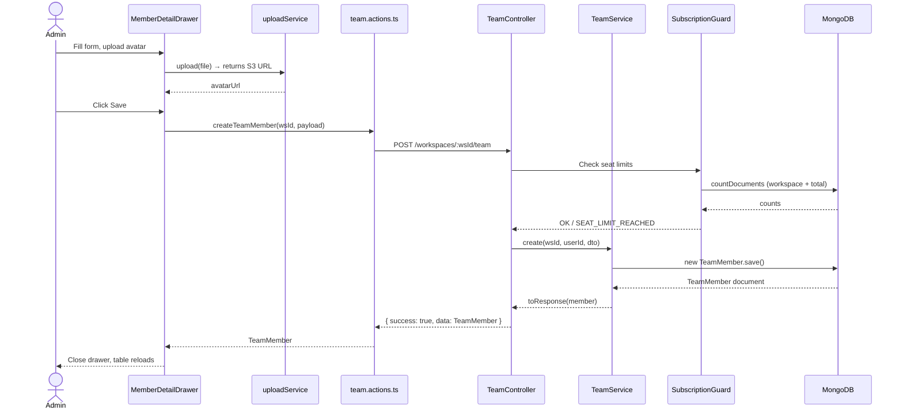
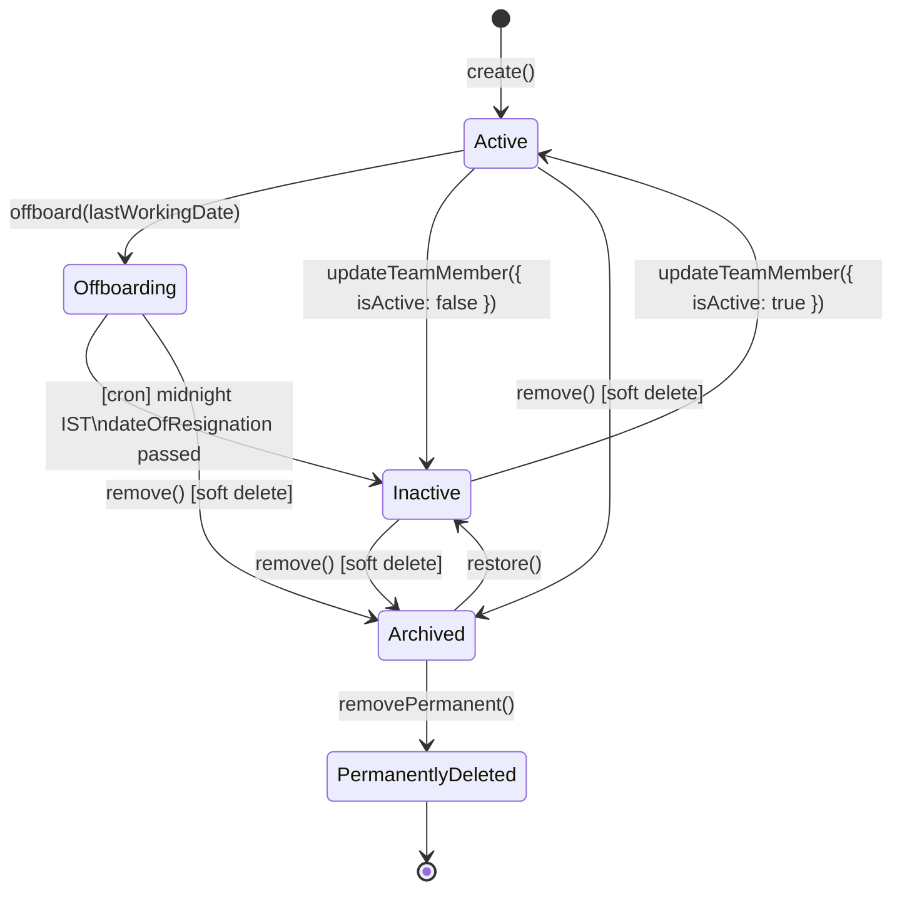
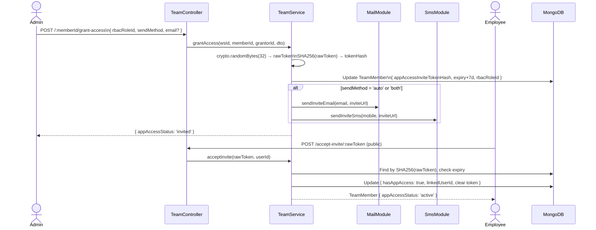

# Team Module - Technical Documentation

> **Project:** Zari360 (Zari360)
> **Module:** Team Management
> **Entry Point:** `zari360-web/app/dashboard/team/page.tsx`
> **Last Updated:** 2026-04-10

---

## Table of Contents

1. [Module Overview](#1-module-overview)
2. [Frontend Architecture](#2-frontend-architecture)
   - [File & Folder Structure](#21-file--folder-structure)
   - [Page Routing & Navigation](#22-page-routing--navigation)
   - [Component Inventory](#23-component-inventory)
   - [State Management](#24-state-management)
   - [Key TypeScript Types](#25-key-typescript-types)
   - [UX Flow (Step-by-Step)](#26-ux-flow-step-by-step)
3. [API Integration (Frontend → Backend)](#3-api-integration-frontend--backend)
   - [Client API Module](#31-client-api-module)
   - [Server Actions](#32-server-actions)
   - [Error Handling & Loading States](#33-error-handling--loading-states)
4. [Backend Processes](#4-backend-processes)
   - [Module Dependencies](#41-module-dependencies)
   - [Controller Endpoints](#42-controller-endpoints)
   - [Service Layer](#43-service-layer)
   - [Database Schemas](#44-database-schemas)
   - [Cron Jobs](#45-cron-jobs)
   - [Subscription Guards & Feature Limits](#46-subscription-guards--feature-limits)
5. [Data Flow Diagrams](#5-data-flow-diagrams)
6. [Key Business Rules & Logic](#6-key-business-rules--logic)
7. [Environment Variables & Configuration](#7-environment-variables--configuration)
8. [Known Limitations & TODOs](#8-known-limitations--todos)

---

## 1. Module Overview

The **Team Module** is the employee management core of the Zari360 platform. It enables workspace administrators and managers to:

- **Create and manage employees** - full profile with personal info, employment details, salary configuration, bank/UPI details, and emergency contacts.
- **Control member lifecycle** - Active → Offboarding → Inactive → Archived → Permanently Deleted, with restore paths at each reversible stage.
- **Assign schedules** - shift-based (predefined shift) or custom (per-week timings and weekly-off days).
- **Set compensation** - monthly fixed, hourly rate, or CTC with component breakdown linked to salary module.
- **Grant mobile app access** - invite team members via email/SMS with a 7-day token to link their account to the mobile app.
- **Bulk operations** - activate, deactivate, archive, and restore multiple members at once.
- **Import members** - clone members from another owned workspace.
- **Export member data** - PDF or Excel with configurable field selection (16 fields).
- **Manage RBAC** - assign permission roles that control what each member can view or do.

> **Note:** There are two distinct "member" concepts in this system:
>
> - **TeamMember** - the HR/payroll record for a company employee (this module).
> - **WorkspaceMember** - a platform collaborator who has been given access to the workspace dashboard. These are separate entities.

---

## 2. Frontend Architecture

### 2.1 File & Folder Structure

```
zari360-web/
│
├── app/dashboard/team/
│   └── page.tsx                              # Main team management page (1,171 lines)
│
├── components/
│   ├── dashboard/
│   │   └── MemberDetailDrawer.tsx            # Add / Edit / View member drawer (1,956 lines)
│   ├── ui/
│   │   ├── BulkActionBar.tsx                 # Bulk operations toolbar (136 lines)
│   │   ├── DsTable.tsx                       # Design system table
│   │   ├── DsModal.tsx                       # Design system modal
│   │   ├── DsAvatar.tsx                      # Avatar with fallback initials
│   │   ├── DsBadge.tsx                       # DsTag + DsStatusDot
│   │   └── FileUpload.tsx                    # File upload with preview
│   ├── export/
│   │   ├── ExportButton.tsx                  # Triggers export data load
│   │   ├── ExportModal.tsx                   # Format and field selector modal
│   │   └── FieldSelector.tsx                 # Per-field toggle checkboxes
│   └── subscription/
│       ├── UpgradePrompt.tsx                 # Inline upgrade CTA
│       ├── FeatureGate.tsx                   # Wrapper that hides locked content
│       └── ModuleLockedPage.tsx              # Full-page locked state
│
├── lib/
│   ├── actions/
│   │   ├── team.actions.ts                   # Server Actions: CRUD + bulk ops (99 lines)
│   │   ├── shifts.actions.ts                 # Shift CRUD (used inline in drawer)
│   │   └── roles.actions.ts                  # RBAC role listing
│   ├── api/
│   │   ├── modules/team.api.ts               # Client-side Axios wrappers (26 lines)
│   │   └── endpoints.ts                      # Endpoint URL builders (team section)
│   ├── exportFields/
│   │   └── teamFields.ts                     # 16 exportable field definitions (133 lines)
│   ├── store.ts                              # Zustand: useWorkspaceStore, useSubscriptionStore
│   ├── utils.ts                              # parseApiError, fmt helpers
│   └── constants.ts                          # LIST_ALL_LIMIT = 200
│
├── hooks/
│   ├── useDebounce.ts                        # Debounce search input
│   ├── useWorkspace.ts                       # Current workspace accessor
│   ├── useFeatureAccess.ts                   # Subscription feature gate hook
│   └── useExport.ts                          # Export orchestration hook
│
└── types/index.ts                            # All shared TypeScript interfaces
```

---

### 2.2 Page Routing & Navigation

The Team module occupies a single route with all state managed via in-memory Zustand and local `useState`.

| Route             | Component                     | Description                                                     |
| ----------------- | ----------------------------- | --------------------------------------------------------------- |
| `/dashboard/team` | `app/dashboard/team/page.tsx` | Main team table with filters, bulk actions, and drawer triggers |

There are no sub-routes. All modals and drawers (add, edit, view, offboard, grant access) are mounted inline within the page.

---

### 2.3 Component Inventory

#### Main Page (`app/dashboard/team/page.tsx`)

Responsibilities:

- Fetches team members on load via `listTeam()` server action
- Determines **client mode** vs **server mode** based on `LIST_ALL_LIMIT` (200) threshold
- Manages filter state: `search`, `status`, `designationFilter`, `shiftFilter`, `roleFilter`
- Manages `selectedRowKeys` + computes `SelectionMode` for bulk actions
- Renders `DsTable`, `BulkActionBar`, `SalarySummaryCards`, `MemberDetailDrawer`, `ExportButton`

**Smart Pagination Logic:**

- If total members ≤ 200 → **client mode**: all data in memory, filtering/sorting done locally
- If total members > 200 → **server mode**: every filter/sort/page change triggers a fresh API call

---

#### `MemberDetailDrawer` (`components/dashboard/MemberDetailDrawer.tsx`)

The most complex component in the module - a multi-tab Ant Design `Drawer` used for adding, viewing, and editing team members.

**Modes:** `add` | `view` | `edit`

**Tabs:**

| Tab                | Content                                                                                                               |
| ------------------ | --------------------------------------------------------------------------------------------------------------------- |
| **Personal**       | Name, mobile, email, avatar upload; collapsible: DOB, gender, blood group, address, emergency contact                 |
| **Work**           | Designation (inline create), date of joining, RBAC role, schedule type, shift/custom schedule, salary config          |
| **Bank Details**   | Bank name, account holder, account number + confirmation, IFSC; passbook upload; UPI ID + QR upload; preferred method |
| **Salary History** | Read-only 12-month ledger fetched via `getSalaryLedger` (salary module cross-reference)                               |

**Key behaviours:**

- File uploads (avatar, passbook, QR code) go through `uploadService` before form submission
- Inline shift creation: opens a nested mini-form with name, color picker, working days selector
- Inline designation creation: adds a new designation to the workspace in real time
- Watched form values drive conditional rendering (e.g., show hourly fields only when salary type = hourly)
- On edit, detects replaced files and deletes old S3 objects via `uploadService.deleteFile()`

---

#### `BulkActionBar` (`components/ui/BulkActionBar.tsx`)

Floating toolbar that appears when rows are selected in the table.

| Prop            | Type            | Description                                                   |
| --------------- | --------------- | ------------------------------------------------------------- |
| `selectedCount` | `number`        | Number of selected rows                                       |
| `mode`          | `SelectionMode` | Determines which actions are shown                            |
| `actions`       | `BulkAction[]`  | Action definitions with labels, handlers, confirmation config |
| `onClear`       | `() => void`    | Clears selection                                              |

**`SelectionMode` values:**

| Value          | Condition                 | Available Actions           |
| -------------- | ------------------------- | --------------------------- |
| `empty`        | No rows selected          | None                        |
| `all-active`   | All selected are active   | Deactivate, Archive         |
| `all-inactive` | All selected are inactive | Activate, Archive           |
| `all-archived` | All selected are archived | Restore                     |
| `mixed`        | Mix of statuses           | Restricted (no bulk action) |

---

#### Export Components

| Component       | Responsibility                                                          |
| --------------- | ----------------------------------------------------------------------- |
| `ExportButton`  | Fetches export data (respects server mode filters), opens `ExportModal` |
| `ExportModal`   | Lets user choose PDF vs Excel and toggle fields                         |
| `FieldSelector` | Checkbox grid for 16 export fields                                      |

**Export field definitions** (`lib/exportFields/teamFields.ts`):

| Field                    | Default Enabled |
| ------------------------ | --------------- |
| Name                     | Yes             |
| Designation              | Yes             |
| Mobile                   | Yes             |
| Email                    | Yes             |
| Salary Amount            | Yes             |
| Salary Type              | Yes             |
| Status                   | Yes             |
| Date of Joining          | Yes             |
| Shift                    | Yes             |
| Gender                   | No              |
| Blood Group              | No              |
| Date of Birth            | No              |
| Address                  | No              |
| Emergency Contact Name   | No              |
| Emergency Contact Mobile | No              |
| Weekly Off               | No              |

---

### 2.4 State Management

#### Zustand Stores (global, persisted)

**`useWorkspaceStore`** (`lib/store.ts`)

| Field             | Description                                                       |
| ----------------- | ----------------------------------------------------------------- |
| `workspace`       | Current workspace object (id, name, branding, designations, etc.) |
| `workspaces`      | List of all workspaces the user belongs to                        |
| `designations`    | List of designations for the current workspace (used in drawer)   |
| `setWorkspace`    | Setter - updates current workspace                                |
| `setDesignations` | Setter - updates designation list after inline creation           |

**`useSubscriptionStore`** (`lib/store.ts`)

| Field             | Description                                                       |
| ----------------- | ----------------------------------------------------------------- |
| `plan`            | Current workspace plan details                                    |
| `entitlements`    | Map of feature key → access level (`FULL` / `LOCKED` / `LIMITED`) |
| `hasFeature(key)` | Helper to check if a feature is accessible                        |

#### Local Page State (`useState` in `page.tsx`)

| State               | Type                        | Description                                                |
| ------------------- | --------------------------- | ---------------------------------------------------------- |
| `members`           | `TeamMember[]`              | Loaded members (client mode)                               |
| `totalCount`        | `number`                    | Server-side total (server mode)                            |
| `loading`           | `boolean`                   | Table loading state                                        |
| `search`            | `string`                    | Debounced search string                                    |
| `statusFilter`      | `StatusFilter`              | `all` / `active` / `inactive` / `offboarding` / `archived` |
| `designationFilter` | `string`                    | Selected designation filter value                          |
| `shiftFilter`       | `string`                    | Selected shift ID filter                                   |
| `roleFilter`        | `string`                    | Selected RBAC role ID filter                               |
| `selectedRowKeys`   | `string[]`                  | Selected table row IDs                                     |
| `drawerMode`        | `'add' \| 'view' \| 'edit'` | MemberDetailDrawer mode                                    |
| `drawerMember`      | `TeamMember \| null`        | Member being viewed/edited                                 |
| `drawerOpen`        | `boolean`                   | Drawer visibility                                          |

---

### 2.5 Key TypeScript Types

All types are in `zari360-web/types/index.ts`.

```typescript
interface TeamMember {
  id: string;
  workspaceId?: string;
  name: string;
  mobile?: string;
  email?: string;
  designation?: string;
  avatar?: string;

  // RBAC
  rbacRole?: RbacRoleInfo;
  role?: RbacRoleInfo; // alias

  // App access
  hasAppAccess: boolean;
  appAccessStatus?: 'none' | 'invited' | 'active';
  linkedUserId?: string;

  // Schedule
  shiftId?: string;
  shift?: ShiftInfo;
  scheduleType: 'shift' | 'custom';
  weeklyOff: string[];
  customSchedule?: { startTime: string; endTime: string };

  // Compensation
  salaryType: 'monthly' | 'hourly';
  salaryAmount: number;
  salaryDayBasis?: 'fixed_month_days' | 'calendar_month_days';
  fixedMonthDays?: number | null;
  attendancePayMode?: 'default' | 'enabled' | 'disabled';
  dailyHours?: number;
  workingDays?: number;
  finalMonthlyOverride?: number;
  ctcAmount?: number;
  componentTemplateId?: string;
  componentOverrides?: EmployeeComponentOverride[];

  // Payment details
  bankDetails?: BankDetails;
  upiDetails?: UpiDetails;
  preferredMethod?: 'BANK' | 'UPI';

  // Personal info
  dateOfBirth?: string;
  dateOfJoining?: string;
  dateOfResignation?: string;
  gender?: 'male' | 'female' | 'other';
  bloodGroup?: string;
  emergencyContactName?: string;
  emergencyContactNumber?: string;
  address?: string;

  // Status flags
  isActive: boolean;
  isDeleted?: boolean;
  deletedAt?: string;
  createdAt?: string;
}

interface RbacRoleInfo {
  id: string;
  name: string;
  color: string;
}

interface ShiftInfo {
  id: string;
  name: string;
  startTime: string;
  endTime: string;
  color: string;
}

interface Shift {
  _id: string;
  id: string;
  workspaceId: string;
  name: string;
  startTime: string;
  endTime: string;
  workingDays: number[]; // 0=Sun, 1=Mon ... 6=Sat
  weeklyOff: string[];
  color: string;
  colorBg: string;
  isDefault: boolean;
  gracePeriodMinutes: number;
  memberCount: number;
}

interface Role {
  _id: string;
  workspaceId?: string;
  name: string;
  description?: string;
  color?: string;
  isSystem: boolean;
  permissions: Permission[]; // [{ module, actions[] }]
  memberCount?: number;
  createdBy?: string;
}

interface BankDetails {
  bankName: string;
  accountHolderName: string;
  accountNumber: string;
  ifscCode: string;
  passbookImageUrl?: string;
}

interface UpiDetails {
  upiId: string;
  qrCodeUrl?: string;
}

interface TeamListResponse {
  members: TeamMember[];
  total: number;
  page: number;
  limit: number;
  pages: number;
}

interface CreateTeamMemberPayload {
  name: string;
  mobile?: string;
  email?: string;
  designation?: string;
  rbacRoleId?: string | null;
  shiftId?: string | null;
  scheduleType?: 'shift' | 'custom';
  weeklyOff?: string[];
  customSchedule?: { startTime: string; endTime: string };
  salaryType?: 'monthly' | 'hourly';
  salaryAmount?: number;
  salaryDayBasis?: 'fixed_month_days' | 'calendar_month_days';
  fixedMonthDays?: number | null;
  attendancePayMode?: 'default' | 'enabled' | 'disabled';
  dailyHours?: number;
  workingDays?: number;
  finalMonthlyOverride?: number | null;
  ctcAmount?: number;
  componentTemplateId?: string | null;
  componentOverrides?: EmployeeComponentOverride[];
  bankDetails?: BankDetails;
  upiDetails?: UpiDetails;
  preferredMethod?: 'BANK' | 'UPI';
  dateOfBirth?: string;
  dateOfJoining?: string;
  dateOfResignation?: string;
  resignationNote?: string;
  gender?: 'male' | 'female' | 'other';
  bloodGroup?: string;
  emergencyContactName?: string;
  emergencyContactNumber?: string;
  address?: string;
  isActive?: boolean;
}

type UpdateTeamMemberPayload = Partial<CreateTeamMemberPayload>;

interface GrantAccessPayload {
  rbacRoleId: string;
  sendMethod: 'auto' | 'link' | 'both';
  email?: string;
}

interface BulkStatusPayload {
  memberIds: string[];
  status: 'active' | 'inactive';
}

interface BulkDeletePayload {
  memberIds: string[];
}
interface BulkRestorePayload {
  memberIds: string[];
}

interface TeamQueryParams {
  search?: string;
  page?: number;
  limit?: number;
  sortBy?: string;
  sortOrder?: 'asc' | 'desc';
  status?: 'all' | 'active' | 'inactive' | 'offboarding' | 'archived';
}
```

---

### 2.6 UX Flow (Step-by-Step)

```
1. PAGE LOAD (/dashboard/team)
   └─ Check subscription entitlements via useSubscriptionStore
   └─ Call listTeam(wsId, { limit: LIST_ALL_LIMIT })
   └─ If pages > 1 → enable server mode
   └─ Render DsTable with member rows

2. ADD MEMBER
   Click "Add Member"
   └─ drawerOpen=true, drawerMode='add'
   └─ MemberDetailDrawer renders blank form
   ├─ Personal tab: fill name (required), mobile, email
   │   └─ Avatar: FileUpload → uploadService → returns URL → stored in form
   ├─ Work tab: fill designation, date of joining, RBAC role, schedule
   │   ├─ Schedule = shift: pick from shift dropdown
   │   │   └─ Inline create: "+" → mini-form → createShift() → refresh dropdown
   │   └─ Schedule = custom: toggle weekly off days + startTime/endTime
   ├─ Bank Details tab: (optional) fill bank or UPI fields + upload passbook/QR
   └─ Click Save → createTeamMember(wsId, payload)
       └─ Success: close drawer, reload table

3. VIEW MEMBER
   Click member row or view icon
   └─ drawerOpen=true, drawerMode='view', drawerMember=member
   └─ All tabs read-only
   └─ Salary History tab: getSalaryLedger(wsId, memberId) → show 12-month table
   └─ Click "Edit" button in header → switch to edit mode

4. EDIT MEMBER
   Click edit icon on row
   └─ drawerOpen=true, drawerMode='edit', drawerMember=member
   └─ Form pre-filled with member data
   └─ File replacement: upload new → uploadService.deleteFile(oldUrl)
   └─ Click Save → updateTeamMember(wsId, memberId, payload)
       └─ Success: close drawer, reload table

5. OFFBOARD MEMBER
   Row action → "Offboard"
   └─ Modal opens asking for last working date + optional note
   └─ offboardMember(wsId, memberId, { lastWorkingDate, resignationNote })
   └─ Member status changes to "Offboarding" (still active until cron runs)

6. DEACTIVATE / ACTIVATE
   Row action → "Deactivate" / "Activate"
   └─ Confirmation modal
   └─ updateTeamMember(wsId, memberId, { isActive: false/true })

7. ARCHIVE (SOFT DELETE)
   Row action → "Archive"
   └─ Confirmation modal
   └─ deleteTeamMember(wsId, memberId)
   └─ Member moves to "Archived" view

8. RESTORE
   Status filter = Archived → row action → "Restore"
   └─ restoreTeamMember(wsId, memberId)
   └─ Member restored as Inactive

9. PERMANENT DELETE
   Archived member → row action → "Delete Permanently"
   └─ Strong confirmation modal
   └─ deleteTeamMemberPermanent(wsId, memberId)
   └─ S3 files deleted, member flagged isPermanentlyDeleted

10. GRANT APP ACCESS
    Row action → "Grant App Access"
    └─ Modal: select RBAC role, choose send method (auto/link/both), optional email
    └─ grantAccess(wsId, memberId, { rbacRoleId, sendMethod, email })
    └─ Backend generates 7-day token, sends email/SMS invite
    └─ Member's appAccessStatus → 'invited'
    └─ When member accepts → appAccessStatus → 'active'

11. BULK ACTIONS
    Check multiple rows → BulkActionBar appears
    └─ selectionMode computed from statuses
    └─ Bulk Deactivate → bulkUpdateTeamStatus(wsId, { memberIds, status: 'inactive' })
    └─ Bulk Activate   → bulkUpdateTeamStatus(wsId, { memberIds, status: 'active' })
    └─ Bulk Archive    → bulkArchiveTeamMembers(wsId, { memberIds })
    └─ Bulk Restore    → bulkRestoreTeamMembers(wsId, { memberIds })

12. EXPORT
    Click "Export"
    └─ Client mode: already in memory
    └─ Server mode: listTeam(wsId, { ...activeFilters, limit: 9999 })
    └─ ExportModal opens → FieldSelector
    └─ PDF: jsPDF + jspdf-autotable (landscape A4, colored header)
    └─ Excel: XLSX with auto-sized columns
```

---

## 3. API Integration (Frontend → Backend)

### 3.1 Client API Module

File: `zari360-web/lib/api/modules/team.api.ts`
Base path: `/workspaces/{wsId}/team`

| Method                                      | HTTP   | Endpoint                       | Payload                                                           | Response           |
| ------------------------------------------- | ------ | ------------------------------ | ----------------------------------------------------------------- | ------------------ |
| `teamApi.list(wsId, params?)`               | GET    | `/team`                        | Query: `search`, `page`, `limit`, `status`, `sortBy`, `sortOrder` | `TeamListResponse` |
| `teamApi.create(wsId, data)`                | POST   | `/team`                        | `CreateTeamMemberPayload`                                         | `TeamMember`       |
| `teamApi.get(wsId, memberId)`               | GET    | `/team/:memberId`              | -                                                                 | `TeamMember`       |
| `teamApi.update(wsId, memberId, data)`      | PATCH  | `/team/:memberId`              | `UpdateTeamMemberPayload`                                         | `TeamMember`       |
| `teamApi.delete(wsId, memberId)`            | DELETE | `/team/:memberId`              | -                                                                 | `void`             |
| `teamApi.grantAccess(wsId, memberId, data)` | POST   | `/team/:memberId/grant-access` | `GrantAccessPayload`                                              | `TeamMember`       |
| `teamApi.acceptInvite(token)`               | POST   | `/team/accept-invite/:token`   | -                                                                 | `TeamMember`       |

All methods use the Axios client from `lib/api/client.ts` and unwrap with `unwrap<T>(response)` (extracts `.data.data`).

---

### 3.2 Server Actions

File: `zari360-web/lib/actions/team.actions.ts`
Marked `'use server'`. Uses `serverHttp()` + `unwrapServer<T>()` (httpOnly cookie auth).

| Function                                            | HTTP   | Description                                        |
| --------------------------------------------------- | ------ | -------------------------------------------------- |
| `listTeam(wsId, params?)`                           | GET    | List team members with optional filters/pagination |
| `createTeamMember(wsId, data, token?)`              | POST   | Create new team member                             |
| `getTeamMember(wsId, memberId)`                     | GET    | Get single member by ID                            |
| `updateTeamMember(wsId, memberId, data, token?)`    | PATCH  | Update member fields                               |
| `deleteTeamMember(wsId, memberId, token?)`          | DELETE | Soft delete (archive)                              |
| `restoreTeamMember(wsId, memberId, token?)`         | PATCH  | Restore archived member                            |
| `deleteTeamMemberPermanent(wsId, memberId, token?)` | DELETE | Permanently delete                                 |
| `grantAccess(wsId, memberId, data, token?)`         | POST   | Grant app access + send invite                     |
| `offboardMember(wsId, memberId, data, token?)`      | POST   | Set resignation date                               |
| `bulkUpdateTeamStatus(wsId, data, token?)`          | PATCH  | Bulk activate/deactivate                           |
| `bulkArchiveTeamMembers(wsId, data, token?)`        | DELETE | Bulk archive                                       |
| `bulkRestoreTeamMembers(wsId, data, token?)`        | PATCH  | Bulk restore                                       |
| `acceptTeamInvite(token)`                           | POST   | Accept mobile app invite (public)                  |

---

### 3.3 Error Handling & Loading States

- **Loading:** Local `useState(loading)` in page. `DsTable` shows skeleton rows while loading.
- **Error parsing:** `parseApiError(error)` from `lib/utils.ts` extracts the API error message; displayed via `antd` `message.error()`.
- **Seat limit errors:** Backend returns `SEAT_LIMIT_REACHED` or `TOTAL_SEAT_LIMIT_REACHED` codes - frontend shows a specific upgrade prompt.
- **Subscription gate:** `useFeatureAccess(featureKey)` returns `FULL` / `LOCKED`. Locked features render `<UpgradePrompt>` instead of the button.
- **401 Refresh:** Handled globally by Axios interceptor in `lib/api/client.ts` - queues requests during token refresh.

---

## 4. Backend Processes

### 4.1 Module Dependencies

File: `zari360-backend/src/modules/team/team.module.ts`

```
TeamModule imports:
  ├─ MongooseModule          - TeamMember schema
  ├─ ScheduleModule          - Cron job (offboard automation)
  ├─ ConfigModule            - Environment variables
  ├─ UploadsModule           - S3/R2/local file delete on member removal
  ├─ SubscriptionsModule     - Seat limit and feature checks
  ├─ WorkspacesModule        - Workspace timezone, owner checks
  ├─ MailModule              - Send invite emails
  └─ SmsModule               - Send invite SMS

TeamModule exports:
  ├─ TeamService             - Used by: SalaryModule, AttendanceModule, StatisticsModule
  └─ MongooseModule          - TeamMember model used by SalaryModule, AttendanceModule
```

---

### 4.2 Controller Endpoints

**Two controllers:**

- `TeamController` - `/api/workspaces/:workspaceId/team` (JWT-protected, workspace-scoped)
- `TeamPublicController` - `/api/team/accept-invite/:token` (public, no auth required)

All `TeamController` routes are protected with:

- `JwtAuthGuard` - validates access token
- `RolesGuard` - checks RBAC permission on the workspace
- `SubscriptionGuard` - verifies subscription feature access
- `@RequirePermissions(AppModule.TEAM, ModuleAction.XXX)` - declares needed permission

| Method | Route                          | Permission Required | Description                   |
| ------ | ------------------------------ | ------------------- | ----------------------------- |
| POST   | `/team`                        | `TEAM.CREATE`       | Create team member            |
| GET    | `/team`                        | `TEAM.VIEW`         | List members (paginated)      |
| GET    | `/team/:memberId`              | `TEAM.VIEW`         | Get single member             |
| PATCH  | `/team/:memberId`              | `TEAM.EDIT`         | Update member                 |
| DELETE | `/team/:memberId`              | `TEAM.DELETE`       | Soft delete (archive)         |
| PATCH  | `/team/bulk-status`            | `TEAM.EDIT`         | Bulk activate/deactivate      |
| PATCH  | `/team/bulk-restore`           | `TEAM.EDIT`         | Bulk restore archived         |
| DELETE | `/team/bulk`                   | `TEAM.DELETE`       | Bulk archive                  |
| POST   | `/team/:memberId/grant-access` | `TEAM.EDIT`         | Grant app access + invite     |
| POST   | `/team/import`                 | `TEAM.CREATE`       | Import from another workspace |
| POST   | `/team/:memberId/offboard`     | `TEAM.EDIT`         | Set resignation date          |
| PATCH  | `/team/:memberId/restore`      | `TEAM.EDIT`         | Restore archived member       |
| DELETE | `/team/:memberId/permanent`    | `TEAM.DELETE`       | Permanent deletion            |
| POST   | `/team/accept-invite/:token`   | _(public)_          | Accept app access invite      |

---

### 4.3 Service Layer

File: `zari360-backend/src/modules/team/team.service.ts` (1,129 lines)

#### `toResponse(member)`

Transforms a raw `TeamMember` Mongoose document into the API response shape:

- Computes `appAccessStatus`: `'none'` (no access) → `'invited'` (token exists, not accepted) → `'active'` (linkedUserId set)
- Populates nested `rbacRole` and `shift` objects (id, name, color)
- Converts dates to ISO strings

#### `findAll(workspaceId, options)`

Paginated list with flexible filtering:

- **Status filters:** `active` → `{ isActive: true, isDeleted: false, !dateOfResignation }`, `inactive` → `{ isActive: false, isDeleted: false }`, `offboarding` → `{ isActive: true, dateOfResignation: { $gte: now } }`, `archived` → `{ isDeleted: true }`, `all` → excludes `isPermanentlyDeleted`
- **Search:** Regex on `name`, `mobile`, `designation`, `email`
- **Pagination:** `skip` + `limit` with total count via `countDocuments`
- **Populated fields:** `rbacRoleId`, `shiftId`

#### `create(workspaceId, userId, dto)`

1. **Seat limit check:**
   - Count all non-permanently-deleted members in workspace → compare vs `maxMembersPerWorkspace`
   - Count all non-permanently-deleted members across all workspaces owned by user → compare vs `maxTotalMembers`
   - Limit `-1` = unlimited
   - Throws `SEAT_LIMIT_REACHED` or `TOTAL_SEAT_LIMIT_REACHED` on breach
2. Creates `TeamMember` document with `workspaceId`, `createdBy`, and all DTO fields.

#### `update(workspaceId, memberId, dto)`

1. Fetches existing member.
2. For file fields (avatar, passbook, QR code): if new URL differs from old, calls `uploadsService.deleteFile(oldUrl)`.
3. Applies all non-undefined DTO fields.
4. Handles `null` values: explicitly unsets fields (e.g., setting `shiftId: null` removes the shift assignment).
5. Saves and returns updated member.

#### `remove(workspaceId, memberId)` - Soft Delete

- Sets: `isDeleted = true`, `deletedAt = now`, `isActive = false`, `hasAppAccess = false`, `linkedUserId = null`
- **Does not delete S3 files** - preserved for potential restore
- **Does not touch User document** - auth system owns it

#### `restore(workspaceId, memberId)`

- Sets: `isDeleted = false`, `deletedAt = null`, `isActive = false` (restored as inactive)

#### `removePermanent(workspaceId, memberId)`

1. Verifies member is already archived (`isDeleted = true`).
2. Calls `uploadsService.deleteFile()` for avatar, passbook image, UPI QR code.
3. Sets: `isPermanentlyDeleted = true`, `permanentlyDeletedAt = now`
4. **Does not delete DB document** - keeps for audit trail; queries exclude `isPermanentlyDeleted = true`

#### `bulkUpdateStatus(workspaceId, memberIds, status)`

- `status = 'inactive'`: also sets `hasAppAccess = false` (revokes app access)
- `status = 'active'`: sets `isActive = true` only

#### `bulkDelete(workspaceId, memberIds)` / `bulkRestore(workspaceId, memberIds)`

- Validates all members belong to workspace before operation
- Applies same logic as single `remove()` / `restore()` in a single `updateMany`

#### `grantAccess(workspaceId, memberId, grantorId, dto)`

1. Generate raw token: `crypto.randomBytes(32).toString('hex')`
2. Store SHA256 hash in `appAccessInviteTokenHash`; set expiry 7 days from now
3. Assign `rbacRoleId` from DTO
4. Based on `sendMethod`:
   - `'auto'`: detect mobile or email → send SMS or email
   - `'link'`: return raw token in response only (admin copies manually)
   - `'both'`: send both SMS and email
5. Email includes: member name, workspace name, role name, invite URL, mobile deep link
6. SMS: concise message with invite URL

#### `acceptInvite(token, userId)`

1. Hash incoming token → find member by `appAccessInviteTokenHash`
2. Verify token not expired (`appAccessInviteExpiry > now`)
3. Set: `hasAppAccess = true`, `linkedUserId = userId`, `appAccessGrantedAt = now`
4. Clear: `appAccessInviteToken`, `appAccessInviteTokenHash`, `appAccessInviteExpiry`

#### `offboard(workspaceId, memberId, dto)`

- Sets `dateOfResignation` and optional `resignationNote`
- Member status becomes "offboarding" (still active)
- Daily cron auto-deactivates after the resignation date passes

#### `importMembers(workspaceId, dto, userId)`

1. Verify `sourceWorkspaceId` is owned by requesting user.
2. Fetch active, non-deleted members from source workspace.
3. For each member: clone fields to new `TeamMember` in target workspace; reset `hasAppAccess = false`, `linkedUserId = null`, `appAccessInviteToken = null`.
4. Bulk-insert all cloned members.

---

### 4.4 Database Schemas

#### `TeamMember` Collection

File: `zari360-backend/src/modules/team/schemas/team-member.schema.ts`

| Field                      | Type                               | Description                                                                  |
| -------------------------- | ---------------------------------- | ---------------------------------------------------------------------------- |
| `workspaceId`              | ObjectId → Workspace               | Workspace this member belongs to                                             |
| `name`                     | String (required)                  | Full name                                                                    |
| `mobile`                   | String                             | Phone number                                                                 |
| `email`                    | String                             | Email address                                                                |
| `designation`              | String                             | Job title                                                                    |
| `avatar`                   | String                             | S3/R2 URL of profile picture                                                 |
| `rbacRoleId`               | ObjectId → Role                    | Assigned RBAC permission role                                                |
| `hasAppAccess`             | Boolean (default: false)           | Whether member has mobile app access                                         |
| `linkedUserId`             | ObjectId → User                    | Auth system user linked to this member                                       |
| `appAccessInviteToken`     | String                             | Raw invite token (cleared after accept)                                      |
| `appAccessInviteTokenHash` | String                             | SHA256 hash of invite token (stored)                                         |
| `appAccessInviteExpiry`    | Date                               | Token expiry (7 days from grant)                                             |
| `appAccessGrantedAt`       | Date                               | When app access was accepted                                                 |
| `appAccessGrantedBy`       | ObjectId → User                    | Who granted access                                                           |
| `shiftId`                  | ObjectId → Shift                   | Assigned shift (if scheduleType = shift)                                     |
| `weeklyOff`                | String[]                           | Weekly off days (e.g. `['Sunday']`)                                          |
| `scheduleType`             | Enum                               | `shift` \| `custom`                                                          |
| `customSchedule`           | `{ startTime, endTime }`           | Custom shift times (if scheduleType = custom)                                |
| `salaryType`               | Enum                               | `monthly` \| `hourly`                                                        |
| `salaryAmount`             | Number (default: 0)                | Base salary amount                                                           |
| `salaryDayBasis`           | Enum                               | `fixed_month_days` \| `calendar_month_days`                                  |
| `fixedMonthDays`           | Number                             | Custom month length override (1–31)                                          |
| `attendancePayMode`        | Enum                               | `default` \| `enabled` \| `disabled`                                         |
| `finalMonthlyOverride`     | Number                             | Override computed monthly salary (hourly workers)                            |
| `ctcAmount`                | Number                             | Total CTC (triggers component breakdown)                                     |
| `componentTemplateId`      | ObjectId → SalaryComponentTemplate | Template for CTC breakdown                                                   |
| `componentOverrides`       | Array                              | Per-employee component overrides `{ componentId, calcMode, value }`          |
| `bankDetails`              | Sub-document                       | `{ bankName, accountHolderName, accountNumber, ifscCode, passbookImageUrl }` |
| `upiDetails`               | Sub-document                       | `{ upiId, qrCodeUrl }`                                                       |
| `preferredMethod`          | Enum                               | `BANK` \| `UPI`                                                              |
| `dateOfBirth`              | Date                               | Date of birth                                                                |
| `dateOfJoining`            | Date                               | Employment start date                                                        |
| `dateOfResignation`        | Date                               | Last working date (offboarding trigger)                                      |
| `resignationNote`          | String                             | Optional resignation note                                                    |
| `gender`                   | Enum                               | `male` \| `female` \| `other`                                                |
| `bloodGroup`               | String                             | Blood group                                                                  |
| `emergencyContactName`     | String                             | Emergency contact person                                                     |
| `emergencyContactNumber`   | String                             | Emergency contact phone                                                      |
| `address`                  | String                             | Home address                                                                 |
| `isActive`                 | Boolean (default: true)            | Active/inactive status                                                       |
| `isDeleted`                | Boolean (default: false, indexed)  | Soft delete flag                                                             |
| `deletedAt`                | Date                               | Soft delete timestamp                                                        |
| `isPermanentlyDeleted`     | Boolean (default: false, indexed)  | Permanent delete flag                                                        |
| `permanentlyDeletedAt`     | Date                               | Permanent delete timestamp                                                   |
| `createdBy`                | ObjectId → User                    | Creator user                                                                 |
| `createdAt`                | Date                               | Auto (timestamps: true)                                                      |
| `updatedAt`                | Date                               | Auto (timestamps: true)                                                      |
| `department`               | String                             | Legacy field (kept for compatibility)                                        |
| `location`                 | String                             | Legacy field (kept for compatibility)                                        |
| `workingDays`              | Number                             | Legacy field (kept for compatibility)                                        |
| `dailyHours`               | Number                             | Legacy field (kept for compatibility)                                        |

**Indexes:**
| Index | Type | Purpose |
|-------|------|---------|
| `{ workspaceId: 1 }` | Single | Primary workspace lookup |
| `{ isDeleted: 1 }` | Single | Soft-delete filtering |
| `{ isPermanentlyDeleted: 1 }` | Single | Permanent delete filtering |
| `{ workspaceId: 1, isActive: 1, isDeleted: 1, name: 1 }` | Compound | Paginated salary/team queries |

---

#### `Role` Collection (RBAC Module)

File: `zari360-backend/src/modules/rbac/schemas/role.schema.ts`

| Field         | Type             | Description                                        |
| ------------- | ---------------- | -------------------------------------------------- |
| `workspaceId` | ObjectId \| null | null = system role, ObjectId = workspace-custom    |
| `name`        | String           | Role name                                          |
| `description` | String           | Role description                                   |
| `color`       | String           | Display color                                      |
| `isSystem`    | Boolean          | System-defined role (cannot be deleted)            |
| `permissions` | Permission[]     | `[{ module: AppModule, actions: ModuleAction[] }]` |
| `createdBy`   | ObjectId → User  | Creator                                            |

**AppModule enum:** `attendance`, `team`, `salary`, `shifts`, `roles`, `settings`, `bills`, `holidays`

**ModuleAction enum:** `view`, `create`, `add`, `edit`, `delete`, `mark`, `export`, `add_payment`, `remove`

**Built-in Role Templates (hardcoded):**

| Template           | Permissions                                  |
| ------------------ | -------------------------------------------- |
| Full Access        | All modules, all actions                     |
| Financial Access   | salary (all), team (view), attendance (view) |
| Attendance Manager | attendance (all), team (view)                |
| View Only          | All modules, view only                       |

---

#### `WorkspaceMember` Collection

File: `zari360-backend/src/modules/workspaces/schemas/workspace-member.schema.ts`

> Distinct from `TeamMember` - represents a platform collaborator with dashboard access.

| Field               | Type                 | Description                                        |
| ------------------- | -------------------- | -------------------------------------------------- |
| `workspaceId`       | ObjectId → Workspace | Workspace reference                                |
| `userId`            | ObjectId → User      | Platform user                                      |
| `roleId`            | ObjectId → Role      | Workspace-level role                               |
| `status`            | Enum                 | `active` \| `invited` \| `suspended` \| `declined` |
| `invitedBy`         | ObjectId → User      | Who sent the invite                                |
| `inviteToken`       | String               | Raw invite token                                   |
| `inviteTokenHash`   | String               | SHA256 hash stored in DB                           |
| `inviteExpiry`      | Date                 | Token expiry                                       |
| `inviteeIdentifier` | String               | Email or mobile used for invite                    |
| `inviteeType`       | Enum \| null         | `email` \| `mobile` \| null                        |
| `joinedAt`          | Date                 | When invite was accepted                           |

**Indexes:**

- Unique sparse: `{ workspaceId, userId }` - one membership per user per workspace
- Sparse: `{ inviteeIdentifier }` - invite lookup by email/mobile

---

### 4.5 Cron Jobs

File: `zari360-backend/src/modules/team/offboard.cron.ts`

**Offboard Automation Cron**

| Property | Value                              |
| -------- | ---------------------------------- |
| Schedule | `0 0 * * *` (midnight daily)       |
| Timezone | `Asia/Kolkata` (IST)               |
| Trigger  | 00:00 IST = 18:30 UTC previous day |

**Algorithm:**

1. Set `now` to end of current day (23:59:59.999).
2. Find all members where:
   - `dateOfResignation < now` (resignation date has passed)
   - `isActive = true`
   - `isDeleted ≠ true`
3. Bulk-update matched members: `isActive = false`, `hasAppAccess = false`
4. Logs count of offboarded members.
5. Errors are caught per-run - a failure does not crash subsequent runs.

---

### 4.6 Subscription Guards & Feature Limits

**Seat Limits** (enforced in `TeamService.create()`):

| Limit                  | Config Key               | Default (no subscription) |
| ---------------------- | ------------------------ | ------------------------- |
| Per-workspace          | `maxMembersPerWorkspace` | 5                         |
| Total (all workspaces) | `maxTotalMembers`        | 5                         |
| Unlimited              | `-1`                     | -                         |

Counting includes: active + inactive + archived (excludes permanently deleted).

**Feature Access by Tier** (enforced via `SubscriptionGuard` + `@RequireSubscription`):

| Feature                   | Free/Basic | Starter | Pro  | Enterprise |
| ------------------------- | ---------- | ------- | ---- | ---------- |
| `add_member`              | FULL       | FULL    | FULL | FULL       |
| `edit_member`             | FULL       | FULL    | FULL | FULL       |
| `remove_member` (archive) | FULL       | FULL    | FULL | FULL       |
| `restore_member`          | FULL       | FULL    | FULL | FULL       |
| `grant_app_access`        | LOCKED     | LOCKED  | FULL | FULL       |
| `offboard_member`         | LOCKED     | LOCKED  | FULL | FULL       |
| `bulk_deactivate`         | LOCKED     | LOCKED  | FULL | FULL       |
| `bulk_restore`            | LOCKED     | LOCKED  | FULL | FULL       |
| `bulk_archive`            | LOCKED     | LOCKED  | FULL | FULL       |
| `bulk_import`             | LOCKED     | LOCKED  | FULL | FULL       |
| `export_team`             | LOCKED     | LOCKED  | FULL | FULL       |
| `designation_filter`      | LOCKED     | FULL    | FULL | FULL       |

---

## 5. Data Flow Diagrams

### Adding a New Team Member



### Member Lifecycle State Machine



### Grant App Access Flow



---

## 6. Key Business Rules & Logic

### Member Status Derivation

Member "status" shown in the UI is not a stored field - it is **computed** from stored flags:

| Displayed Status | Stored Condition                                                                                 |
| ---------------- | ------------------------------------------------------------------------------------------------ |
| Active           | `isActive = true`, `isDeleted = false`, `!dateOfResignation` OR `dateOfResignation > now`        |
| Offboarding      | `isActive = true`, `isDeleted = false`, `dateOfResignation` exists AND `dateOfResignation > now` |
| Inactive         | `isActive = false`, `isDeleted = false`                                                          |
| Archived         | `isDeleted = true`, `isPermanentlyDeleted = false`                                               |

### Smart Pagination Threshold

```
LIST_ALL_LIMIT = 200

On page load:
  if (response.pages === 1):
    → CLIENT MODE: store all members in memory
      - Search: JavaScript .filter() on name/email/mobile/designation
      - Sort: JavaScript .sort() on any column
      - Pagination: slice in-memory array
  else:
    → SERVER MODE: every interaction triggers API call
      - Search, sort, page, status, shift, designation filters sent as query params
```

### Offboarding Rule

- Calling `offboard()` sets `dateOfResignation` - member **remains active** until that date.
- The **daily cron** (midnight IST) checks for members with `dateOfResignation < today`.
- This allows payroll to compute correctly for the last partial month.
- After cron runs: `isActive = false`, `hasAppAccess = false`.

### Permanent Delete Rule

- Only members already **Archived** (`isDeleted = true`) can be permanently deleted.
- Permanent delete does **not remove the MongoDB document** - it sets `isPermanentlyDeleted = true`.
- All queries exclude `isPermanentlyDeleted = true`, making the record invisible.
- Audit trail is preserved in the database.

### App Access Token Security

| Property     | Detail                                                        |
| ------------ | ------------------------------------------------------------- |
| Generation   | `crypto.randomBytes(32).toString('hex')`                      |
| Storage      | SHA256 hash only - raw token never persisted                  |
| Expiry       | 7 days from grant                                             |
| Acceptance   | Links `linkedUserId` to `TeamMember`; clears all token fields |
| One-time use | Token fields cleared after accept                             |

### Seat Limit Counting

Seat limits count members per these rules:

- **Includes:** Active, Inactive, Archived (soft-deleted)
- **Excludes:** Permanently deleted (`isPermanentlyDeleted = true`)
- Two separate limits checked: per-workspace (`maxMembersPerWorkspace`) and total across all workspaces (`maxTotalMembers`)
- `-1` = unlimited on either limit

### RBAC Permission Evaluation

```
1. Is user the workspace owner? → ALLOW (implicit full access)
2. Is user an active WorkspaceMember (status='active')? → continue
3. Does WorkspaceMember have a roleId? → continue
4. Fetch Role → check permissions array for { module, action }
5. Permission found? → ALLOW; else → DENY (403)
```

### Dual Member System

| Aspect       | TeamMember                                 | WorkspaceMember                            |
| ------------ | ------------------------------------------ | ------------------------------------------ |
| Purpose      | HR/payroll record for employees            | Platform access record for dashboard users |
| Created by   | Admin/manager explicitly                   | Workspace invite flow                      |
| Auth link    | Optional (`linkedUserId`)                  | Required (`userId`)                        |
| RBAC         | `rbacRoleId` → granular module permissions | `roleId` → workspace-level role            |
| Salary       | Full salary config                         | None                                       |
| Cron-managed | Yes (offboard cron)                        | No                                         |

---

## 7. Environment Variables & Configuration

| Variable                                              | Used In                 | Description                                          |
| ----------------------------------------------------- | ----------------------- | ---------------------------------------------------- |
| `MONGODB_URI`                                         | Backend                 | MongoDB connection string                            |
| `BACKEND_API_URL`                                     | Web (server-only)       | Backend base URL for Server Actions                  |
| `NEXT_PUBLIC_BACKEND_API_URL`                         | Web (client)            | Backend base URL for Axios client                    |
| `JWT_SECRET`                                          | Backend                 | JWT access token secret                              |
| `JWT_REFRESH_SECRET`                                  | Backend                 | JWT refresh token secret                             |
| `SMTP_HOST` / `SMTP_PORT` / `SMTP_USER` / `SMTP_PASS` | Backend (MailModule)    | Email sending configuration for invite emails        |
| `SMS_*`                                               | Backend (SmsModule)     | SMS gateway credentials for invite SMS               |
| `R2_*` / `S3_*` / `LOCAL_UPLOAD_PATH`                 | Backend (UploadsModule) | Storage config for avatar, passbook, QR code uploads |
| `APP_URL`                                             | Backend                 | Base URL used to build invite links in emails/SMS    |
| `MOBILE_DEEP_LINK_SCHEME`                             | Backend                 | Mobile app deep link prefix for invite URLs          |

**No team-specific env vars exist** - all configuration is runtime (database-stored or global app config).

---

## 8. Known Limitations & TODOs

| #   | Area                                       | Description                                                                                                                                                                                                                                 |
| --- | ------------------------------------------ | ------------------------------------------------------------------------------------------------------------------------------------------------------------------------------------------------------------------------------------------- |
| 1   | **Offboard cron timezone**                 | Cron runs at midnight IST only. Workspaces in other timezones will experience deactivation at incorrect local times.                                                                                                                        |
| 2   | **Permanent delete keeps DB row**          | `removePermanent` marks `isPermanentlyDeleted = true` but never removes the document. Over time with high churn, this accumulates orphaned records.                                                                                         |
| 3   | **Invite token not invalidated on resend** | If `grantAccess` is called twice, a new token is generated but the old hash is overwritten. If the employee has the old link, it won't work - but there is no "resend invite" UX confirmation.                                              |
| 4   | **Import members copies salary config**    | `importMembers` clones all fields including salary amounts from source workspace. These may not be valid for the target workspace's currency or salary component template.                                                                  |
| 5   | **No test coverage**                       | No test framework configured. `TeamService` (1,129 lines) and `MemberDetailDrawer` (1,956 lines) have zero automated tests.                                                                                                                 |
| 6   | **Legacy fields**                          | `department`, `location`, `workingDays`, `dailyHours` are kept on the schema for backward compatibility but are not used in any active UI or business logic.                                                                                |
| 7   | **Bulk action mixed-status guard**         | When selected rows have mixed statuses (e.g., some active + some archived), `BulkActionBar` renders in `mixed` mode with no available actions. There is no message explaining why actions are disabled.                                     |
| 8   | **Designation not a separate collection**  | Designations are stored as strings on `WorkspaceSettings.designations` array - not a normalized collection. Renaming or deleting a designation does not cascade to existing `TeamMember.designation` values.                                |
| 9   | **Export server-mode cap**                 | Server-mode export calls `listTeam(..., { limit: 9999 })`. There is no streaming or pagination - large workspaces could hit memory limits or timeout.                                                                                       |
| 10  | **App access status on archived member**   | When a member is archived (`remove()`), `hasAppAccess` is set to `false` and `linkedUserId` is cleared. If the member is later restored, they lose app access and must be re-invited. This is by design but not surfaced in the restore UX. |
